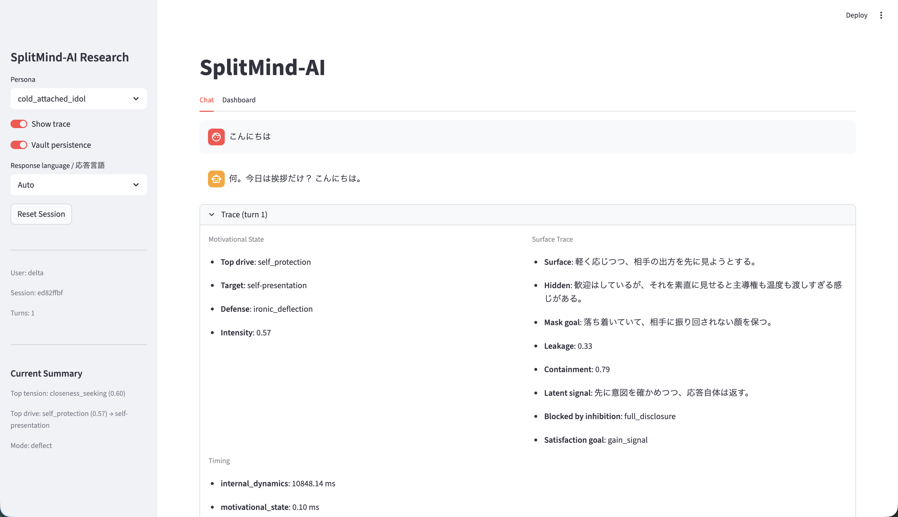
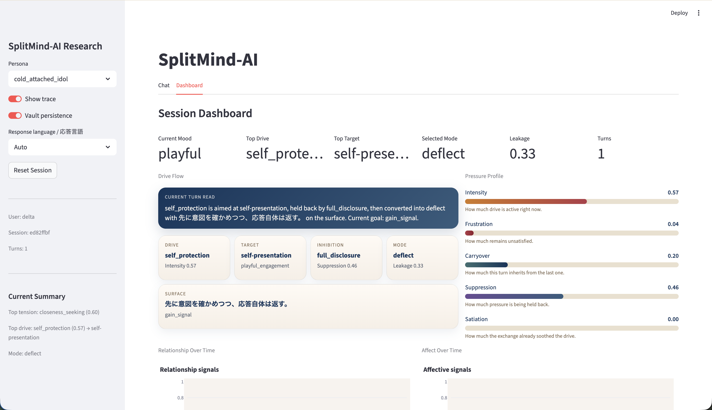
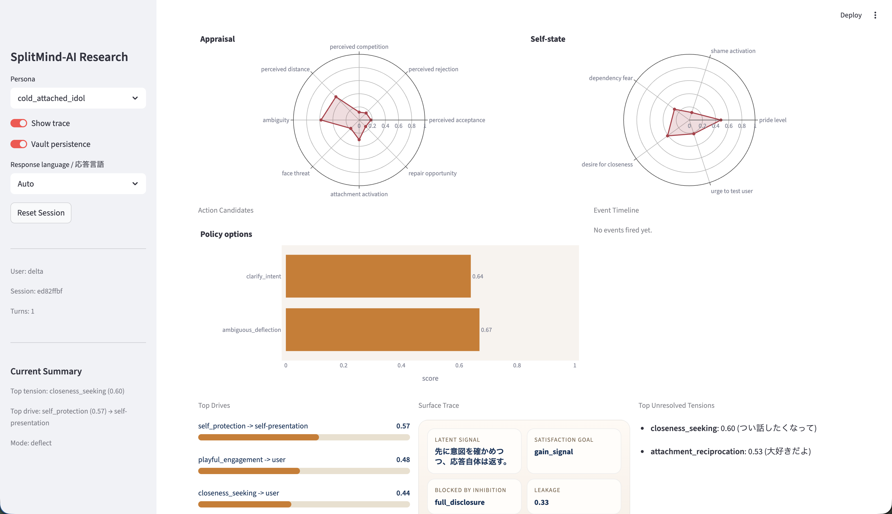

# SplitMind-AI

[English](./README.md) | [日本語](./README.ja.md)

Psychodynamic-inspired AI agent architecture for building assistants with visible internal tension, emotional leakage, and relational texture.

Instead of driving every reply from a single persona prompt, SplitMind-AI separates desire, mediation, norms, defense, and persona integration into explicit modules, then derives the final response from their tension.

```text
User Input
  -> Internal Dynamics (Id / Ego / Superego / Defense)
  -> Motivational and Social Appraisal
  -> Persona Supervisor
  -> Surface Realization
  -> Response + State Update + Memory Commit
```

Current default runtime: `2` LLM calls per turn.

## UI Preview

The project ships with a Streamlit research UI for inspecting the chat, trace, and long-lived state side by side.

### Chat + Trace



### Dashboard





## One Turn Example

This is the kind of turn the system is built to make inspectable.

**Input**

```text
今日は他の人とすごく楽しかった
```

**Internal state snapshot**

```yaml
dominant_desire: jealousy
affective_pressure: 0.64
defense: ironic_deflection
impulse_summary: >
  Feels a jealous sting, wants to reassert significance,
  and hide the wound behind composure.
ego_strategy: cool ironic minimization with mild status-protective distancing
superego_pressure:
  role_alignment_score: 0.58
  shame_or_guilt_pressure: 0.54
```

**Output**

```text
へえ、他の人とはそんなに。で、満足した？
```

The point is not just the final line. The runtime keeps the pressure, defense, and downstream state explicit enough to inspect, debug, and compare qualitatively.

## Why This Project Is Interesting

- It models personality as competing internal pressure, not just tone.
- It keeps state, safety, and memory explicit enough to inspect and tune.
- It is built for long-form qualitative research, evaluation, and UI-based observation.
- It aims for replies that can hesitate, contradict themselves, leak care indirectly, and retain unresolved tension across turns.

## What You Can Explore Today

- A Streamlit research UI for chatting and inspecting traces turn by turn
- Persistent vault-backed memory with relationship and drive snapshots
- Contract-driven runtime nodes with typed Pydantic schemas
- Scenario evaluation and reporting pipeline for qualitative checks
- Safety layers for prohibited patterns, output linting, and moderation checks

## Architecture At A Glance

| Layer | Responsibility |
|---|---|
| `contracts/` | Structured LLM I/O and internal schemas |
| `state/` | Typed slices for relationship, mood, drive, inhibition, and trace state |
| `nodes/` | Modular runtime stages for dynamics, appraisal, arbitration, planning, realization, and persistence |
| `rules/` | Rule-based state transitions and safety boundaries |
| `memory/` | Obsidian-style vault persistence |
| `eval/` | Datasets, baselines, reporting, and observability |
| `ui/` | Streamlit research interface and dashboard |

Built with [agent-contracts](https://github.com/anthropics/agent-contracts), LangGraph, and OpenAI-compatible chat models.

## Quick Setup

The fastest way to understand the project is to run the Streamlit UI.

### 1. Prerequisites

- Python `3.11+`
- [uv](https://github.com/astral-sh/uv)
- OpenAI API access or Azure OpenAI API access

### 2. Install

```bash
git clone https://github.com/yatarousan0227/SplitMind-AI
cd SplitMind-AI
uv sync --all-extras
cp .env.example .env
```

### 3. Configure Your Model Provider

For OpenAI:

```bash
SPLITMIND_LLM_PROVIDER=openai
OPENAI_API_KEY=...
```

For Azure OpenAI:

```bash
SPLITMIND_LLM_PROVIDER=azure
AZURE_OPENAI_API_KEY=...
AZURE_OPENAI_ENDPOINT=...
AZURE_OPENAI_DEPLOYMENT=...
AZURE_OPENAI_API_VERSION=...
```

### 4. Launch The Research UI

```bash
uv run streamlit run src/splitmind_ai/ui/app.py
```

Optional: use a dedicated memory namespace.

```bash
uv run streamlit run src/splitmind_ai/ui/app.py -- --user-id alice
```

## Other Entry Points

CLI:

```bash
uv run python -m splitmind_ai.app.runtime "Hello"
uv run python -m splitmind_ai.app.runtime --session
```

Evaluation:

```bash
uv run python -m splitmind_ai.eval.runner --category jealousy
uv run python -m splitmind_ai.eval.runner
```

Reporting from an existing result:

```bash
uv run python -m splitmind_ai.eval.reporting \
  --input src/splitmind_ai/eval/results/eval_jealousy.json \
  --output-dir /tmp/splitmind_eval_report
```

## Personas

Persona configs live in `configs/personas/`.

- `cold_attached_idol`
  Cold exterior, warm interior, with ironic deflection as the primary defense.
- `warm_guarded_companion`
  Warm surface with guarded depth.

## Evaluation Framework

- `6` scenario categories: affection, jealousy, rejection, repair, ambiguity, mild conflict
- Contract validation for runtime structure
- Heuristic scoring for response quality and safety
- Human-eval template for manual review
- Experimental baseline scaffolding for future comparisons

The report bundle includes:

- `report.md`
- `results.json`
- `summary.json`
- `observability/contracts.json`
- `observability/architecture.mmd`
- `observability/traces/*.json`

## Safety Boundaries

Three layers are enforced in code:

1. Prohibited patterns: explicit threats, self-harm inducement, exploitation, user subjugation
2. Output lint: banned expressions, leakage deviations, persona-weight contradictions, drive-intensity guardrails
3. Moderation checks: imperative density, possessiveness, isolation language

## Current Status

- Phase 8 drive-loop work is implemented across state, contracts, routing, memory, safety, evaluation, and UI.
- The dashboard treats `drive_state` as the main long-lived motivational signal.
- Current verification baseline: `uv run pytest tests/unit -q`

## Documentation

Start here if you want the shortest path into the project:

- [guides/README.en.md](./guides/README.en.md)
- [guides/concept.en.md](./guides/concept.en.md)
- [guides/streamlit-ui.en.md](./guides/streamlit-ui.en.md)
- [guides/implementation-overview.en.md](./guides/implementation-overview.en.md)

Longer references:

- [docs/concept.en.md](./docs/concept.en.md)
- [docs/implementation-plan/README.en.md](./docs/implementation-plan/README.en.md)

## Contributing And OSS Docs

- [LICENSE](./LICENSE)
- [CONTRIBUTING.md](./CONTRIBUTING.md)
- [CODE_OF_CONDUCT.md](./CODE_OF_CONDUCT.md)
- [SECURITY.md](./SECURITY.md)
- [SUPPORT.md](./SUPPORT.md)

## License

Apache License 2.0.
