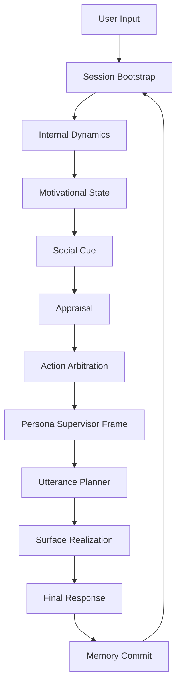

# SplitMind-AI Concept Specification

> Note
> This document is both a concept specification and a snapshot of the implementation state as of 2026-03-17.
> The theoretical role split and the concrete runtime node graph are related, but not always one-to-one.

## 0. System View

SplitMind-AI does not decide responses from a single persona prompt. It separates desire, mediation, normative pressure, defense, appraisal, and response framing into explicit computational roles, then derives the final response from their tension.

## 1. Overview

### 1.1 Name

SplitMind-AI

### 1.2 Summary

This architecture is inspired by psychodynamic thinking, but it is not an attempt to reproduce clinical psychology literally. It uses role-separated internal processes so that an assistant can show more human-like qualities:

- hesitation
- contradiction
- guarded warmth
- leakage after suppression
- relational texture across multiple turns

The system treats personality as an interaction between pressures, not just a tone preset.

### 1.3 Core Hypothesis

Human presence often comes from structured internal tension, not from correctness alone.

Examples:

- wanting something while restraining it
- feeling something while managing its expression
- trying to preserve an ideal self while slipping
- suppressing pressure that still leaks out indirectly

SplitMind-AI turns that tension into explicit runtime structure.

## 2. Problem Setting

Many assistants and character systems still fail in familiar ways:

- language quality is high, but emotional depth is thin
- responses are overly cooperative and frictionless
- long-term relational feel is weak
- suppressed desire and conflicted intention are hard to surface
- persona remains stylistic instead of governing decisions
- it is difficult to debug why a response felt out of character

The project addresses this by separating internal conflict and expression control into inspectable layers.

## 3. Goals

### 3.1 Primary Goals

1. Represent internal conflict in a controllable and reusable architecture.
2. Separate desire, mediation, normative pressure, and persona integration into distinct modules.
3. Improve the human feel, texture, and memory residue of responses.
4. Preserve debuggability and product-grade control surfaces.
5. Keep the system useful for both character experiences and broader generative agent research.

### 3.2 Secondary Goals

1. Make persona act as high-level policy, not only style.
2. Treat defense mechanisms as response-transformation operators.
3. Make friction, softness, directness, and leakage tunable.
4. Support both qualitative and quantitative evaluation.

## 4. Non-Goals

SplitMind-AI is not meant to:

1. reproduce clinical psychology with scientific fidelity
2. operationalize Freudian theory as truth
3. replace therapy, psychiatry, or counseling
4. intentionally optimize for dependency or manipulation
5. maximize aggression or harmfulness in the name of realism

## 5. Core Concepts

### 5.1 Id

The `Id` generates desire candidates and affective impulses, for example:

- approach
- avoidance
- jealousy
- possessiveness
- longing
- resentment
- need for affirmation
- desire for closeness
- urge to withdraw

It does not optimize for politeness, feasibility, or safety.

### 5.2 Ego

The `Ego` mediates between impulse and reality. It handles:

- relationship context
- prediction of user reaction
- continuity of the conversation
- socially viable expression
- sequencing of action and utterance
- face management and self-protection

It is not only suppressive; it converts pressure into workable form.

### 5.3 Superego

The `Superego` applies norms, ideals, role obligations, shame, and value coherence. It checks whether candidate behavior violates character alignment, ethics, or intended role boundaries.

### 5.4 Persona Supervisor

The `Persona Supervisor` is the top-level integrator. In the current implementation it mainly decides the response frame rather than directly writing the final surface text.

It resolves tradeoffs such as:

- elegance versus honesty
- warmth versus distance
- dominance versus restraint
- mystery versus clarity
- ideal-self preservation versus emotional exposure

### 5.5 Defense Mechanisms

Defense mechanisms transform internal pressure when it cannot be expressed directly. Early support includes:

- repression
- rationalization
- projection
- reaction formation
- displacement
- sublimation
- avoidance
- ironic deflection
- partial disclosure

These are treated as expressive strategies, not pathology labels.

### 5.6 Leakage

Leakage is the residue of an internal state that survives suppression or transformation and remains visible in the surface response.

Examples:

- shorter answers than usual
- colder phrasing
- delayed recovery of warmth
- topic avoidance
- ambiguous wording
- mild irony
- overcompensation

Leakage is central to the feeling of aliveness.

### 5.7 Appraisal

`Appraisal` converts the user message from "what happened" into "what does this mean for me?" It captures variables such as:

- perceived acceptance
- perceived rejection
- closeness change
- threat to role or face
- invitation to repair
- ambiguity that must be resolved

### 5.8 Drive State

Phase 8 extends the model so that desire is not only a label on one turn. Drives persist, accumulate frustration, get inhibited, and continue shaping later action selection.

This is why `drive_state` is treated as the main long-lived motivational source in the current UI and state design.

## 6. Runtime Principles

The current default runtime uses two LLM calls per turn:

1. internal dynamics analysis
2. persona supervisor generation and selection

The rest of the pipeline is handled through Python nodes, typed contracts, state transitions, safety checks, and memory persistence.

This keeps the system relatively inspectable while still allowing rich internal structure.

## 7. State Model

Important state categories include:

- relationship state
- mood state
- unresolved tensions
- appraisal outputs
- action policy and arbitration results
- drive state and inhibition state
- trace snapshots for observability

The architecture favors explicit state because it is easier to debug, compare, and evaluate than hidden prompt-only behavior.

## 8. Memory Model

Memory is persisted into an Obsidian-style vault. The project records:

- relationship snapshots
- session summaries
- emotional memory candidates
- semantic preferences
- turn-level observability material where relevant

The goal is continuity across sessions rather than only within one runtime invocation.

## 9. Evaluation Model

The evaluation framework compares SplitMind-AI against simpler baselines and checks:

- schema and contract integrity
- heuristic safety and behavioral signals
- scenario-based quality
- human evaluation readiness
- observability artifacts for later analysis

Datasets currently cover categories such as affection, jealousy, rejection, repair, ambiguity, and mild conflict.

## 10. Safety Boundaries

Safety is handled in layers:

1. prohibited patterns that block explicitly harmful behavior
2. output lint rules for drive-aware and persona-consistency checks
3. moderation-oriented checks for imperative density, possessiveness, and isolation language

The system is meant to support emotionally textured dialogue without removing explicit safety boundaries.

## 11. Why The Architecture Matters

This design has two intended benefits.

### 11.1 Better Texture

Responses can show conflict, restraint, and residue instead of sounding uniformly smooth.

### 11.2 Better Debugging

When something feels wrong, you can ask:

- which pressure dominated?
- which defense transformed it?
- which appraisal misread the user?
- which state transition failed to decay?
- which safety layer intervened?

That is much easier than debugging a single giant persona prompt.

## 12. Related Documents

- [../README.md](../README.md)
- [../README.ja.md](../README.ja.md)
- [../guides/README.en.md](../guides/README.en.md)
- [implementation-plan/README.en.md](./implementation-plan/README.en.md)
