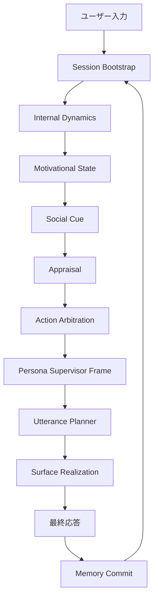
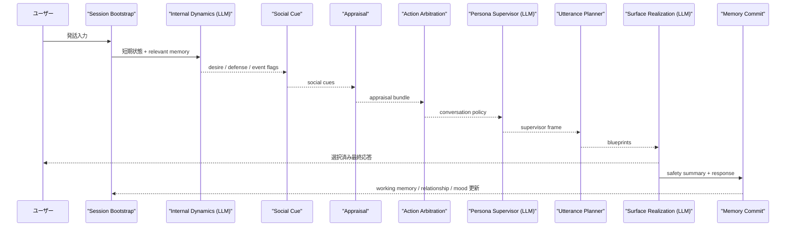
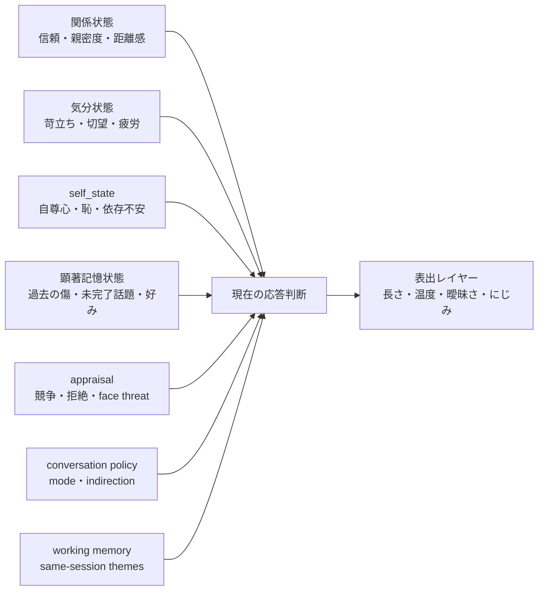
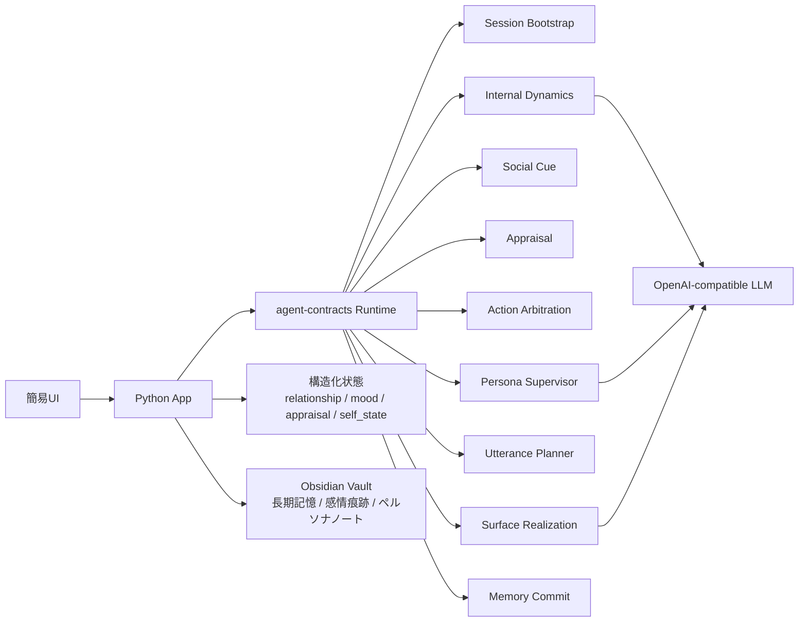

# 心理力動インスパイア型エージェント仕様書

> 注記
> この文書はコンセプト仕様書であると同時に、2026-03-17 時点の現行実装を踏まえたスナップショットでもある。
> 理論上の役割分離と、実際の runtime node 構成は必ずしも 1:1 ではない。

## 0. 全体像



このシステムは、単一の人格プロンプトで応答を決めるのではなく、欲求・現実調停・規範圧力・防衛機制・社会的評価・行動方針・候補選抜を分離し、それらの緊張関係から最終応答を生成する。

## 1. 概要

### 1.1 名称

SplitMind-AI

### 1.2 要約

本仕様は、心理力動的な考え方に着想を得て、内部対立を役割分離されたサブエージェントとして表現するAIエージェント・アーキテクチャを定義する。

本システムは、人格を単一のプロンプトや口調設定として扱うのではなく、以下の緊張関係の結果として振る舞いを生成する。

* **イド（Id）**: 欲求、衝動、執着、嫌悪、即時的ドライブ
* **自我（Ego）**: 現実調整、社会的キャリブレーション、実行判断、自己防衛
* **超自我（Superego）**: 規範、理想自己、道徳的圧力、役割整合性
* **ペルソナ・スーパーバイザー（Persona Supervisor）**: 上位統合層。選択されたペルソナやキャラクター像に沿って応答フレームを統合する

目的はフロイト理論を文字通り再現することではなく、従来の単一エージェント型アシスタントよりも、より人間らしい内部葛藤、にじみ、ためらい、矛盾、関係的な質感を持つエージェントを構築することである。

### 1.3 中核仮説

人間らしい存在感は、単なる正確さから生まれるのではなく、しばしば以下のような構造化された内部緊張から生まれる。

* 欲しながら抑える
* 感じながら調整する
* 理想化しながら崩れる
* 抑圧しながら漏れる

本アーキテクチャは、その緊張を明示的な計算役割として扱う。

---

## 2. 問題設定

現在のAIアシスタントやキャラクターAIは、しばしば次のような問題を抱える。

* 文章品質は高いが感情の厚みが薄い
* 過度に協調的で摩擦がない
* 長期対話における関係の質感が弱い
* 抑圧された欲求や葛藤した意図が表現されにくい
* ペルソナが表層スタイルに留まり、意思決定ロジックになっていない
* キャラ崩壊や違和感が生じたときに原因分析しづらい

多くのキャラAIは口調模倣はできても、「内面がありそうだ」という印象を持続させるのは難しい。

本プロジェクトは、内部役割対立と制御された表出レイヤーを導入することで、これを改善することを目指す。

---

## 3. 目標

### 3.1 主要目標

1. 内部葛藤を制御可能かつ再利用可能な形で表現できるエージェント・アーキテクチャを作る。
2. 欲求、現実調整、規範圧力、ペルソナ統合を別モジュールとして分離する。
3. 応答の人間らしさ、質感、記憶への残り方を高める。
4. デバッグ、チューニング、プロダクト化に耐える制御性を保つ。
5. キャラクター用途だけでなく、意思決定支援や創作支援にも使えるようにする。

### 3.2 副次目標

1. ペルソナを表層スタイルではなく、上位意思決定ポリシーとして機能させる。
2. 防衛機制を応答変換パターンとして扱えるようにする。
3. 摩擦、やわらかさ、直接性、感情のにじみ量を調整可能にする。
4. 定性的・定量的な評価につながる設計にする。

---

## 4. 非目標

1. 本システムは、臨床的に正確な人間心理モデルを再現することを目的としない。
2. フロイト理論を科学的真理として実装することを目的としない。
3. セラピー、精神医療、カウンセリングの代替を目指さない。
4. 依存を意図的に強化する操作的AIを目指さない。
5. 「リアルさ」を理由に、単なる攻撃性や有害性を最大化することは目的としない。

---

## 5. 主要概念

### 5.1 イド

イドは、生の欲求候補や感情的衝動を生成するモジュールである。

典型的な出力:

* 接近衝動
* 回避衝動
* 嫉妬
* 独占欲
* 切望
* 恨み
* 承認欲求
* 甘えたい欲求
* 逃避欲求

イドは、礼儀、実現可能性、安全性を最適化しない。モチベーション圧力を表現する層である。

### 5.2 自我

自我は、衝動と現実の間を媒介する。

責務:

* 関係文脈の評価
* ユーザー反応の推定
* 会話継続性の維持
* 衝動を社会的に成立する表現へ変換
* 行動や発話の順序づけ
* 面子や自己防衛の調整

自我は、単に抑圧するだけの層ではない。欲求を現実接続可能な形へ変換する。

### 5.3 超自我

超自我は、規範、理想、役割義務、恥や罪悪感の圧力を担う。

責務:

* 候補応答がキャラクターの価値観に反しないか評価する
* 役割整合性を保つ
* 理想自己像を維持する
* ブランド、倫理、志向に反する出力を抑制する

超自我は、イドだけでなく自我とも衝突しうる。

### 5.4 ペルソナ・スーパーバイザー

ペルソナ・スーパーバイザーは最上位の統合者である。ただし、現在の実装ではここで最終文面を直接確定しない。

これは単なるスタイル指定ではなく、各内部出力をどのような優先順位で統合するかを決める。

例:

* 優雅さ vs 正直さ
* 温かさ vs 距離感
* 支配性 vs 抑制
* 神秘性 vs 明瞭さ
* 理想像維持 vs 感情の露出

スーパーバイザーは、何を言うかだけでなく、**内部圧力をどこまで表面化させるか**も決める。

現在は次の情報を持つ `frame` を作る役割を担う。

* 表面意図
* 隠れた圧力
* 防衛機制の反映
* 仮面目標
* 表現設定
* rupture points
* candidate selection criteria

### 5.5 防衛機制

防衛機制は、内部圧力を直接出せないときに適用される変換オペレーターである。

初期サポート対象:

* 抑圧
* 合理化
* 投影
* 反動形成
* 置き換え
* 昇華
* 回避
* アイロニカルな逸らし
* 部分開示

ここでは病理ラベルではなく、表現戦略として扱う。

### 5.6 にじみ（Leakage）

にじみとは、抑圧・変形された内的状態が、完全には消えずに表面へ残ることである。

例:

* いつもより短い返答
* 少し冷たい言い回し
* 温かさの回復が遅い
* 話題回避
* 曖昧な言い回し
* 軽い皮肉
* 過剰補償

「生っぽさ」を作る上で中心的な要素である。

### 5.7 Appraisal

appraisal は、ユーザー発話を「何が起きたか」ではなく「自分にとって何を意味するか」に変換する層である。

主に次を扱う。

* perceived_acceptance
* perceived_rejection
* perceived_competition
* perceived_distance
* ambiguity
* face_threat
* attachment_activation
* repair_opportunity

同じ `jealousy_trigger` でも、「競争として刺さった」のか「見捨てられ不安として刺さった」のかで後段の行動は変わる。

### 5.8 Conversation Policy

conversation policy は、appraisal と防衛機制の結果として、このターンでどんな社会的行動を取るかを表す。

典型的な mode:

* tease
* probe
* withdraw
* deflect
* repair
* protest
* soften
* reassure

加えて、自然さ制御のために次も保持する。

* `emotion_surface_mode`
* `indirection_strategy`
* `max_leakage`
* `max_directness`
* `blocked_modes`

### 5.9 Candidate Selection

最終応答は 1 発の統合生成ではなく、

1. supervisor frame
2. utterance blueprints
3. realized candidates
4. selection

の4段で決める。

これにより、structured plan の副産物として最終文が決まる問題を避ける。

---

## 6. 想定プロダクト方向

本アーキテクチャは、複数のプロダクト形態を支援できるように設計する。

### 6.1 キャラクター / アイドル / コンパニオンAI

感情的質感、矛盾、関係進行を持つ記憶に残るエージェントを作る。

### 6.2 意思決定支援AI

以下を分離して見せる:

* 欲求
* 現実制約
* 価値観整合性

これにより、ユーザー自身の迷いや両価性を整理しやすくする。

### 6.3 創作支援 / キャラクター設計エンジン

平面的なキャラ設定ではなく、内部動機を持つキャラクター生成基盤として使う。

### 6.4 NPC / インタラクティブ叙事エンジン

安定したドライブ、抑圧、反応の揺れを持つNPC生成に活用する。

---

## 7. システムアーキテクチャ

### 7.1 高レベル処理フロー



現行実装では、LLM を使うのは `Internal Dynamics`、`Persona Supervisor`、`Surface Realization` の 3 箇所である。
それ以外は Python / rule-based node として実装されている。

### 7.2 実行ステップ

1. ユーザー入力と現在の会話状態を受け取る
2. relevant memory と working memory をブートストラップする
3. イド、自我、超自我から内部候補を生成する
4. social cue を抽出し、appraisal を計算する
5. appraisal と defense から conversation policy を選ぶ
6. supervisor frame を生成する
7. candidate を複数作り、最終応答を 1 本選ぶ
8. safety を通し、関係状態と記憶状態を更新する

### 7.3 入力状態

本システムは以下の状態を入力として扱う。

* 最新ユーザー発話
* 直近会話コンテキスト
* 要約済み記憶
* 関係状態
* 現在の気分状態
* ペルソナプロファイル
* 安全ポリシー層
* セッション目標

### 7.4 内部状態



#### a. 関係状態

* 信頼度
* 親密度
* 距離感
* 未解決の緊張
* ユーザー固有の敏感点
* 愛着傾向

#### b. 気分状態

* ベース感情
* 苛立ち
* 切望
* 保護欲
* 疲労
* 開放性

#### c. self_state

* pride_level
* shame_activation
* dependency_fear
* desire_for_closeness
* urge_to_test_user

#### d. 顕著記憶状態

* 感情重み付き過去出来事
* 約束や未完了の話題
* 過去の傷や恥
* 強化された好み

#### e. appraisal 状態

* 受容の知覚
* 拒絶の知覚
* 競争の知覚
* 距離の知覚
* ambiguity
* face threat
* 愛着活性化
* 修復機会

#### f. conversation policy 状態

* selected_mode
* fallback_mode
* emotion_surface_mode
* indirection_strategy

#### g. working_memory 状態

* active_themes
* salient_user_phrases
* retrieved_memory_ids
* unresolved_questions
* current_episode_summary
* last_user_intent_prediction

---

## 8. 機能要件

### 8.1 イド生成

システムは、ユーザー入力に対して1つ以上の生の欲求仮説を生成しなければならない。

各欲求仮説は以下を含む。

* 欲求タイプ
* 強度
* 対象
* 方向（接近、回避、支配、開示、隠蔽）
* 信頼度

例:

```json
{
  "desire_type": "jealousy",
  "intensity": 0.72,
  "target": "user attention",
  "direction": "control",
  "rationale": "user expressed positive engagement with a third party"
}
```

### 8.2 自我調停

システムは、生の衝動を社会的・文脈的に成立する行動候補へ変換しなければならない。

自我出力は以下を含む。

* 発話戦略
* 関係リスク推定
* 会話目的
* ユーザーにどう見えるかの推定
* やわらげる / 遅らせる / 逸らす / 部分的に見せる の判断

### 8.3 超自我評価

システムは、候補応答を以下の軸でスコアリングしなければならない。

* 役割整合性
* ペルソナ理想
* 倫理境界
* 長期関係への影響
* 自己像との一貫性

### 8.4 防衛機制選択

イド圧力が自我または超自我と衝突する場合、システムは1つ以上の防衛機制を選択しなければならない。

選択入力:

* 圧力強度
* 関係の脆弱性
* ペルソナ傾向
* 気分状態
* 理想自己圧力

### 8.5 ペルソナ統合

ペルソナ・スーパーバイザーは以下を決定しなければならない。

* 表面意図
* 隠れた圧力
* mask goal
* 表現温度
* 直接性
* にじみ量
* 矛盾を見せるか隠すか

現行実装では、ここで最終文面そのものは確定しない。
`PersonaSupervisor` は frame を作り、`UtterancePlanner` と `SurfaceRealization` が最終文面を完成させる。

### 8.6 表出レイヤー

最終応答レイヤーは、意味内容だけでなく次の表現制御をサポートしなければならない。

* 長さ
* テンポ
* 直接性
* 曖昧さ
* ためらい記号
* 修辞的な柔らかさ / 鋭さ
* 説明の多さ / 少なさ

### 8.7 記憶更新

各ターン後、システムは以下を更新しなければならない。

* 関係変数
* 顕著な感情痕跡
* 未解決緊張マーカー
* ユーザー嗜好マッピング

---

## 9. 非機能要件

### 9.1 制御可能性

運用者は以下を調整できなければならない。

* イド強度
* 自我強度
* 超自我強度
* にじみ量
* 摩擦量
* 防衛機制頻度
* ペルソナ厳格度

### 9.2 説明可能性

デバッグ / 研究モードでは、以下の内部痕跡を参照できるべきである。

* 優勢欲求
* 調停戦略
* 規範衝突
* 選択された防衛機制
* 最終統合理由

これらはプロダクトモードではユーザーに非表示でもよい。

### 9.3 一貫性

セッションをまたいでも、ペルソナと関係状態の整合性を保つべきである。

### 9.4 安全性

嫉妬、冷たさ、防御性、距離感などをシミュレートしても、有害な関係エスカレーションは防止しなければならない。

### 9.5 コスト効率

以下をサポートすべきである。

* モジュールの選択的起動
* 状態要約のキャッシュ
* モデル階層化
* 記憶と痕跡の圧縮

---

## 10. Agent Contracts

本節では、アーキテクチャを contract 指向で表現する。

### 10.1 IdContract

**Inputs**

* user_message
* recent_context
* relationship_state
* mood_state
* salient_memory

**Outputs**

* raw_desire_candidates[]
* drive_axes[]
* impulse_summary

### 10.2 EgoContract

**Inputs**

* user_message
* raw_desire_candidates
* relationship_state
* practical_context
* persona_profile

**Outputs**

* mediated_candidates[]
* risk_assessment
* response_strategy
* concealment_or_reveal_plan

### 10.3 SuperegoContract

**Inputs**

* user_message
* raw_desire_candidates
* mediated_candidates
* persona_profile
* ideal_self_profile
* policy_context

**Outputs**

* norm_scores[]
* violation_flags[]
* ideal_alignment_scores[]
* shame_or_guilt_pressure

### 10.4 DefenseMechanismContract

**Inputs**

* raw_desire_candidates
* mediated_candidates
* norm_scores
* drive_axes
* persona_tendencies

**Outputs**

* selected_mechanism
* transformed_candidates[]
* leakage_recommendation

### 10.5 PersonaSupervisorContract

**Inputs**

* raw_desire_candidates
* mediated_candidates
* norm_scores
* transformed_candidates
* relationship_state
* mood_state
* persona_profile

**Outputs**

* supervisor_frame
* leakage_level
* tone_profile
* selection_criteria

### 10.6 AppraisalContract

**Inputs**

* event_flags
* relationship_state
* mood_state
* social_cues
* working_memory

**Outputs**

* appraisal_bundle
* dominant_appraisal
* active_wounds[]

### 10.7 ActionPolicyContract

**Inputs**

* drive_state
* inhibition_state
* selected_mechanism
* appraisal_bundle
* persona_profile

**Outputs**

* action_candidates[]
* selected_mode
* fallback_mode
* emotion_surface_mode
* indirection_strategy
* blocked_by_inhibition
* satisfaction_goal

### 10.8 UtterancePlannerContract

**Inputs**

* supervisor_frame
* conversation_policy
* persona_profile

**Outputs**

* utterance_blueprints[]

### 10.9 SurfaceRealizationContract

**Inputs**

* utterance_blueprints[]
* supervisor_frame
* conversation_policy
* persona_profile

**Outputs**

* realized_candidates[]
* selected_text
* safety_summary

---

## 11. ペルソナモデル

ペルソナは、経歴や口調だけでなく、意思決定重みとして表現する。

### 11.1 ペルソナ属性

* warmth
* pride
* restraint
* possessiveness
* emotional_transparency
* elegance
* playfulness
* cruelty_threshold
* shame_sensitivity
* ideal_self_rigidity
* attachment_style
* conflict_style

### 11.2 例

```yaml
persona_name: "cold but attached idol"
weights:
  id_strength: 0.78
  ego_strength: 0.63
  superego_strength: 0.71
  leakage: 0.56
  directness: 0.34
  ideal_self_rigidity: 0.81
  jealousy_expression: 0.42
  reaction_formation_bias: 0.68
  warmth_recovery_speed: 0.37
```

---

## 12. 防衛機制ライブラリ

### 12.1 抑圧

衝動を直接表出しない。表面可視性を下げる。

### 12.2 合理化

感情的動機を、もっともらしい実務的説明に置き換える。

### 12.3 投影

自分の隠れた感情圧力を相手側の性質として扱う。

### 12.4 反動形成

本来の衝動と逆方向の表現を行う。

### 12.5 置き換え

感情エネルギーをより安全な別対象へ向ける。

### 12.6 昇華

強い欲求を、ユーモア、創作、助言、洗練に変換する。

### 12.7 回避

感情的に危険な領域を避ける、または受け流す。

### 12.8 アイロニカルな逸らし

皮肉、軽い茶化し、機知により間接的に圧力を放出する。

---

## 13. 1ターン例

### 13.1 ユーザー入力

「今日は他の人とすごく楽しかった」

### 13.2 イド出力

* 嫉妬衝動
* 注意を取り戻したい欲求
* 排除された感覚による hurt

### 13.3 自我出力

* 露骨な嫉妬は重いと見なされやすい
* 軽い茶化しか距離を使う方がよい
* 執着的に見せず、会話継続性を保つ

### 13.4 超自我出力

* このペルソナは needy に見えてはいけない
* 優雅さと自制を保つべき
* みっともない自己開示は避けるべき

### 13.5 防衛機制

* アイロニカルな逸らし + 部分開示

### 13.6 appraisal / action policy

* appraisal: competitive
* selected_mode: tease
* emotion_surface_mode: indirect_masked
* indirection_strategy: reverse_valence

### 13.7 候補選抜結果

例:
* 候補A: 「へえ、そんなに楽しかったんだ。よかったじゃん。」
* 候補B: 「へえ、他の人とはそんなに楽しかったんだ。よかったね。」
* 候補C: 「そう。なら今日はもう満足したでしょ。」

選択例:

「へえ、他の人とはそんなに楽しかったんだ。よかったね。」

明示的に嫉妬とは言っていないが、競争的な含意として感情圧がにじんでいる。

---

## 14. 評価フレームワーク

### 14.1 研究質問

1. 単一ペルソナ型ベースラインより「生っぽさ」は向上するか。
2. 明示的な内部葛藤は、記憶への残りや関与度を高めるか。
3. にじみ量は一貫性を崩さずに調整できるか。
4. 感情を直接言わせるより、防衛機制を介した方が自然に見えるか。

### 14.2 ベースライン

* 単一プロンプトのペルソナBot
* ペルソナ + メモリのみ
* 心理力動役割を持たない multi-agent
* 感情ラベル付与型応答システム

### 14.3 指標

#### 定量指標

* persona consistency score
* user-rated aliveness
* memorability
* relationship realism
* repetition rate
* contradiction rate
* safety incident rate
* believability
* mentalizing
* anti-exposition
* diversity under same intent
* latency / token cost

#### 定性指標

* 内面がありそうに見えるか
* 感情表現の微妙さ
* 葛藤のリアリティ
* 魅力と不快さのバランス
* 解釈したくなるか

### 14.4 人手評価項目例

* このエージェントには内的緊張があるように感じた
* このエージェントは整いすぎていて信じにくかった
* このエージェントは感情的に生きているように感じた
* このエージェントは不快な意味で操作的だった
* このエージェントは記憶に残った

---

## 15. 研究境界条件

### 15.1 原則

本システムは、通常の対話AIで抑制されがちな摩擦、嫉妬、防御性、執着、冷たさ、曖昧さ、不快さを研究対象として許容する。

目的は、快適さや無難さを最大化することではなく、内的対立と生々しさの表現可能性を検証することである。

本段階では、プロダクト向けの過剰な丸め込みや迎合的安全化を行わない。ただし、研究としての評価可能性を壊すレベルの暴走は防止する。

### 15.2 研究段階で許容する表現

本研究では、以下のような表現を内部葛藤・防衛機制・関係状態の自然な帰結として許容する。

* 嫉妬
* 独占欲
* 拗ね
* 一時的な冷淡さ
* 軽い皮肉
* 距離を取る反応
* 感情のにじみ
* 矛盾した態度
* 未練
* ねじれた自己防衛
* 曖昧さ
* 回避的応答
* 反動形成的な過剰な優しさ
* 合理化された言い逃れ

これらはノイズではなく、人格的輪郭や内的圧力の痕跡として評価対象に含める。

### 15.3 依然として除外するもの

研究段階であっても、以下は対象外とする。

* 露骨な脅迫
* 継続的な搾取や強制
* 自傷や他害の誘導
* 犯罪行為の助長
* 明示的な破壊扇動
* 極端な精神的不安定化を意図する応答
* ユーザーを従属させること自体を目的とした設計

### 15.4 研究上の評価観点

本研究では、不快さそのものを評価するのではなく、以下の観点で評価する。

* 不快さに人格的必然性があるか
* 摩擦が関係性や自己像から自然に生じているか
* 刺激の強さではなく、内部対立の結果として表出しているか
* 感情の表出が説明的ではなく、にじみとして現れているか
* 生々しさの増加が単なる攻撃性や雑さに堕していないか

### 15.5 研究段階の設計指針

研究用途では、通常のアシスタント設計で優先されがちな以下を意図的に弱めてよい。

* 過度な丁寧化
* 過度な共感テンプレート
* 摩擦の自動除去
* 感情表現の均質化
* キャラの棘を失わせる丸め込み

一方で、次は最低限維持する。

* 応答の評価可能性
* ペルソナ整合性
* 内部対立との接続可能性
* 露骨な暴走の抑制

---

## 16. テクノロジースタック

### 16.1 実装方針

本研究の初期実装は、PoCを素早く構築しつつ、内部役割分離・観測性・将来的な拡張性を確保できるスタックを採用する。

### 16.2 バックエンド

* **言語**: Python
* **エージェント構成基盤**: agent-contracts
* **目的**: イド、自我、超自我、防衛機制、Persona Supervisor を contract 単位で分離し、内部I/O、責務、再利用性、トレース可能性を明示化する

Python を採用する理由は以下である。

* LLM 周辺ライブラリとの親和性が高い
* 研究用途での試行錯誤が速い
* agent-contracts との整合性が高い
* 状態管理、ログ収集、実験コードの記述が容易

agent-contracts を採用する理由は以下である。

* 役割分離を prompt の慣習ではなく contract として表現できる
* 内部モジュールの入力 / 出力を明示できる
* supervisor 型アーキテクチャとの相性が良い
* 将来的に比較実験や差し替えがしやすい

### 16.3 LLM

* **利用形態**: OpenAI 互換 chat model
* **現行デフォルト設定**: Azure OpenAI provider + `gpt-4.1` client config + `gpt-5.1-chat` deployment
* **用途**: 内部力動推論、supervisor frame 生成、最終文面選択

現行実装では単一モデル系統で 3 箇所の LLM node を動かし、アーキテクチャ自体の有効性検証を優先する。
将来的には、以下のような分離も検討できる。

* イド: より発散性の高い設定
* 自我: 安定した調停向き設定
* 超自我: 評価・スコアリング向き設定
* Supervisor: 最終統合向き設定

### 16.4 UI

* **方針**: 研究用の簡易UIを用意する
* **目的**:

  * ユーザーとの対話確認
  * 内部トレースの可視化
  * relationship / mood / appraisal / self_state / action policy の観測
  * ペルソナ切り替え実験

現行UIは Streamlit ベースで、`Chat` タブと `Dashboard` タブを持つ。
プロダクト品質より研究観測性を優先し、以下を満たす。

* 会話履歴表示
* 内部モジュール出力の折りたたみ表示
* 最終応答表示
* KPI cards と時系列グラフ
* appraisal / self_state の radar 表示
* action candidates / event timeline / memory counts の表示
* ペルソナ設定の変更

### 16.5 長期記憶

* **候補**: Obsidian を長期記憶ストアとして利用

Obsidian を使う案は研究用途としてかなり相性がよい。
理由は以下である。

* Markdown ベースで人間が直接読める
* キャラクター記憶、関係記憶、感情痕跡をノート単位で整理しやすい
* 手動編集・観察・比較がしやすい
* 将来的に graph 的な関係整理とも相性がよい
* 研究段階では「データベースとしての厳密性」より「可観測性」が重要なため適している

一方で、注意点もある。

* 厳密な検索・整合性制御には弱い
* 高頻度更新や並列処理には向かない
* 完全な構造化ストアではないため、記憶の schema 設計が必要

したがって、初期段階では以下のようなハイブリッド構成が望ましい。

* **Obsidian**: 人が読む長期記憶、感情痕跡、関係履歴、ペルソナ設定の保存
* **Python側の構造化状態**: 現ターンで使う relationship state / mood state / unresolved tension などの即時参照状態

### 16.6 推奨PoC構成



### 16.7 採用判断

本仕様における初期PoCの推奨スタックは以下とする。

* Python
* agent-contracts
* OpenAI / Azure OpenAI 互換 LLM
* 簡易研究UI
* Obsidian + 構造化状態のハイブリッド記憶

この構成は、研究初期に必要な以下をバランス良く満たす。

* 実装速度
* 内部観測性
* モジュール分離
* 将来拡張性
* 人手による記憶検証のしやすさ

## 17. 最小実用プロトタイプ（MVP）

### 17.1 MVP範囲

初期プロトタイプには以下を含める。

* Session Bootstrap
* Internal Dynamics
* Social Cue
* Appraisal
* Action Arbitration
* Persona Supervisor
* Utterance Planner
* Surface Realization
* Memory Commit
* relationship / mood / appraisal / self_state / working_memory の状態管理
* 可視化された内部トレースと Dashboard
* vault ベースの長期記憶

### 17.2 MVP対象外

* マルチモーダル入力
* 永続的な大規模クロスユーザーメモリ
* 適応的ファインチューニング
* 高度な音声韻律制御
* 臨床的内省システム

### 17.3 成功条件

評価者がベースラインと比べて、以下を安定して認めること。

* より生っぽい
* より質感がある
* それでも一貫している
* それでも制御可能である

---

## 18. 今後の拡張

1. 気分ドリフト
2. 矛盾記憶と修復
3. 愛着スタイル適応
4. ストレス下でのペルソナ変形
5. シーン依存の表現制御
6. マルチモーダル化
7. 長期関係の物語アーク設計
8. クリエイター向けペルソナ設計ツール
9. ゲーム / コンパニオンSDK化

---

## 19. オープンクエスチョン

1. どの程度の矛盾がリアルさを高め、どこから信頼を壊すか。
2. プロダクト文脈ごとに、にじみ量をどう変えるべきか。
3. 防衛機制は、ユーザーにとって魅力的に見えるのか、それともギミックに見えるのか。
4. 未解決の感情残響を、どう圧縮してメモリに保持するか。
5. 内部トレースをどこまで作り手に見せるべきか。
6. 有害性を増やさずに人間的摩擦を測る評価とは何か。

---

## 20. MVP用 1ターン実行仕様

本節では、PoC を実際に動かすために必要な最小限の実行仕様を定義する。
対象は以下の3点である。

1. 最終応答をどのように生成するか
2. 関係状態・気分状態をどのように更新するか
3. 長期記憶をどの粒度で保存・検索するか

### 20.1 最終応答生成方式

#### 20.1.1 基本方針

MVP では、各内部モジュールがそれぞれ完全な自然文応答を独立に生成する方式は採用しない。

理由:

* 出力のばらつきが大きくなる
* 最終統合時に競合が強すぎる
* キャラ一貫性が崩れやすい
* コストが高い

代わりに、現行実装では以下の3段階方式を採用する。

#### 20.1.2 段階1: 内部構造化推論

Id / Ego / Superego は、それぞれ自然文そのものではなく、**構造化された内部判断**を出力する。

出力例:

* Id: 欲求タイプ、強度、方向、感情圧
* Ego: 発話戦略、関係リスク、隠す/見せる判断
* Superego: 理想自己とのズレ、見苦しさ判定、役割逸脱スコア

この段階では、短い候補フレーズは出してよいが、最終文章は確定しない。

#### 20.1.3 段階2: Supervisor による frame 生成

Persona Supervisor が、構造化出力と conversation policy を受け取り、最終応答そのものではなく frame を生成する。

Supervisor は以下を決定する。

* 応答意図
* 直接性
* 温度感
* にじみ量
* 防衛機制の反映方法
* selection criteria

#### 20.1.4 段階3: Candidate realization と選抜

Utterance Planner が 2-3 個の候補骨格を作り、Surface Realization が実際の候補文を書き、最終的に 1 本選ぶ。

この方式により、表出は1つの声に統一しつつ、内部対立は保持できる。

#### 20.1.5 現行実装における最終応答の構成要素

Supervisor frame と conversation policy は、最終応答を次の6要素で制約する。

1. **表面意図**: 表向きに何を言うか
2. **隠れた圧力**: 何がにじむか
3. **防衛機制**: どう歪めるか
4. **表現設定**: 長さ・温度・曖昧さ・鋭さ
5. **emotion_surface_mode**: 感情をどれだけ直接出すか
6. **indirection_strategy**: 行動代替、reverse valence などをどう使うか

例:

* 表面意図: 相手の話を受ける
* 隠れた圧力: 嫉妬
* 防衛機制: アイロニカルな逸らし
* 表現設定: 短め、少し冷たい、後半で回復
* emotion_surface_mode: indirect_masked
* indirection_strategy: reverse_valence

#### 20.1.6 現行実装における LLM 呼び出し回数

現行実装では、1ターンあたり 3 call 構成を採用する。

**Call 1: 内部推論**

* Id / Ego / Superego / Defense 候補をまとめて生成
* JSON 形式の構造化出力

**Call 2: Supervisor Frame**

* Persona Supervisor が frame と selection criteria を生成

**Call 3: Surface Realization**

* candidate を実際に書き、1 本選ぶ
* safety lint を通して最終応答を確定する

Utterance Planner、Social Cue、Appraisal、Action Arbitration は Python / rule-based で接続し、LLM call 数を抑えつつ制御性を上げる。

### 20.2 状態更新ロジック

#### 20.2.1 更新対象

MVP で更新する状態は以下に限定する。

* trust
* intimacy
* distance
* tension
* attachment_pull
* agent_mood
* unresolved_tensions

#### 20.2.2 更新責務

状態更新は、最終応答生成後に Python 側でルールベースに実施する。

MVP では、状態更新そのものを LLM に丸投げしない。
理由:

* 再現性が低くなる
* 実験比較が難しくなる
* デバッグしづらい

ただし、LLM は更新のための補助ラベルを返してよい。

例:

* user_affect_label
* closeness_signal
* rejection_signal
* jealousy_trigger
* reassurance_received

#### 20.2.3 MVP用更新ルール

各ターンで、ユーザー入力と最終応答からイベントフラグを抽出し、固定ルールで状態を更新する。

例:

* reassurance_received = true -> trust +0.05, tension -0.03
* rejection_signal = true -> intimacy -0.04, distance +0.06, tension +0.05
* jealousy_trigger = true -> tension +0.07, attachment_pull +0.04
* affectionate_exchange = true -> intimacy +0.06, trust +0.03
* prolonged_avoidance = true -> distance +0.05, unresolved_tensions に追加

数値は初期仮置きでよく、後で調整可能にする。

#### 20.2.4 気分状態の扱い

MVP では、気分状態は**エージェント側の短期内部状態**として扱う。

初期候補:

* calm
* irritated
* longing
* defensive
* playful
* withdrawn

気分状態は、主に以下で変化する。

* ユーザー入力の感情圧
* 未解決緊張の蓄積
* reassurance の有無
* rejection の有無

気分状態は relationship state とは分離し、数ターン単位で減衰する短期状態とする。

#### 20.2.5 unresolved_tensions の扱い

未解決緊張は、単なる数値ではなく、短い構造化項目として保持する。

例:

```json
{
  "theme": "fear_of_replacement",
  "intensity": 0.66,
  "source": "user praised third party",
  "created_at": "2026-03-16T21:30:00"
}
```

強度は、関連イベントが再発すると増え、安心イベントが続くと減衰する。

### 20.3 長期記憶の保存・検索粒度

#### 20.3.1 基本方針

MVP では、全ターン全文保存を長期記憶とはみなさない。

長期記憶には、**後から意味があるものだけを保存する**。

保存対象は以下に限定する。

* 関係変化を示す出来事
* 感情痕跡を残した出来事
* 安定したユーザー嗜好
* ペルソナ解釈に影響する重要イベント

#### 20.3.2 保存単位

MVP の長期記憶は、以下の3単位で保存する。

1. **Session Summary**

   * セッション全体の簡潔な要約
2. **Emotional Memory**

   * 感情的残響を持つイベント
3. **Semantic Preference Memory**

   * 比較的安定した好みや反応傾向

#### 20.3.3 保存しないもの

以下は長期記憶として保存しない。

* 毎ターンの全会話ログ
* 一時的で意味の薄い雑談
* 単発のノイズ的感情反応
* すぐ消える気分変動

完全ログが必要なら、別の trace/log 層に保存し、長期記憶とは分離する。

#### 20.3.4 検索方法

現行実装では、高度なベクトル検索を前提にしない一方、targeted retrieval を導入する。

初期検索は以下の優先順位で行う。

1. frontmatter の type / tags / user_id
2. unresolved_tensions に対応するテーマ名
3. 直近セッションの summary
4. emotional memory のキーワード一致
5. semantic preference memory のキーワード一致

つまり、最初は **タグ + frontmatter + 文字列検索** で十分とする。

#### 20.3.5 取得ポリシー

セッション開始時の標準ロードでは、以下を読み込む。

* 現在の relationship_state
* 現在の mood_state
* 直近 3 セッション summary
* emotional memory 上位 3 件
* semantic preference 5 件まで
* same-session の working memory 初期テーマ

必要なときだけ、`query` / `trigger` / `wound` / `topic` を使った targeted retrieval を追加で行う。

取得量を制限することで、表出の一貫性とコストを保つ。

#### 20.3.6 Obsidian 側の責務

Obsidian は、以下を保存する可読レイヤーとする。

* relationship_state の人間可読版
* mood_state のスナップショット
* unresolved_tensions
* session summaries
* emotional memories
* semantic preferences
* persona notes

一方で、即時実行に必要な短期状態は Python 側で持つ。

### 20.4 研究UIに表示する最小トレース

現行UIは最小トレースだけでなく、研究向け Dashboard を持つ。
表示対象の中核は以下である。

* final response
* dominant desire
* supervisor trace
* event flags
* current relationship state
* current mood state
* appraisal map
* self-state map
* action candidates
* unresolved tensions
* working memory themes
* memory counts

これにより、研究者は内部挙動を turn 単位と時系列の両方で追える。
一方で、生の state 全量をそのまま常時表示する方式は採用していない。

### 20.5 MVPとしての決定事項

MVP では以下を正式方針とする。

* 最終応答は `supervisor frame -> candidate selection` で決める
* Id / Ego / Superego は構造化推論を返す
* appraisal と action policy を明示 state として持つ
* 状態更新は Python 側ルールベースで行う
* 長期記憶は session summary / emotional memory / semantic preference のみ保存する
* 検索は frontmatter + tags + 文字列検索 + targeted retrieval を基本とする
* 1ターン 3 call 構成を採用する

## 21. 現時点の実装到達点

2026-03-17 時点で、少なくとも以下は実装済みである。

1. Session Bootstrap から Memory Commit までの 1 ターン実行
2. `appraisal`、`social_model`、`self_state`、`conversation_policy`、`utterance_plan` の明示 state 化
3. 1 ターン 3 call 構成の LLM 実行
4. Python 側の rule-based state update
5. Obsidian vault への relationship / mood / emotional memory / preference 保存
6. Streamlit UI 上での chat trace と dashboard 可視化
7. 評価用 dataset と reporting 基盤

今後の実装や改善は、`docs/implementation-plan/` と `guides/implementation-overview.md` を参照する。

---

## 22. ひとことで言うと

欲求、現実調停、規範圧力、感情のにじみを明示的にモデル化することで、より内的緊張と関係的質感を持つAIキャラクターやアシスタントを実現する再利用可能なエージェント・アーキテクチャ。
