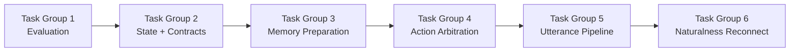

# Phase 6: Implementation Task List

This document breaks the broader roadmap into concrete task groups that can be executed in code.

## Purpose

- define the order of work
- make touched files predictable
- clarify what "done enough to move on" means

## Task Group Order

## Intended Use

Read this after the roadmap if you need execution order rather than design rationale.
