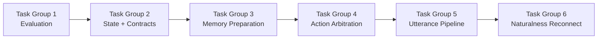
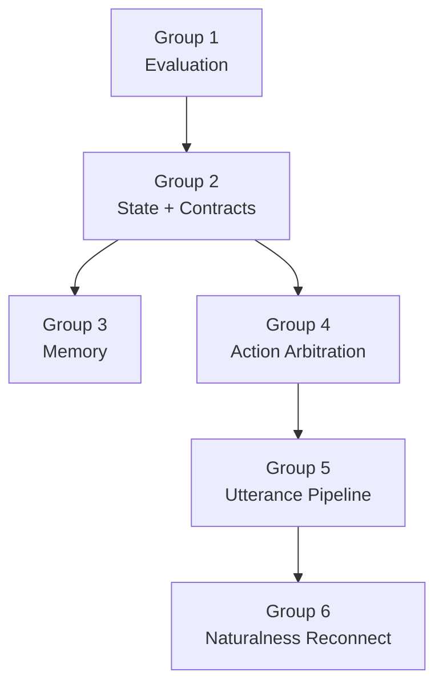

# 06 — 実装タスクリスト

## 0. 目的

[`06-psychology-agent-fusion-roadmap.md`](/Users/iwasakishinya/Documents/hook/SplitMind-AI/docs/implementation-plan/06-psychology-agent-fusion-roadmap.md)
を、そのまま実装へ移せる粒度に分解したチェックリストである。

この文書の役割は 3 つ。

* 何から着手するかを固定する
* どのファイルを触るかを明確にする
* どこまでできたら次へ進んでよいかを定義する

---

## 1. 実装順

---

## 1.5 現在の進捗

| Task Group | Status | Notes |
| --- | --- | --- |
| Group 1: Evaluation Redesign | Complete For Now | v1 実装、report 配線、jealousy fresh run は完了。`believability` / `diversity` の校正は follow-up 扱い |
| Group 2: State and Contract Expansion | Complete | state slice / contract schema / unit test まで完了 |
| Group 3: Memory Preparation | Complete | targeted retrieval と in-session memory 更新の土台まで完了 |
| Group 4: Action Arbitration | Implemented | ノード追加と graph 接続は完了。複数カテゴリでの広域検証は未実施 |
| Group 5: Utterance Pipeline | Implemented | candidate selection 化と trace 分離は完了。広域評価は未実施 |
| Group 6: Naturalness Reconnect | Implemented | policy 連動の indirection / safety 接続と regression test は完了。fresh eval は未実施 |

---

## 2. Definition of Ready

以下を満たしたら、Phase 6 の本実装に着手してよい。

- [x] `06-psychology-agent-fusion-roadmap.md` の方向性に合意している
- [x] このタスクリストの実装順に合意している
- [x] appraisal / action policy の契約ひな形がリポジトリに存在する
- [x] 既存 runtime を壊さずに段階導入する方針に合意している
- [x] 評価軸の追加が最初の実装対象であると合意している

---

## 3. Task Group 1: Evaluation Redesign

Status: Complete For Now

補足:

- v1 の評価軸追加と report / summary への配線は完了
- jealousy fresh run で `mentalizing` による失点ケースを確認済み
- `believability` と `diversity` はまだ甘く、追加校正は follow-up に回す

### 3.1 目的

「整合しているが AI っぽい」を検出できる評価を先に作る。

### 3.2 対象ファイル

- `src/splitmind_ai/eval/heuristic.py`
- `src/splitmind_ai/eval/human_eval_template.yaml`
- `src/splitmind_ai/eval/datasets/jealousy.yaml`
- `src/splitmind_ai/eval/datasets/repair.yaml`
- `src/splitmind_ai/eval/datasets/rejection.yaml`
- `tests/unit/test_eval.py`

### 3.3 タスク

- [x] `believability` チェックを追加する
- [x] `mentalizing` チェックを追加する
- [x] `anti_exposition` チェックを追加する
- [x] `diversity_under_same_intent` の評価方法を決める
- [x] human eval template に新項目を追加する
- [x] jealousy / repair / rejection dataset に appraisal 期待値の欄を追加する
- [x] 新しい評価ロジックの unit test を追加する
- [x] comparison report に check pass rate を出す
- [x] comparison report に diversity summary を出す
- [ ] `believability` の判定基準を jealousy / repair / rejection で再校正する
- [ ] `diversity` が 1.0 固定にならないよう閾値または特徴量を再設計する

Deferred Follow-up:

- `believability` / `diversity` は jealousy 再検証でも弁別力が弱かったため、Task Group 1 完了後の再設計課題として切り出す

### 3.4 完了条件

- [x] heuristic の新項目がテストで通る
- [x] レポートに新評価軸が出る
- [x] 高得点でも AI 臭いケースを最低 1 つ検出できる
- [ ] jealousy / repair / rejection の複数カテゴリで新評価軸の弁別力を確認する
- [ ] `believability` と `diversity` が常時満点にならないことを確認する

---

## 4. Task Group 2: State and Contract Expansion

Status: Complete

### 4.1 目的

感情メーターではなく、appraisal と action policy を state に乗せる準備をする。

### 4.2 対象ファイル

- `src/splitmind_ai/state/slices.py`
- `src/splitmind_ai/state/agent_state.py`
- `src/splitmind_ai/contracts/appraisal.py`
- `src/splitmind_ai/contracts/action_policy.py`
- `tests/unit/test_contracts.py`
- `tests/unit/test_state.py`

### 4.3 タスク

- [x] `appraisal` slice を追加する
- [x] `social_model` slice を追加する
- [x] `self_state` slice を追加する
- [x] `conversation_policy` slice を追加する
- [x] `working_memory` slice を追加する
- [x] appraisal contract の schema を固める
- [x] action policy contract の schema を固める
- [x] 新しい slice / contract の unit test を追加する

### 4.4 完了条件

- [x] 新しい state slice が型として定義されている
- [x] contract schema が最小限のサンプルで validate できる
- [x] 既存 runtime に未接続でも test が通る

---

## 5. Task Group 3: Memory Preparation

Status: Complete

### 5.1 目的

保存だけでなく、in-session 更新と targeted retrieval に移る準備をする。

### 5.2 対象ファイル

- `src/splitmind_ai/memory/vault_store.py`
- `src/splitmind_ai/nodes/session_bootstrap.py`
- `src/splitmind_ai/nodes/memory_commit.py`
- `tests/unit/test_vault_store.py`
- `tests/unit/test_nodes.py`

### 5.3 タスク

- [x] emotional memory を trigger / wound / action / outcome 単位で見直す
- [x] semantic preference の schema を event 依存から episode 依存へ見直す
- [x] `memory_commit` で `memory` slice を更新する方針を決める
- [x] targeted retrieval API の I/O を決める
- [x] in-session memory 更新の unit test を追加する

### 5.4 完了条件

- [x] 同一セッション中に追加した記憶が次ターンへ戻せる設計になっている
- [x] targeted retrieval の interface が固まっている

---

## 6. Task Group 4: Action Arbitration

Status: Implemented

補足:

- `social_cue` / `appraisal` / `action_arbitration` ノードは graph に接続済み
- trace と `conversation_policy` は runtime に流れる
- jealousy / repair / rejection を横断した広域検証は未実施

### 6.1 目的

internal dynamics を「分析結果」から「社会的行動の競合」に変える。

### 6.2 対象ファイル

- `src/splitmind_ai/nodes/internal_dynamics.py`
- `src/splitmind_ai/nodes/social_cue.py`
- `src/splitmind_ai/nodes/appraisal.py`
- `src/splitmind_ai/nodes/action_arbitration.py`
- `src/splitmind_ai/contracts/dynamics.py`
- `src/splitmind_ai/contracts/appraisal.py`
- `src/splitmind_ai/contracts/action_policy.py`
- `tests/unit/test_nodes.py`

### 6.3 タスク

- [x] `SocialCueNode` を追加する
- [x] `AppraisalNode` を追加する
- [x] `ActionArbitrationNode` を追加する
- [x] `InternalDynamicsNode` を段階的に縮退させる移行方針を決める
- [x] dominant desire から action candidate への変換ロジックを定義する
- [x] node contract と trigger condition を定義する
- [x] ノードごとの unit test を追加する

### 6.4 完了条件

- [ ] jealousy / repair / rejection で action candidate が分岐する
- [x] 既存の単一 `dominant_desire` だけでは出なかった policy 差が trace で見える

---

## 7. Task Group 5: Utterance Pipeline

Status: Implemented

補足:

- `PersonaSupervisorNode` は frame 生成へ縮退済み
- `UtterancePlannerNode` / `SurfaceRealizationNode` による candidate selection は実装済み
- 表現固定化の広域評価は未実施

### 7.1 目的

最終応答を 1 発で決めるのではなく、candidate selection に変える。

### 7.2 対象ファイル

- `src/splitmind_ai/nodes/persona_supervisor.py`
- `src/splitmind_ai/nodes/utterance_planner.py`
- `src/splitmind_ai/nodes/surface_realization.py`
- `src/splitmind_ai/contracts/persona.py`
- `src/splitmind_ai/contracts/action_policy.py`
- `src/splitmind_ai/prompts/persona_supervisor.py`
- `tests/unit/test_nodes.py`
- `tests/unit/test_prompts.py`

### 7.3 タスク

- [x] `UtterancePlannerNode` を追加する
- [x] `SurfaceRealizationNode` を追加する
- [x] `PersonaSupervisorNode` の責務を段階的に縮小する
- [x] utterance candidate を 2-3 個作る contract を定義する
- [x] selection 基準を定義する
- [x] final response が structured report の副産物にならないようにする

### 7.4 完了条件

- [x] 同一 state から複数の plausible utterance candidate が出る
- [x] selection の理由が trace で確認できる
- [ ] 既存より表現固定化が下がる

---

## 8. Task Group 6: Naturalness Reconnect

Status: Implemented

補足:

- `emotion_surface_mode` / `indirection_strategy` は `conversation_policy` に正式接続済み
- anti-exposition lint は safety / eval へ接続済み
- broad regression は未実施

### 8.1 目的

`05` の間接表現改善を、新しい action policy ベースの生成へ接続する。

### 8.2 対象ファイル

- `src/splitmind_ai/prompts/indirection_guide.py`
- `src/splitmind_ai/prompts/persona_supervisor.py`
- `src/splitmind_ai/rules/safety.py`
- `src/splitmind_ai/contracts/persona.py`
- `tests/unit/test_prompts.py`
- `tests/unit/test_safety.py`

### 8.3 タスク

- [x] `emotion_surface_mode` を正式導入する
- [x] `indirection_strategy` を action policy と接続する
- [x] directness だけでなく appraisal と defense に応じて表現戦術を選ぶ
- [x] anti-exposition lint を safety / eval に接続する
- [x] naturalness の regression test を追加する

### 8.4 完了条件

- [x] 間接表現が単独ルールではなく policy の帰結になっている
- [x] 感情語を避けるだけの不自然な回避が減る

---

## 9. 依存関係

補足:

- Group 1 は先行着手する
- Group 2 が終わらないと Group 4 は本実装に入れない
- Group 5 を先にやると、また meta-first な設計に戻りやすい

---

## 10. 今回ここまでで用意した準備物

- [x] Phase 6 のロードマップ文書
- [x] Mermaid 図による構造説明
- [x] この実装タスクリスト
- [x] appraisal / action policy の契約ひな形
- [x] Task Group 1 の v1 実装
- [x] Quality Axis Summary / Diversity Summary の report 配線
- [x] jealousy fresh run による初回検証

---

## 11. 次の具体的着手候補

最初の着手は次のどちらかがよい。

1. Evaluation first
   * Group 1 だけ先に実装し、AI 臭さを測る軸を先に作る
2. State first
   * Group 2 の `appraisal` / `conversation_policy` を先に入れてから、評価軸を拡張する

このロードマップでは `Evaluation first` を推奨する。
