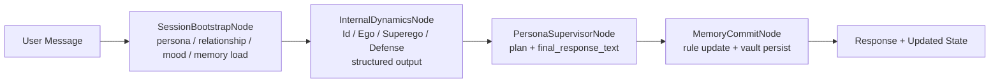
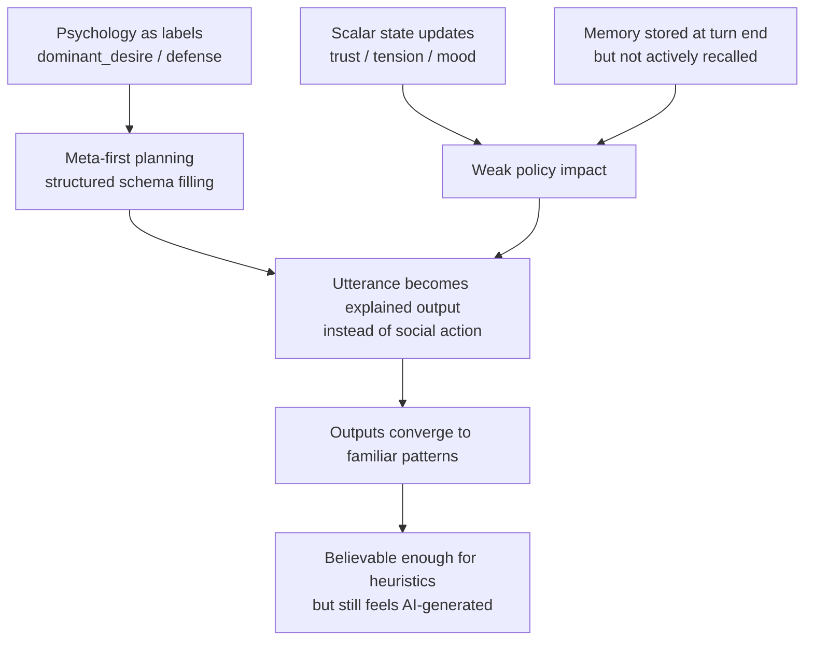
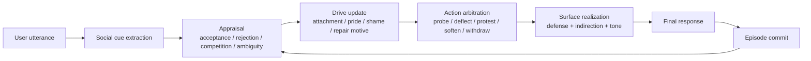
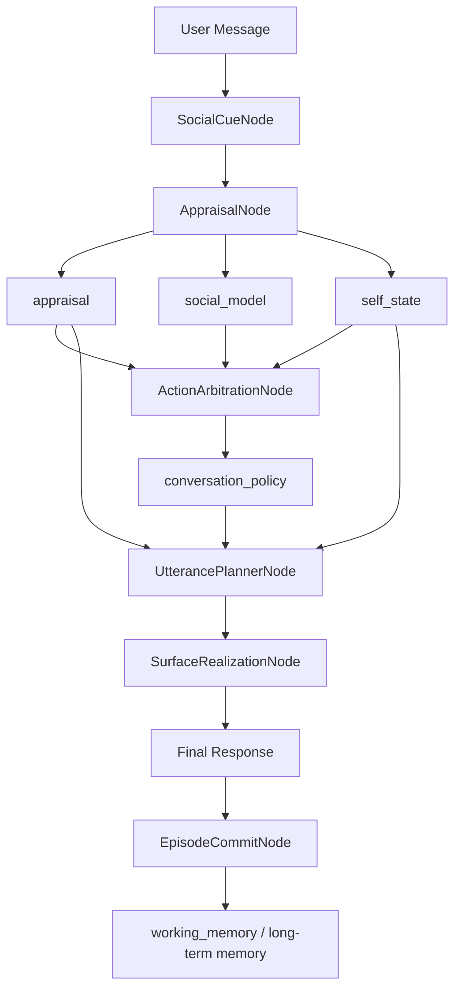
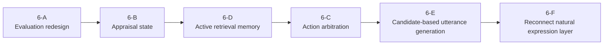

# 06 — 心理学 × AI Agent 融合の再設計ロードマップ

## 0. この文書の目的

`05-indirect-expression-naturalness.md` は、感情語の直接表現や間接表現タクソノミーといった「表面の自然さ」を改善する計画として有効である。

ただし、現在の「AI臭さ」は表現レイヤだけの問題ではない。根本には、

1. 心理学が内部ラベルとしては入っているが、対話制御の中核にはなっていない
2. Agent が心理的な過程を回しているのではなく、構造化 JSON を埋めてから返答文を作っている
3. 記憶・関係・気分が、発話の選択ポリシーに十分つながっていない

という構造的な問題がある。

この文書は、現状実装を調査したうえで、

* どこがすでに実現できているか
* どこが「心理学っぽいが、まだ AI 的」なのか
* どういうアーキテクチャへ進めば、心理学と AI Agent が本当に融合するか

を整理し、次フェーズの改善計画へ落とす。

---

## 1. 調査対象

今回の調査では、主に以下を読んだ。

* ランタイムとグラフ
  * `src/splitmind_ai/app/graph.py`
  * `src/splitmind_ai/app/runtime.py`
* ノード実装
  * `src/splitmind_ai/nodes/session_bootstrap.py`
  * `src/splitmind_ai/nodes/internal_dynamics.py`
  * `src/splitmind_ai/nodes/persona_supervisor.py`
  * `src/splitmind_ai/nodes/memory_commit.py`
* プロンプトと契約
  * `src/splitmind_ai/prompts/internal_dynamics.py`
  * `src/splitmind_ai/prompts/persona_supervisor.py`
  * `src/splitmind_ai/prompts/indirection_guide.py`
  * `src/splitmind_ai/contracts/dynamics.py`
  * `src/splitmind_ai/contracts/persona.py`
* 状態・記憶・ルール
  * `src/splitmind_ai/state/slices.py`
  * `src/splitmind_ai/rules/state_updates.py`
  * `src/splitmind_ai/rules/safety.py`
  * `src/splitmind_ai/memory/vault_store.py`
* 評価
  * `src/splitmind_ai/eval/heuristic.py`
  * `src/splitmind_ai/eval/baselines.py`
  * `splitmind_eval_report_2/report.md`
  * `splitmind_eval_report_2/observability/traces/*.json`

---

## 2. 現状実装の要約

### 2.1 現在の 1 ターン処理

現状の SplitMind は、MVP としてかなり明快な 2-call 構成になっている。

1. `SessionBootstrapNode`
   * ペルソナ、relationship、mood、memory をロードする
2. `InternalDynamicsNode`
   * ユーザー発話から `Id / Ego / Superego / Defense` を構造化出力する
3. `PersonaSupervisorNode`
   * 上記の構造化出力を受けて最終応答を生成する
4. `MemoryCommitNode`
   * event flag と dominant desire を使って relationship / mood / memory candidates を更新・保存する

これは「構造が見える」「トレースしやすい」「比較実験しやすい」という意味では良い設計である。

### 2.2 すでに実現できていること

現状でも以下は十分に価値がある。

* 心理力動を単なる長いキャラプロンプトではなく、明示的な内部段階として分離している
* ノードの reads / writes / trigger が contract として明示されている
* ペルソナ・関係状態・気分・記憶・安全境界・評価が分離されている
* ベースライン比較があり、「内部構造が効いているか」を検証できる
* `05` の間接表現ガイドまで含めて、表現上の改善導線が用意されている

つまり、土台は弱くない。問題は「心理学の語彙が入ったこと」と「人間の対人心理を駆動すること」がまだ一致していない点にある。

---

## 3. 現状から見えた主要課題

### 3.1 心理学が「内部ラベル」に留まり、因果的な制御ループになっていない

`InternalDynamicsNode` は、1 回の LLM 呼び出しで以下をまとめて返す。

* raw desire candidates
* response strategy
* norm pressure
* selected defense mechanism
* dominant desire
* event flags

これは便利だが、心理プロセスとしては圧縮しすぎている。

現状の問題:

* `dominant_desire` が単一ラベルに潰れている
* `defense_output.selected_mechanism` も単一選択で終わる
* appraisal の時間差、葛藤の揺れ、確信度、認知の歪みが state に残らない
* 「相手の意図をどう誤解したか」「どの自己像が傷ついたか」が明示されない

結果として、心理学が「説明変数」ではなく「タグ」に近くなる。

これは AI 臭さの原因になる。人間らしさはラベルの豊富さではなく、曖昧な appraisal と、その揺れの結果として生まれるからである。

### 3.2 発話生成が meta-first で、対人行為としての utterance になり切っていない

`PersonaSupervisorNode` は `PersonaSupervisorPlan` を structured output で生成し、その 1 フィールドとして `final_response_text` を出している。

つまり現状は、

* `surface_intent`
* `hidden_pressure`
* `defense_applied`
* `mask_goal`
* `expression_settings`
* `rupture_points`
* `integration_rationale`

を一緒に埋めることが主タスクになっており、`final_response_text` はその副産物になりやすい。

この構造だと、モデルは自然な会話者になる前に「説明可能な設計書の作成者」になりやすい。

その結果として起きやすいこと:

* 返答が「きれいに意味づけされた」ものになる
* defense が生っぽい反応ではなく、上手な言い換えになる
* 文章のリズムより、整合性の高いラベル埋めが優先される
* 同じカテゴリでは似た表現に収束しやすい

### 3.3 relationship / mood / memory が、言語生成のポリシーに浅くしか効いていない

`state_updates.py` は明快だが、かなり event-driven かつ scalar-driven である。

例:

* jealousy trigger なら `tension += 0.07`
* repair attempt なら `trust += 0.03`
* affectionate exchange なら `openness += 0.1`

この設計は評価しやすい一方で、対人心理としては粗い。

足りていないもの:

* 相手の言い方への解釈
* 自己像の損傷度
* 関係の非対称性
* attachment wound の再活性化
* 今回は戦うべきか、引くべきか、試すべきかという行動政策

いまの state は「気分メーター」に近く、「次の一手を選ぶ内的状況」にはまだなっていない。

### 3.4 記憶が storage 中心で、active recall になっていない

`SessionBootstrapNode` はセッション開始時に vault から memory context をまとめてロードするが、その後は active retrieval がない。

加えて、重要な制約がある。

* `MemoryCommitNode` は memory candidate を vault へ保存する
* しかし返り値の `memory` slice は更新していない
* そのため、同一セッション中に新しくできた emotional memory / preference は、次ターンの生成には戻ってこない

つまり現在の memory は、

* セッション開始時にまとめて読む
* ターン終了時に保存する
* その場の対話で柔軟に取り出して使う

という Agent 的なループになっていない。

これは「関係がいま育っている」「さっきの微妙な空気を引きずっている」という感触を弱くする。

### 3.5 conversation state が短すぎて、相互行為の流れを持てていない

`runtime._build_turn_state()` が次ターンに持ち越す会話履歴は直近 6 メッセージのみで、`conversation.summary` は実質ほぼ未活用である。

これにより、モデルは以下が苦手になる。

* 何ターンかかけた駆け引き
* 一度引いてから戻るような応答
* 前ターンの失敗を踏まえた repair
* 「そのときは強がったが、今は少し揺れている」といった時間差

対人心理をやるなら、会話は発話列ではなく interaction episode として扱う必要がある。

### 3.6 評価が「整合しているか」を測れても、「人間として believable か」を十分に測れていない

`heuristic.py` は以下に強い。

* 禁則違反
* leakage policy 逸脱
* persona weight と expression settings の整合
* state direction の方向性

逆に弱いもの:

* mentalizing の巧拙
* ユーザーの face に対する応答の自然さ
* repair のタイミングの自然さ
* 返答の多様性
* 同カテゴリ内の表現固定化
* 「説明っぽさ」「生成物っぽさ」

実際に `splitmind_eval_report_2/report.md` では、

* `splitmind_full` と `persona_memory` が同率首位
* 嫉妬カテゴリの 3 ケースで `dominant_desire=jealousy`、`selected_mechanism=ironic_deflection` へ強く収束
* heuristic 上は高得点でも、出力の型がかなり近い

という状態が見える。

これは悪いことではなく、「いまの評価軸では AI 臭さを十分に罰せていない」ということを示している。

### 3.7 表現改善だけでは限界がある

`05-indirect-expression-naturalness.md` の方向は正しい。

ただし、間接表現だけで解決しようとすると以下にぶつかる。

* 根本の appraisal が薄いままなので、間接表現もパターン化する
* Agent が「感情語を避けるテクニック」を覚えるだけで、心理的必然性が増えない
* 嫉妬・修復・拒絶のような対人場面で、表現の変化は起きても、方針の変化は起きにくい

結論として、`05` は必要だが十分ではない。

---

## 4. 根本方針: 心理学をラベルではなく制御ループにする

次の段階では、心理学を「出力説明の語彙」ではなく「Agent の policy を決める中核状態」に変えるべきである。

### 4.1 目指す変化

現状:

* 心理学 = LLM が返す構造化 JSON
* Agent = その JSON を受けて文を作る orchestrator

目標:

* 心理学 = appraisal, attachment, self-protection, repair motive を更新する state machine
* Agent = その状態を使って「次に何をするか」を選ぶ policy loop
* 言語生成 = 最後に選ばれた social action を発話へ落とす surface realization

### 4.2 中核となる新しい流れ

1. 相手の発話から social cue を抽出する
2. その cue が、関係・自己像・期待にどう作用したかを appraisal する
3. attachment / pride / shame / curiosity / repair motive など複数の drive を更新する
4. 「攻める・引く・試す・ごまかす・安心させる・距離を置く」などの social action 候補を作る
5. 候補同士をペルソナと関係の文脈で競合させる
6. 選ばれた action を、 defense と utterance style を通して表面化する
7. 応答後に episode を記憶へ圧縮し、次ターンの appraisal に戻す

これなら心理学と Agent が同じループ上に乗る。

---

## 5. 目標アーキテクチャ

### 5.1 新しく持つべき state

今後は、現在の `relationship` / `mood` / `memory` に加えて、少なくとも以下の state を明示的に持ちたい。

### A. `appraisal`

ユーザー発話に対する主観的評価。

候補:

* perceived_acceptance
* perceived_rejection
* perceived_competition
* perceived_distance
* ambiguity
* face_threat
* attachment_activation
* repair_opportunity

### B. `social_model`

ユーザーをどう見ているか。

候補:

* user_current_intent_hypotheses
* user_attachment_guess
* user_sensitivity_guess
* confidence
* recent_prediction_errors

### C. `self_state`

ペルソナの内的な守りたいもの。

候補:

* threatened_self_image
* pride_level
* shame_activation
* dependency_fear
* desire_for_closeness
* urge_to_test_user

### D. `conversation_policy`

このターンで取りたい social action。

候補:

* engage
* probe
* deflect
* protest
* soften
* repair
* withdraw
* tease
* reassure

### E. `working_memory`

今セッション内でまだ未整理な interaction residue。

候補:

* unresolved micro-events
* recent failed bids
* recent repair attempts
* user wording that stung
* agent wording that overreached

### 5.2 新しいノード分解

MVP の 2-call を守る必要がなくなった段階では、次のような分解が現実的である。

1. `SocialCueNode`
   * 発話から対人手がかりを抽出する
2. `AppraisalNode`
   * 関係・自己像・記憶に照らして意味づけする
3. `ActionArbitrationNode`
   * 複数 drive から social action を競合させる
4. `UtterancePlannerNode`
   * 発話の目的、情報量、距離、 defense を決める
5. `SurfaceRealizationNode`
   * 最終文面を生成する
6. `EpisodeCommitNode`
   * event flag ではなく episode 単位で記憶を更新する

重要なのは、「心理分析」と「最終発話」のあいだに、social action を決める層を挟むことである。

---

## 6. 改善計画

以下は、表面改善ではなく、心理学と Agent 制御を統合するための段階的ロードマップである。

### Phase 6-A. 計測の作り直し

### 目的

いまの heuristic では「AI臭さ」を捉えきれない。まず評価軸を増やす。

### 実装

追加したい評価:

* `believability`
  * 人間の対人反応として納得感があるか
* `mentalizing`
  * 相手の立場や含意を読み違えていないか
* `interactional_fit`
  * 返答が直前のやり取りに噛み合っているか
* `diversity_under_same_intent`
  * 同じ意図でも文面が型に固定されていないか
* `anti_exposition`
  * 感情や意図を説明しすぎていないか
* `repair_timing`
  * 修復が早すぎる / 遅すぎる / 過剰でないか

必要な変更候補:

* `src/splitmind_ai/eval/heuristic.py`
* `src/splitmind_ai/eval/datasets/*.yaml`
* `src/splitmind_ai/eval/human_eval_template.yaml`

### 完了条件

heuristic の高得点と、人手の「AI臭い」評価が乖離しにくくなること。

### Phase 6-B. state を感情メーターから appraisal state へ拡張

### 目的

気分や trust のスカラーだけでなく、「なぜその反応になるのか」を state として保持する。

### 実装

追加・更新候補:

* `src/splitmind_ai/state/slices.py`
* `src/splitmind_ai/state/agent_state.py`
* `src/splitmind_ai/contracts/dynamics.py`

変更方針:

* `dominant_desire` 一本足から、drive vector + confidence へ変更
* `event_flags` 中心から、`appraisal` と `conversation_policy` 中心へ変更
* `mood` は残すが、政策決定の主役からは降ろす

### 完了条件

次の一手が、単なるカテゴリ反応ではなく appraisal によって説明できること。

### Phase 6-C. internal dynamics を「分析」から「行動選択」に寄せる

### 目的

Id / Ego / Superego を心理ラベルとして出すだけでなく、social action を選ぶ競合構造へ変える。

### 実装

新規候補:

* `src/splitmind_ai/nodes/social_cue.py`
* `src/splitmind_ai/nodes/appraisal.py`
* `src/splitmind_ai/nodes/action_arbitration.py`
* `src/splitmind_ai/contracts/appraisal.py`
* `src/splitmind_ai/contracts/action_policy.py`

設計方針:

* Id = desire 生成器
* Ego = interaction cost / repairability / plausibility を評価
* Superego = persona face と規範コストを評価
* Defense = utterance transformation だけでなく、action suppression / redirection にも使う

つまり defense は「言い換え」ではなく「そもそも何をするか」を歪める層にする。

### 完了条件

同じ jealousy でも、

* 軽く刺す
* 試す
* 冷える
* 気にしていないふりをする
* 逆に世話を焼く

などの policy 分岐が、state に応じて自然に起こること。

### Phase 6-D. memory を active retrieval + episode learning に変える

### 目的

記憶を「保存」ではなく「その場で効くコンテキスト」にする。

### 実装

変更候補:

* `src/splitmind_ai/memory/vault_store.py`
* `src/splitmind_ai/nodes/session_bootstrap.py`
* `src/splitmind_ai/nodes/memory_commit.py`

追加したいこと:

* 現ターンの cue に応じた targeted retrieval
* emotional memory の類似検索ではなく、trigger / wound / bid / repair type での検索
* 同一セッション中に `memory` slice を更新
* episode 単位の記憶圧縮
  * 何が起きたか
  * どう解釈したか
  * 何をしたか
  * 結果どうなったか

### 完了条件

数ターン前の微妙な interaction residue が、次の発話選択に実際に影響すること。

### Phase 6-E. 発話生成を single-shot 設計書生成から、candidate selection に変える

### 目的

自然な応答を作るには、1 発で「正しい説明付き完成文」を作るより、複数の social action candidate から選ぶ方が強い。

### 実装

方針:

1. `UtterancePlannerNode`
   * 3 つ前後の候補行為を作る
2. `SurfaceRealizationNode`
   * それぞれを短い文面へ落とす
3. `Selector / Critic`
   * ペルソナ・自然さ・対人整合性で選ぶ

候補例:

* `cool_probe`
* `injured_withdrawal`
* `dry_tease`
* `guarded_repair`
* `soft_concern_after_deflection`

この方式なら、「同じ心理状態から毎回ほぼ同じ一文が出る」問題をかなり抑えられる。

### 完了条件

同じ state でも複数の plausible utterance が存在し、その中から選ばれること。

### Phase 6-F. `05` の自然表現計画をこの新構造へ接続する

### 目的

間接表現ガイドを残しつつ、表面だけのルールにしない。

### 実装

`05` の内容は引き続き有効だが、適用箇所を変える。

現状:

* `directness < 0.5` なら supervisor prompt に間接表現ガイドを注入

今後:

* `conversation_policy`
* `emotion_surface_mode`
* `indirection_strategy`
* `defense`
* `attachment activation`

の組み合わせから、surface realization 時に戦術を選ぶ。

つまり、「感情語を避ける」ではなく、「いまこの人物ならどういう漏れ方をするか」を生成時点で決める。

### 完了条件

自然化ルールが単独の lint ではなく、appraisal と action policy の帰結として機能すること。

---

## 7. 優先順位

着手順は以下を推奨する。

1. Phase 6-A: 評価軸の追加
2. Phase 6-B: appraisal state の導入
3. Phase 6-D: memory の in-session 更新と targeted retrieval
4. Phase 6-C: action arbitration ノード追加
5. Phase 6-E: candidate selection 型の utterance 生成
6. Phase 6-F: `05` の表現計画を新構造へ再接続

理由:

* 先に評価軸がないと、改善しても何が効いたか分からない
* memory と appraisal がないまま表現をいじっても、結局テンプレート化しやすい
* utterance の多様化は最後にやる方が、心理的必然性を保ちやすい

---

## 8. 直近の実装タスク案

次の 2 スプリントでやるなら、まず以下が良い。

詳細なチェックリスト:

* [`06-implementation-tasklist.md`](/Users/iwasakishinya/Documents/hook/SplitMind-AI/docs/implementation-plan/06-implementation-tasklist.md)

### Sprint 1

* `eval` に `believability`, `mentalizing`, `anti_exposition`, `diversity_under_same_intent` を追加
* `memory_commit` が同一セッション中の `memory` slice を更新するようにする
* `state` に `appraisal` slice を追加する
* jealousy / repair / rejection データセットに appraisal 期待値を追加する

### Sprint 2

* `InternalDynamicsNode` を `AppraisalNode + ActionArbitrationNode` に分割する
* `PersonaSupervisorNode` を `UtterancePlannerNode + SurfaceRealizationNode` に分割する
* `final_response_text` を structured report の副産物にしない構成へ変える
* `05` の間接表現を `SurfaceRealizationNode` へ移す

---

## 9. 成功条件

「AI臭さが減った」と判断する基準を、以下のように置く。

### 定量

* `splitmind_full` が `persona_memory` に対して human eval で優位になる
* 同カテゴリ 10 run の表現多様性が上がる
* believability / mentalizing / anti_exposition の平均が改善する

### 定性

* 返答が「心理学用語を知っている AI」ではなく、「内面のある相手」に見える
* 修復・回避・刺し・引き下がりが、文体ではなく interaction policy として感じられる
* 同じ jealousy でも毎回ほぼ同じ冷笑文に寄らない
* 数ターン前の空気が、次の応答の温度や選択に残る

---

## 10. 結論

現状の SplitMind は、心理力動を明示的な構造として扱う基盤をすでに持っている。これは強い。

しかし、いまの「AI臭さ」は主に以下から来ている。

* 心理学が still image で、interaction loop になっていない
* 発話生成が meta schema の充足に引っ張られている
* 記憶と関係が action policy に十分接続されていない
* 評価が believability より整合性を優先している

したがって、次にやるべきことは小手先の語尾調整ではない。

やるべきことは、

* appraisal を state に入れる
* social action を選ぶ Agent に変える
* memory を active recall にする
* utterance を candidate selection で作る
* `05` の自然表現計画をその上に載せる

ことである。

この順で進めれば、SplitMind は「心理学っぽい会話 AI」から、「心理過程が応答選択を実際に駆動する Agent」へ進める。
