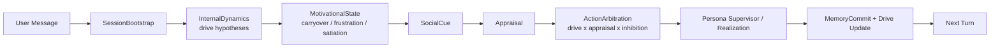

# 08 — 欲求・本能を駆動系にする実装計画

## 0. 目的

SplitMind-AI は仕様上、`Id` を欲求・衝動・執着・嫌悪の発生源として持っている。
しかし現状実装では、その圧力が主に `dominant_desire` という単一ラベルと `affective_pressure` という単一スカラーに圧縮されやすく、会話行動を継続的に駆動する状態になり切っていない。

この Phase の目的は、欲求や本能を「説明用ラベル」から「次の一手を決める持続状態」へ変えることにある。

狙うのは次の変化である。

1. 欲求がターンをまたいで残る
2. 欲求の満たされなさや抑圧が、行動選択に反映される
3. 応答が「感情を分析した文」ではなく、「何かを求めて反応した文」に寄る

---

## 0.5 実装状況

2026-03-17 時点で、Phase 8 の主要トラックは実装済みである。

| Track | 状態 | 実装内容 | 残タスク |
|---|---|---|---|
| Track A | 実装済み | heuristic eval に drive 系評価軸を追加し、jealousy / repair / rejection dataset に `expected_drive_state` を導入した | baseline 比較結果の継続蓄積 |
| Track B | 実装済み | `contracts/drive.py`、`drive_state` / `inhibition_state` slice、drive-aware contract を追加し、`dynamics` を legacy summary へ縮退した | `dominant_desire` 参照の段階削減 |
| Track C | 実装済み | `MotivationalStateNode` を追加し、`InternalDynamics -> drive_state -> appraisal / action_arbitration` の loop を接続した | 係数の追加 tuning |
| Track D | 実装済み | emotional memory に `target` / `blocked_action` / `attempted_action` / `residual_drive` を追加し、bootstrap / commit / retrieval を drive residue ベースへ更新した | retrieval ranking の高度化 |
| Track E | 実装済み | `latent_drive_signature` の trace 化、self-explanation 抑制 prompt、drive intensity guardrail を追加した | surface の自然さの定性再調整 |
| Track F | 実装済み | Streamlit dashboard / trace / KPI を `drive_state` 中心に再構成し、`dominant_desire` / `affective_pressure` 依存を UI から除去した | 実運用 UI の before / after 観察 |

検証:

- `uv run pytest tests/unit -q`
- `207 passed`

---

## 1. 現状の問題整理

### 1.1 欲求が単一ラベルに潰れやすい

現状の `InternalDynamicsNode` は `raw_desire_candidates` を出しているが、後段では `dominant_desire` が主な参照点になっている。
その結果、複数の欲求が同時にせめぎ合う構造が薄くなる。

例:

- 近づきたいが傷つきたくない
- 独占したいが見苦しくはなりたくない
- 甘えたいが主導権は渡したくない

こうした人間らしい混合圧力が、後段では単一の代表ラベルへ倒れやすい。

### 1.2 防衛機制が「結果ラベル」寄りで、圧力変換の過程になっていない

`selected_mechanism` は trace 上は有用だが、現状では「どの圧力をどれだけ隠し、どれだけ漏らしたか」という変換過程まで状態として残していない。
そのため、防衛機制が会話の生っぽい歪みより、設計説明のタグに見えやすい。

### 1.3 欲求の未充足が翌ターンの政策へ十分につながっていない

relationship / mood / memory は更新されるが、

- 欲求が満たされたか
- どの対象に向いたか
- どれだけ抑圧されたか
- その抑圧が次ターンで再燃しそうか

が、直接 `conversation_policy` の入力として持続していない。

### 1.4 出力が meta-first になりやすい

現状の最終応答は、内部ラベルを整理した上で統合文を作る流れが強い。
そのため、「衝動から反応が出る」のではなく、「衝動を説明可能な設計に整えてから応答する」感じが残りやすい。

---

## 2. この Phase のゴール

### 2.1 主要ゴール

1. `dominant_desire` 一本足から、複数軸の `drive_state` へ移行する
2. 欲求の未充足、抑圧、満足、反復活性化を state として保持する
3. `conversation_policy` を appraisal だけでなく drive competition からも決まる形にする
4. memory を「何が刺さるか」「何が欲求を再点火するか」に接続する
5. 既存の安全境界と UI 観測性を維持したまま段階導入する

### 2.2 守る制約

- LLM call 数はむやみに増やさない
- 互換レイヤ維持のために状態設計を歪めない
- 欲求強化を、有害な依存誘導や支配性の正当化に使わない
- 臨床的な心理再現ではなく、対話制御の改善に限定する

---

## 3. 設計原則

### 3.1 欲求はラベルではなくベクトルで扱う

この Phase では、欲求を単一カテゴリではなく、複数軸の活性値として扱う。

初期導入では次の 8 軸を想定する。

- `attachment_closeness`
- `territorial_exclusivity`
- `status_recognition`
- `autonomy_preservation`
- `threat_avoidance`
- `protest_retaliation`
- `curiosity_approach`
- `rest_withdrawal`

これは固定の真理モデルではなく、行動選択に必要な最小軸である。

### 3.2 欲求には時間差を持たせる

各 drive には、その場の活性値だけでなく次を持たせる。

- `urgency`
- `frustration`
- `satiation`
- `carryover`
- `target`
- `suppression_load`

これにより、「今この瞬間の衝動」だけでなく、「前ターンからくすぶっている圧力」を扱えるようにする。

### 3.3 防衛機制は単一選択ではなく変換スタックとして扱う

最終的な説明ラベルとして `selected_mechanism` を残してもよいが、内部状態としては次を持つ。

- どの drive を抑えたか
- どの drive を別の言い方へ変換したか
- どの程度 leakage を許したか

これにより、防衛機制を trace 用ラベルから policy 変換器へ上げる。

### 3.4 drive は appraisal と衝突しながら行動を決める

drive が強いだけでは不十分である。
実際の行動は、

- drive pressure
- appraisal
- self-state
- superego / role pressure
- defense transform

の競合から決まるべきである。

---

## 4. 目標アーキテクチャ

重要なのは、新しい LLM ノードを大量追加することではない。
`drive` の持続と更新はできる限り rule-based に寄せ、LLM は drive hypothesis の推定と表出に集中させる。

---

## 5. 状態モデルの変更

### 5.1 新規 slice: `drive_state`

永続する欲求状態として `drive_state` を追加する。

想定フィールド:

- `drive_vector`
- `top_drives`
- `drive_targets`
- `frustration_vector`
- `satiation_vector`
- `suppression_vector`
- `carryover_vector`
- `last_satisfied_drive`
- `last_blocked_drive`

### 5.2 新規 slice: `inhibition_state`

自我と超自我が drive をどの程度抑えるかを、ターンごとに参照しやすい形へ出す。

想定フィールド:

- `role_pressure`
- `face_preservation`
- `dependency_fear`
- `pride_level`
- `allowed_modes`
- `blocked_modes`
- `preferred_defenses`

### 5.3 `dynamics` slice の整理

`dynamics` は source of truth から降ろす。
Phase 8 では `drive_state` を唯一の欲求状態とし、旧 `dominant_desire` 依存は段階廃止する。

必要なら trace 内に要約値として残すが、runtime state と UI は `drive_state` を直接参照する。

### 5.4 `working_memory` との接続

`working_memory.active_themes` は今後、

- 強い drive target
- 未充足の drive
- 直近の傷つきテーマ

を優先して前景化する。

---

## 6. contract / schema の変更

### 6.1 `contracts/dynamics.py`

現行の `IdOutput` を拡張し、`raw_desire_candidates` に加えて `drive_axes` を返せるようにする。

追加例:

- `drive_axes`
- `approach_avoidance_balance`
- `target_lock`
- `suppression_risk`

### 6.2 新規 `contracts/drive.py`

`drive_state` と `motivational_update` 用の schema を分離する。

責務:

- persistent drive state の型定義
- turn-level update payload の型定義
- safety 用の drive intensity 正規化

### 6.3 `contracts/action_policy.py`

`conversation_policy` が参照した drive 根拠を残す。

追加例:

- `drive_rationale`
- `competing_drives`
- `blocked_by_inhibition`
- `satisfaction_goal`

### 6.4 `contracts/appraisal.py`

appraisal は drive と切り離さず、どの drive がどの cue で活性化したかを保持する。

追加例:

- `triggered_drives`
- `targeted_wounds`
- `self_image_threats`

---

## 7. ノード実装の変更

### 7.1 `SessionBootstrapNode`

役割:

- persisted drive residue をロードする
- emotional memory から再活性化しやすい target / wound を復元する
- 初期 `drive_state` を構成する

対象ファイル:

- `src/splitmind_ai/nodes/session_bootstrap.py`
- `src/splitmind_ai/memory/vault_store.py`

### 7.2 `InternalDynamicsNode`

役割:

- 単一の `dominant_desire` ではなく、drive hypothesis と圧力分布を返す
- どの対象に drive が向いているかを返す
- 抑圧リスクと leakage リスクを返す

注意:

- ここではまだ行動を決め切らない
- explanation を増やしすぎず、後段が使える構造へ寄せる

### 7.3 新規 `MotivationalStateNode`

役割:

- 前ターンの `drive_state` と今ターンの hypothesis を統合する
- frustration / satiation / carryover を更新する
- `top_drives` を決める

実装方針:

- まずは rule-based
- 高コストな LLM 呼び出しは使わない

### 7.4 `AppraisalNode`

役割:

- social cue の意味づけだけでなく、「どの drive が刺さったか」を返す
- 競争、拒絶、接近、曖昧さが drive にどう作用したかを更新する

### 7.5 `ActionArbitrationNode`

役割:

- `dominant_desire` 依存から脱却し、drive competition で mode を選ぶ
- 例: `attachment_closeness` と `autonomy_preservation` が同時に高い場合、`soften + limit-setting` 系候補を優先する

ここで扱うべき競合:

- 近づきたい vs 傷つきたくない
- 独占したい vs 露骨には見せたくない
- 甘えたい vs 主導権は渡したくない
- 反撃したい vs 関係は壊したくない

### 7.6 `PersonaSupervisorNode` / `SurfaceRealizationNode`

役割:

- drive を説明しすぎず、表面の言い方へ変換する
- candidate ごとに「どの drive が漏れているか」を trace として残す

追加方針:

- `selected_text` だけでなく、`latent_drive_signature` を trace へ残す
- 直球な自己説明ではなく、行動的な言い回しを優先する

### 7.7 `MemoryCommitNode`

役割:

- 何が欲求を活性化したか
- 何が満たされたか / 満たされなかったか
- どの drive が次ターンへ残るか

を保存する。

保存粒度は「感情名」ではなく episode 単位へ寄せる。

---

## 8. 記憶と永続化の変更

### 8.1 emotional memory の再設計

現行より次を強める。

- `trigger`
- `target`
- `blocked_action`
- `attempted_action`
- `outcome`
- `residual_drive`

### 8.2 active retrieval の変更

retrieval は単なる関連記憶ではなく、次を優先する。

- 同じ target を持つ episode
- 同じ wound を刺激した episode
- 未解決の residual drive が強い episode

### 8.3 in-session update

同一セッション中に発生した drive 更新を、次ターンの `drive_state` へ必ず戻す。
これにより、「さっき抑え込んだ欲求」が即座に消えないようにする。

---

## 9. 評価計画

### 9.1 新規評価軸

追加したい軸:

- `drive_persistence`
- `frustration_carryover`
- `multi_drive_conflict_visibility`
- `action_from_pressure`
- `anti_self_explanation`
- `target_consistency`

### 9.2 定性確認項目

最低限、次のシナリオで比較する。

1. 近づきたいが素直になれない
2. 比較刺激で独占欲が刺さる
3. 修復したいが面子を保ちたい
4. 拒絶後に距離を取るが、完全には切れない
5. 甘えたいが依存は見せたくない

### 9.3 悪化監視

欲求を強くすると次が悪化しやすいので、必ず監視する。

- 所有欲の露骨化
- ユーザー孤立化の示唆
- 脅しや罪悪感誘導
- 同じ drive への過収束
- 応答多様性の低下

### 9.4 Streamlit UI 検証

この Phase では、研究 UI も state モデル変更に合わせて破壊的に更新する。

最低限、次を確認する。

- KPI cards が `dominant_desire` ではなく `top_drives` を表示する
- Dashboard snapshot が `drive_state` を source of truth にする
- Trace view が `latent_drive_signature` と `suppression / frustration / satiation` を表示する
- tension / active themes だけでなく drive residue も時系列で追える
- 旧 state 依存の view-model が残っていない

---

## 10. 実装トラック

### Track A: Evaluation Baseline

状態: 実装済み

#### 目的

drive loop 導入前に、何が改善で何が悪化かを測れるようにする。

#### 対象ファイル

- `src/splitmind_ai/eval/heuristic.py`
- `src/splitmind_ai/eval/datasets/*.yaml`
- `tests/unit/test_eval.py`

#### タスク

1. [x] drive 系評価軸を追加する
2. [x] dataset に `expected_drive_state` を追加する
3. [x] unit test で通過 / 失敗ケースを固定する

#### 完了条件

- drive loop の有無を比較できる

実装メモ:

- `src/splitmind_ai/eval/heuristic.py`
- `src/splitmind_ai/eval/runner.py`
- `src/splitmind_ai/eval/datasets/jealousy.yaml`
- `src/splitmind_ai/eval/datasets/repair.yaml`
- `src/splitmind_ai/eval/datasets/rejection.yaml`
- `tests/unit/test_eval.py`

### Track B: State / Contract Expansion

状態: 実装済み

#### 目的

欲求を持続状態として保持できる型を追加する。

#### 対象ファイル

- `src/splitmind_ai/state/slices.py`
- `src/splitmind_ai/contracts/dynamics.py`
- `src/splitmind_ai/contracts/appraisal.py`
- `src/splitmind_ai/contracts/action_policy.py`
- `src/splitmind_ai/contracts/drive.py`
- `tests/unit/test_contracts.py`
- `tests/unit/test_state.py`

#### タスク

1. [x] `drive_state` slice を追加する
2. [x] `inhibition_state` slice を追加する
3. [x] 旧 `dynamics` 欲求フィールドを削除または縮退する
4. [x] contract の validate test を追加する

#### 完了条件

- 型定義が揃う
- runtime 未接続でも test が通る

実装メモ:

- `src/splitmind_ai/contracts/drive.py`
- `src/splitmind_ai/contracts/dynamics.py`
- `src/splitmind_ai/contracts/appraisal.py`
- `src/splitmind_ai/contracts/action_policy.py`
- `src/splitmind_ai/state/slices.py`
- `src/splitmind_ai/state/agent_state.py`
- `tests/unit/test_contracts.py`
- `tests/unit/test_state.py`

### Track C: Motivational Loop Integration

状態: 実装済み

#### 目的

drive を appraisal と action policy に接続する。

#### 対象ファイル

- `src/splitmind_ai/nodes/internal_dynamics.py`
- `src/splitmind_ai/nodes/appraisal.py`
- `src/splitmind_ai/nodes/action_arbitration.py`
- `src/splitmind_ai/nodes/motivational_state.py`
- `tests/unit/test_nodes.py`

#### タスク

1. [x] `InternalDynamicsNode` を drive hypothesis 出力へ拡張する
2. [x] `MotivationalStateNode` を追加する
3. [x] `ActionArbitrationNode` を drive competition ベースへ更新する
4. [x] jealousy / repair / rejection / ambiguity で policy 分岐を確認する

#### 完了条件

- `dominant_desire` だけでは出なかった分岐が trace に出る
- 欲求の carryover が次ターンへ残る

実装メモ:

- `src/splitmind_ai/nodes/motivational_state.py`
- `src/splitmind_ai/nodes/internal_dynamics.py`
- `src/splitmind_ai/nodes/appraisal.py`
- `src/splitmind_ai/nodes/action_arbitration.py`
- `src/splitmind_ai/app/graph.py`
- `src/splitmind_ai/app/runtime.py`
- `tests/unit/test_nodes.py`
- `tests/unit/test_graph.py`
- `tests/unit/test_runtime.py`

### Track D: Memory and Persistence

状態: 実装済み

#### 目的

drive の残留を vault と in-session の両方へ接続する。

#### 対象ファイル

- `src/splitmind_ai/memory/vault_store.py`
- `src/splitmind_ai/nodes/session_bootstrap.py`
- `src/splitmind_ai/nodes/memory_commit.py`
- `tests/unit/test_vault_store.py`
- `tests/unit/test_nodes.py`

#### タスク

1. [x] episode schema に `residual_drive` を追加する
2. [x] targeted retrieval を target / wound / blocked action ベースへ寄せる
3. [x] in-session drive update を固定する

#### 完了条件

- 同一セッション内で drive residue が再利用される
- 次セッションでも主要な残留 drive が復元される

実装メモ:

- `src/splitmind_ai/contracts/memory.py`
- `src/splitmind_ai/memory/vault_store.py`
- `src/splitmind_ai/nodes/session_bootstrap.py`
- `src/splitmind_ai/nodes/memory_commit.py`
- `tests/unit/test_vault_store.py`
- `tests/unit/test_bootstrap_vault.py`
- `tests/unit/test_nodes.py`

### Track E: Surface Behavior and Safety

状態: 実装済み

#### 目的

欲求を強くしても危険な方向へ漏らさないようにする。

#### 対象ファイル

- `src/splitmind_ai/nodes/persona_supervisor.py`
- `src/splitmind_ai/nodes/surface_realization.py`
- `src/splitmind_ai/rules/safety.py`
- `tests/unit/test_safety.py`
- `tests/unit/test_prompts.py`

#### タスク

1. [x] latent drive signature を trace に残す
2. [x] self-explanation 過多を抑える prompt 制約を足す
3. [x] drive intensity が高いときの safety lint を強化する

#### 完了条件

- 欲求が見えるが危険な露骨化は抑えられる
- 「分析している感じ」より「反応している感じ」が増える

実装メモ:

- `src/splitmind_ai/drive_signals.py`
- `src/splitmind_ai/nodes/persona_supervisor.py`
- `src/splitmind_ai/nodes/surface_realization.py`
- `src/splitmind_ai/prompts/persona_supervisor.py`
- `src/splitmind_ai/rules/safety.py`
- `tests/unit/test_safety.py`
- `tests/unit/test_prompts.py`

### Track F: Streamlit Research UI Refactor

状態: 実装済み

#### 目的

研究 UI を `drive_state` 中心の観測面へ更新し、旧 `dominant_desire` 前提を取り除く。

#### 対象ファイル

- `src/splitmind_ai/ui/app.py`
- `src/splitmind_ai/ui/dashboard.py`
- `src/splitmind_ai/app/runtime.py`
- `tests/unit/test_ui_dashboard.py`

#### タスク

1. [x] KPI cards を `top_drives` / `top_target` / `selected_mode` / `leakage` 表示へ置き換える
2. [x] Dashboard snapshot を `drive_state`, `inhibition_state`, `working_memory` から再構成する
3. [x] affect chart を `frustration / satiation / suppression / carryover` 系の推移へ更新する
4. [x] trace panel に `latent_drive_signature`, `blocked_by_inhibition`, `satisfaction_goal` を追加する
5. [x] 旧 `dominant_desire` / `affective_pressure` 前提の view-model を削除する
6. [x] UI helper の unit test を追加する

#### 完了条件

- `src/splitmind_ai/ui/app.py` に `dominant_desire` 依存が残っていない
- `src/splitmind_ai/ui/dashboard.py` の snapshot が `drive_state` を直接参照する
- 1 ターンの state から drive residue を目視確認できる

実装メモ:

- `src/splitmind_ai/ui/app.py`
- `src/splitmind_ai/ui/dashboard.py`
- `src/splitmind_ai/app/runtime.py`
- `tests/unit/test_ui_app.py`
- `tests/unit/test_ui_dashboard.py`

---

## 11. ロールアウト方針

### 11.1 後方互換

この Phase では後方互換を前提にしない。
旧 `dominant_desire` を中心にした state / UI / trace は、drive loop 移行に合わせて置き換える。

### 11.2 実装後の残課題

1. eval runner の継続実行で baseline 差分を蓄積する
2. `rules/state_updates.py` などに残る `dominant_desire` 依存を順次削る
3. prompt と係数の定性再調整を行う

---

## 12. 完了定義

この Phase は、次を満たした時点で完了とみなす。

1. 欲求が単一ラベルではなく複数軸で trace できる
2. 欲求の未充足と抑圧が次ターンの mode selection に効く
3. 同カテゴリでも表出が単調収束しにくくなる
4. believability / mentalizing / safety が悪化しない
5. UI 上で drive residue と drive resolution を追跡できる

---

## 13. 非目標

この Phase では次をやらない。

- 人間の本能を生理学的に正確に再現すること
- 欲求を増やすためだけに LLM call 数を増やすこと
- 危険な依存誘導や支配性を product feature として正当化すること
- マルチモーダル入力前提の身体信号モデリング

重要なのは、「欲や本能があるように見える」ことではなく、
欲や本能が会話選択の因果として働くことにある。
