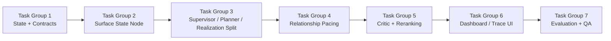

# Phase 9: Implementation Task List

This document turns the Phase 9 architecture redesign into concrete task groups.

## Purpose

- lock execution order
- make touched files predictable
- keep root-cause work separate from cosmetic fixes
- include Dashboard and evaluation work in the definition of done

## Task Group Order

## Intended Use

Read this after the Phase 9 roadmap if you need implementation order rather than design rationale.
