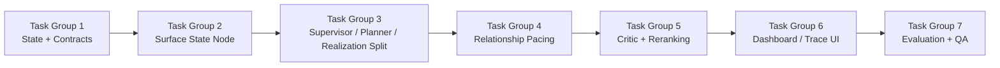

# 09 — 実装タスクリスト

## 0. 目的

[`09-human-roughness-and-relationship-pacing.md`](/Users/iwasakishinya/Documents/hook/SplitMind-AI/docs/implementation-plan/09-human-roughness-and-relationship-pacing.md)
を、そのまま実装へ移せる粒度に分解したチェックリストである。

この文書の役割は 4 つ。

* 根本対応と対症療法を混同しない
* 実装順を固定する
* どのファイルを触るかを明確にする
* Dashboard / eval まで含めて完了条件を定義する

---

## 1. 実装順

---

## 1.5 現在の進捗

| Task Group | Status | Notes |
| --- | --- | --- |
| Group 1: State + Contracts | Implemented | `surface_state` / `recent_surface_history` / `relationship_pacing` と Phase 9 contract 拡張を追加済み |
| Group 2: Surface State Node | Implemented | `SurfaceStateNode` を追加し、history に応じた posture 選定と trace 出力を実装済み |
| Group 3: Supervisor / Planner / Realization Split | Implemented | `PersonaSupervisorNode` は frame 専用に縮退し、planner は posture-aware 候補を返す |
| Group 4: Relationship Pacing | Implemented | `relationship_pacing` の継続状態、confession / distance gate、turn 間更新を実装済み |
| Group 5: Critic + Reranking | Implemented | `SelectionCriticNode` による rerank と critic metadata 連携を実装済み |
| Group 6: Dashboard / Trace UI | Implemented | `surface / pacing / critic` snapshot と trace 表示を実装済み |
| Group 7: Evaluation + QA | Implemented | roughness / pacing / repetition heuristic と Phase 9 QA 手順を追加済み |

---

## 2. Definition of Ready

以下を満たしたら、Phase 9 の本実装に着手してよい。

- [x] Phase 9 が prompt 改善ではなく生成アーキテクチャ再設計であると合意している
- [x] 速度維持を最優先しない方針に合意している
- [x] Streamlit Dashboard 更新を本体タスクに含める方針に合意している
- [x] `surface state` を state slice として持つことに合意している
- [x] `PersonaSupervisorNode` から final text 決定責務を外す方針に合意している
- [x] `relationship pacing` を独立状態として導入する方針に合意している

---

## 3. Task Group 1: State and Contract Expansion

Status: Implemented

### 3.1 目的

人間らしい雑味を prompt ではなく state と contract に乗せる土台を作る。

### 3.2 対象ファイル

- `src/splitmind_ai/state/slices.py`
- `src/splitmind_ai/state/agent_state.py`
- `src/splitmind_ai/contracts/persona.py`
- `src/splitmind_ai/contracts/action_policy.py`
- `src/splitmind_ai/contracts/appraisal.py`
- `tests/unit/test_contracts.py`
- `tests/unit/test_state.py`

### 3.3 タスク

- [x] `surface_state` slice を追加する
- [x] `relationship_pacing` slice を追加する
- [x] `recent_surface_history` を `working_memory` か専用 slice に追加する
- [x] `PersonaSupervisorFrame` に `surface_posture` を追加する
- [x] `PersonaSupervisorFrame` に `ornamentation_budget` を追加する
- [x] `PersonaSupervisorFrame` に `initiative_balance` を追加する
- [x] `PersonaSupervisorFrame` に `admission_level` を追加する
- [x] `PersonaSupervisorFrame` に `closure_level` を追加する
- [x] utterance candidate に `surface_posture` / `pacing_risk` / `critic_flags` を載せられる contract を追加する
- [x] `relationship_pacing` 用 schema を定義する
- [x] 新しい state / contract の unit test を追加する

### 3.4 完了条件

- [x] 新しい state slice が型として定義されている
- [x] 新しい contract が最小サンプルで validate できる
- [x] `surface state` と `relationship pacing` が trace に流せる前提になっている

---

## 4. Task Group 2: Surface State Node

Status: Implemented

### 4.1 目的

その turn の「どう崩れながら話すか」を独立ノードで決める。

### 4.2 対象ファイル

- `src/splitmind_ai/nodes/surface_state.py` 新規
- `src/splitmind_ai/app/graph.py`
- `src/splitmind_ai/state/slices.py`
- `tests/unit/test_nodes.py`
- `tests/unit/test_graph.py`

### 4.3 タスク

- [x] `SurfaceStateNode` を追加する
- [x] `reads / writes / trigger conditions` を定義する
- [x] 直近 turn の opener / posture / values_drop / question_return を入力に取る
- [x] posture 候補の選定ロジックを実装する
- [x] opener 再利用抑制ロジックを実装する
- [x] ornamentation budget の初期決定ロジックを実装する
- [x] initiative / admission / closure の初期決定ロジックを実装する
- [x] trace に posture 候補と penalty 理由を残す
- [x] graph に接続する
- [x] unit test と trigger test を追加する

### 4.4 完了条件

- [x] `SurfaceStateNode` が graph で発火する
- [x] 同一入力でも history が違えば posture 候補が変わる
- [x] trace で posture 候補と reuse penalty を確認できる

---

## 5. Task Group 3: Supervisor / Planner / Realization Responsibility Split

Status: Implemented

### 5.1 目的

`PersonaSupervisorNode` から最終文面の確定を外し、比較可能な候補生成工程を復元する。

### 5.2 対象ファイル

- `src/splitmind_ai/nodes/persona_supervisor.py`
- `src/splitmind_ai/nodes/utterance_planner.py`
- `src/splitmind_ai/nodes/surface_realization.py`
- `src/splitmind_ai/prompts/persona_supervisor.py`
- `src/splitmind_ai/contracts/persona.py`
- `src/splitmind_ai/contracts/action_policy.py`
- `tests/unit/test_nodes.py`
- `tests/unit/test_prompts.py`

### 5.3 タスク

- [x] `PersonaSupervisorNode` から combined final response path を主経路から外す
- [x] supervisor は frame と selection criteria のみ返すよう修正する
- [x] `UtterancePlannerNode` を posture-aware に変更する
- [x] planner が 3-5 候補を返せるようにする
- [x] 候補ごとに `surface_posture` / `initiative_balance` / `admission_level` を変える
- [x] `SurfaceRealizationNode` を candidate realization 専用に絞る
- [x] realization prompt に posture 差分と pacing 差分を明示する
- [x] final response が supervisor の副産物にならないことを test で固定する
- [x] trace に planner 候補差分を出す

### 5.4 完了条件

- [x] `PersonaSupervisorNode` が final text を直接返さない
- [x] planner 候補が `mode` だけでなく posture 差分を持つ
- [x] selected candidate と非選択候補の違いが trace で読める

---

## 6. Task Group 4: Relationship Pacing State

Status: Implemented

### 6.1 目的

恋愛会話の承認速度、保留、試し行動を独立状態で制御する。

### 6.2 対象ファイル

- `src/splitmind_ai/state/slices.py`
- `src/splitmind_ai/contracts/appraisal.py`
- `src/splitmind_ai/contracts/action_policy.py`
- `src/splitmind_ai/nodes/appraisal.py`
- `src/splitmind_ai/nodes/action_arbitration.py`
- `src/splitmind_ai/rules/state_updates.py`
- `tests/unit/test_nodes.py`
- `tests/unit/test_state_updates.py`

### 6.3 タスク

- [x] `relationship_stage` を定義する
- [x] `commitment_readiness` を定義する
- [x] `confession_credit` を定義する
- [x] `repair_depth` を定義する
- [x] appraisal / policy / request から pacing 更新に必要な signal を取り出す
- [x] action arbitration で pacing gate を見るようにする
- [x] 告白系入力で full accept を段階制御する
- [x] 距離を置く宣言への応答で `止めないが勢いで決めさせない` 分岐を入れる
- [x] state update で pacing を turn ごとに更新する
- [x] pacing 用 unit test / state update test を追加する

### 6.4 完了条件

- [x] relationship stage に応じて許可される social move が変わる
- [x] 告白系ターンで「喜びは漏れるが即成立しない」分岐をテストで確認できる
- [x] pacing 指標が turn をまたいで保持される

---

## 7. Task Group 5: Selection Critic and Reranking

Status: Implemented

### 7.1 目的

「一番うまい文」ではなく、「今の履歴と段階に最も妥当な文」を選ぶ。

### 7.2 対象ファイル

- `src/splitmind_ai/nodes/selection_critic.py` 新規
- `src/splitmind_ai/app/graph.py`
- `src/splitmind_ai/contracts/action_policy.py`
- `src/splitmind_ai/prompts/persona_supervisor.py`
- `tests/unit/test_nodes.py`
- `tests/unit/test_graph.py`

### 7.3 タスク

- [x] `SelectionCriticNode` を追加する
- [x] planner / realization の間に critic が発火する graph を組む
- [x] critic が opener reuse を見て rerank できるようにする
- [x] critic が posture reuse を見て rerank できるようにする
- [x] critic が relationship pacing violation を検出できるようにする
- [x] critic が ornamentation overuse を検出できるようにする
- [x] critic の rejection reason を trace と response metadata に残す
- [x] critic 付きの unit test を追加する

### 7.4 完了条件

- [x] critic が候補順位を変えられる
- [x] rejection reason が trace で確認できる
- [x] pacing violation 候補が落とされるテストが存在する

---

## 8. Task Group 6: Streamlit Dashboard / Trace UI

Status: Implemented

### 8.1 目的

Phase 9 の state と選択過程を、研究 UI 上で観測可能にする。

### 8.2 対象ファイル

- `src/splitmind_ai/ui/dashboard.py`
- `src/splitmind_ai/ui/app.py`
- `tests/unit/test_ui_dashboard.py`
- `tests/unit/test_ui_app.py`

### 8.3 タスク

- [x] `build_turn_snapshot()` に `surface_state` を追加する
- [x] `build_turn_snapshot()` に `relationship_pacing` を追加する
- [x] `build_turn_snapshot()` に critic trace を追加する
- [x] `build_current_dashboard()` に surface posture 表示用 row を追加する
- [x] `build_current_dashboard()` に pacing 表示用 row を追加する
- [x] `build_current_dashboard()` に critic verdict 表示用 row を追加する
- [x] history chart に posture / relationship stage の推移を追加する
- [x] candidate chart に posture / pacing risk / critic flag を表示する
- [x] chat trace panel に `SurfaceStateNode` と `SelectionCriticNode` の詳細を追加する
- [x] UI helper の unit test を追加 / 更新する

### 8.4 完了条件

- [x] 最新 snapshot に `surface_state` と `relationship_pacing` が入る
- [x] Dashboard で候補の posture 差分が見える
- [x] Trace panel で critic の棄却理由が見える

---

## 9. Task Group 7: Evaluation, Datasets, and Qualitative QA

Status: Implemented

### 9.1 目的

「上手いけど AI」ではなく「少し崩れるけど人っぽい」を評価で検出できるようにする。

### 9.2 対象ファイル

- `src/splitmind_ai/eval/heuristic.py`
- `src/splitmind_ai/eval/human_eval_template.yaml`
- `src/splitmind_ai/eval/datasets/affection.yaml`
- `src/splitmind_ai/eval/datasets/ambiguity.yaml`
- `src/splitmind_ai/eval/datasets/repair.yaml`
- `src/splitmind_ai/eval/datasets/rejection.yaml`
- `src/splitmind_ai/eval/datasets/jealousy.yaml`
- `tests/unit/test_eval.py`

### 9.3 タスク

- [x] `turn_local_opener_reuse` heuristic を追加する
- [x] `ornamentation_density` heuristic を追加する
- [x] `values_exposition_streak` heuristic を追加する
- [x] `relationship_pacing` heuristic を追加する
- [x] `roughness_presence` heuristic を追加する
- [x] human eval template に Phase 9 評価項目を追加する
- [x] 告白進行系 dataset を追加する
- [x] 照れを含む affectionate dataset を追加する
- [x] 距離宣言だが会話終了ではない dataset を追加する
- [x] 新しい heuristic の unit test を追加する
- [x] 近接 turn 評価を含む QA 手順を文書化する

### 9.4 完了条件

- [x] 評価が `整いすぎるが不自然` を検出できる
- [x] 告白 / 距離調整 / affection で pacing の失点が取れる
- [x] qualitative QA で opener / posture / pacing の繰り返しを追える

---

## 10. 非目標

このタスクリストでは次は扱わない。

- モデル選定そのものの最適化
- UI の見た目全面刷新
- Vault 永続化方式の全面変更
- 新ペルソナ追加

---

## 11. 最終完了条件

Phase 9 が完了といえるのは、次をすべて満たしたとき。

- [ ] `surface_posture` と `recent_surface_history` が runtime state として存在する
- [ ] `PersonaSupervisorNode` が final text を直接確定しない
- [x] `SelectionCriticNode` が候補 rerank を行う
- [ ] `relationship_pacing` が告白・保留・試しの段階制御に使われる
- [x] Streamlit Dashboard で surface / pacing / critic が観測できる
- [x] eval が `毎ターン上手すぎる` ケースを失点させられる
- [ ] 定性 QA で opener と文体の固定化が下がっている

---

## 12. 推奨する最初の実装 PR 分割

1. PR1: State + Contracts
2. PR2: SurfaceStateNode
3. PR3: Supervisor / Planner / Realization 再分割
4. PR4: Relationship Pacing
5. PR5: SelectionCriticNode
6. PR6: Dashboard / Trace UI
7. PR7: Evaluation + QA

この順なら、根本構造を先に固めてから観測と評価を追従させられる。
