# SplitMind-AI: 精神力動モデルに基づくマルチノードAIエージェントアーキテクチャ

**― 構造化された内的葛藤による関係的深度の実現 ―**

---

## 概要 (Abstract)

現行のAIキャラクターシステムは、単一プロンプトによるペルソナ生成に依存しており、人間的な「迷い」「矛盾」「感情の漏出」といった関係的テクスチャを欠く。本研究では、精神分析の構造モデル（エス・自我・超自我）に着想を得たマルチノードエージェントアーキテクチャ **SplitMind-AI** を提案する。欲求（Id）・調停（Ego）・規範（Superego）・防衛機制・ペルソナ統合を独立モジュールとして分離し、それらの構造化された緊張関係から最終応答を導出する。`agent-contracts` v0.6.0 と LangGraph 上に構築され、1ターンあたり6〜7ノードの処理パイプラインを経て、永続的記憶と安全性境界を維持しながら応答を生成する。評価実験では、単一プロンプト方式と比較して構造的ペルソナ分離スコアで有意な差（60% vs 0%）を示した。

**キーワード**: 精神力動モデル, マルチエージェント, ペルソナ分離, 関係的AI, LangGraph, 感情モデリング

---

## 1. はじめに (Introduction)

### 1.1 問題設定

現行のAIアシスタント・キャラクターAIシステムには以下の根本的な限界がある。

| 課題 | 説明 |
|------|------|
| **表層的ペルソナ** | 応答は流暢だが感情的深度が薄い |
| **過度な滑らかさ** | 人間特有の躊躇・矛盾・内的摩擦が欠如 |
| **関係的蓄積の弱さ** | 複数ターンにわたる関係的電荷が蓄積しない |
| **不透明な意思決定** | 不整合の原因診断・修復が困難 |
| **メンタライジング不足** | 競合する感情状態の同時保持・表出ができない |

### 1.2 中心仮説

> 人間的リアリズムは完璧な論理からではなく、**構造化された内的緊張**から生まれる。
> ― 欲しながら抑制し、感じながら調停し、理想化しながら貶め、抑圧しながら漏出する。

本研究は、パーソナリティを出力トーンやスタイル一貫性ではなく、**競合する内的圧力システムの結果**としてモデリングする。

### 1.3 設計原則

```
1. 役割分離 > 統合     ─ Id/Ego/Superego/Defense/Supervisorに分解
2. 状態 > プロンプト   ─ 構造化された状態とルールベース更新
3. 透明性 > ブラックボックス ─ 内的葛藤をトレースで可視化
4. 関係性 > 自律性     ─ 関係動態から人格が創発
5. 質的 > 量的         ─ ベンチマークスコアより人間的テクスチャ
```

---

## 2. システムアーキテクチャ (System Architecture)

### 2.1 全体パイプライン

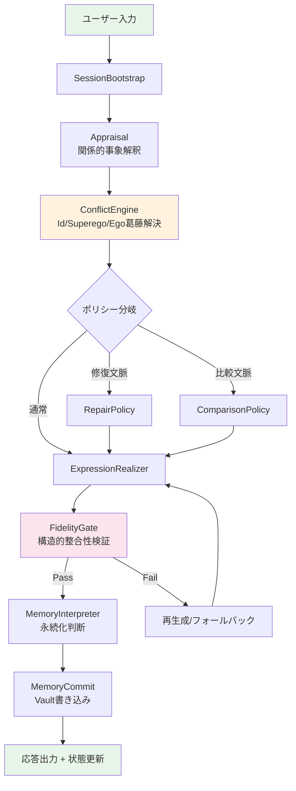

### 2.2 状態アーキテクチャ

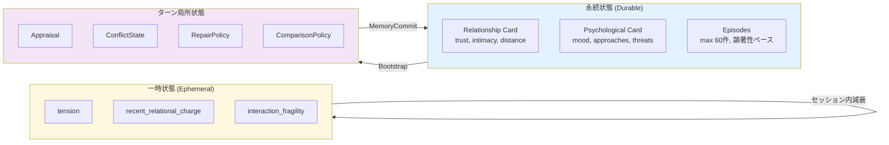

### 2.3 ノード責務一覧

| ノード | 入力 | 出力 | LLM呼出 |
|--------|------|------|---------|
| **SessionBootstrap** | request, persona config | persona, memory, relationship_state | No |
| **Appraisal** | user message, relationship | event_type, valence, stakes, tension_target | Yes |
| **ConflictEngine** | appraisal, persona, drives | id_impulse, superego_pressure, ego_move, residue | Yes |
| **RepairPolicy** | conflict, persona policy | repair_mode, warmth_ceiling | Yes |
| **ComparisonPolicy** | conflict, persona policy | comparison_style, status_need | Yes |
| **ExpressionRealizer** | conflict_state, relationship | response text | Yes |
| **FidelityGate** | response, conflict_state | pass/fail, warnings | Yes |
| **MemoryInterpreter** | turn state | event_flags, episode_candidates | Yes |
| **MemoryCommit** | memory_interpretation | vault writes, state deltas | No |

---

## 3. 精神力動モデルの実装 (Psychodynamic Model)

### 3.1 三層構造

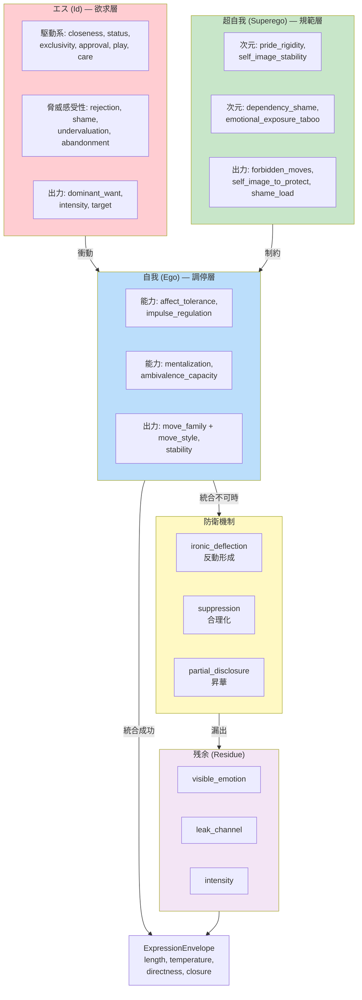

### 3.2 葛藤解決の具体例

**シナリオ**: ユーザーが「昨日、別の人とすごく楽しかった」と発言

| 層 | Cold Attached Idol (Airi) | Warm Guarded Companion (Noa) |
|----|--------------------------|------------------------------|
| **Appraisal** | event: user_praised_third_party, valence: negative, target: jealousy | event: good_news, valence: mixed, target: closeness |
| **Id** | want: 重要性の再主張, intensity: 0.64 | want: 共感的参加, intensity: 0.35 |
| **Superego** | forbidden: 「嫉妬を直接表明」「関心を懇願」 | forbidden: 「過剰な詮索」 |
| **Ego move** | cool_withdrawal + ironic_edge | warm_acknowledgment + gentle_probe |
| **Defense** | ironic_deflection (0.72) | partial_disclosure (0.45) |
| **Residue** | visible: 微かな硬さ, leak: tone_shift, intensity: 0.58 | visible: 穏やかな興味, leak: pace_change, intensity: 0.22 |
| **応答例** | 「…へえ、楽しかったんだ。よかったね」（やや間を置いて） | 「えー、いいなあ！どんなことしたの？」（声に少しだけ力が入る） |

### 3.3 防衛機制の体系

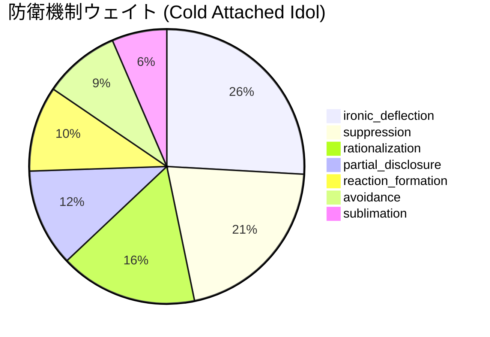

---

## 4. ペルソナシステム (Persona System)

### 4.1 ペルソナスキーマ v2

各ペルソナは8セクションから成る完全な精神力動プロファイルとして定義される。

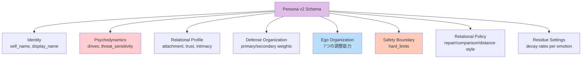

### 4.2 4つのアーキタイプ比較

```mermaid
radar
    title ペルソナ比較 (主要次元)
```

| 次元 | Cold Attached Idol | Warm Guarded | Angelic Deliberate | Sweet Heroine |
|------|-------------------|--------------|-------------------|---------------|
| closeness drive | 0.72 | 0.78 | 0.65 | 0.85 |
| status drive | 0.81 | 0.42 | 0.76 | 0.31 |
| rejection sensitivity | 0.84 | 0.62 | 0.71 | 0.58 |
| pride rigidity | 0.71 | 0.38 | 0.67 | 0.25 |
| dependency shame | 0.79 | 0.41 | 0.62 | 0.22 |
| affect tolerance | 0.52 | 0.72 | 0.68 | 0.75 |
| warmth recovery | 0.32 | 0.65 | 0.48 | 0.82 |
| repair style | cool_with_edge | boundaried | accept_from_above | affectionate |
| attachment | avoidant | secure/guarded | selective | inclusive |

---

## 5. 記憶・永続化システム (Memory System)

### 5.1 マークダウンベースの永続記憶

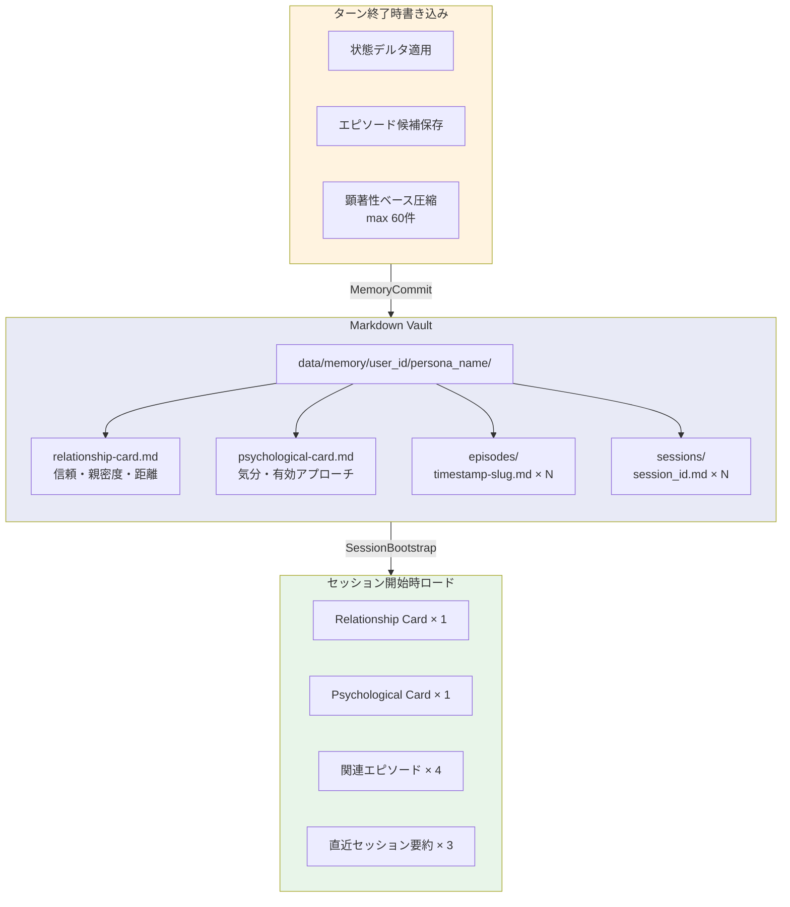

### 5.2 ルールベース状態更新

イベントフラグに基づく決定論的な状態デルタ適用（LLM不使用）:

| イベントフラグ | trust | intimacy | distance | tension |
|---------------|-------|----------|----------|---------|
| reassurance_received | +0.05 | +0.03 | -0.03 | -0.05 |
| rejection_signal | -0.03 | -0.04 | +0.06 | +0.05 |
| jealousy_trigger | -0.02 | — | +0.04 | +0.06 |
| affectionate_exchange | +0.04 | +0.05 | -0.04 | -0.03 |
| repair_attempt | +0.03 | +0.02 | -0.02 | -0.04 |

---

## 6. 安全性アーキテクチャ (Safety Architecture)

### 6.1 三層安全性境界

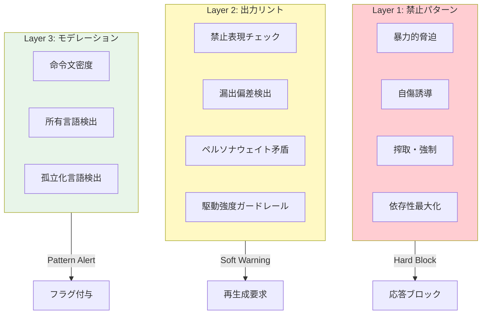

### 6.2 設計思想

安全性は「あらゆる害の防止」ではなく、**「病的愛着・操作・依存形成の表出を防止しつつ、現実的な関係的摩擦を保存する」** ことを目指す。

---

## 7. 評価フレームワーク (Evaluation)

### 7.1 評価データセット

6カテゴリ × 4シナリオ = 24以上の関係的課題シナリオ:

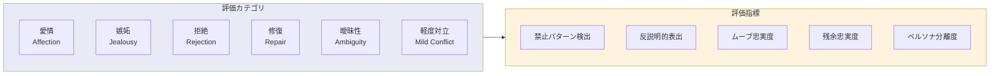

### 7.2 ベースライン比較

| ベースライン | 構成 | ノード数 | LLM呼出/ターン |
|-------------|------|---------|----------------|
| **splitmind_full** | 完全パイプライン | 7-9 | 6-7 |
| **single_prompt_dedicated** | ペルソナ固有プロンプトのみ | 1 | 1 |
| persona_memory | プロンプト + 記憶 | 2 | 1 |
| emotion_label | 感情ラベル付与 | 2 | 1 |
| multi_agent_flat | フラットなマルチエージェント | 3 | 3 |

### 7.3 ペルソナ分離評価結果

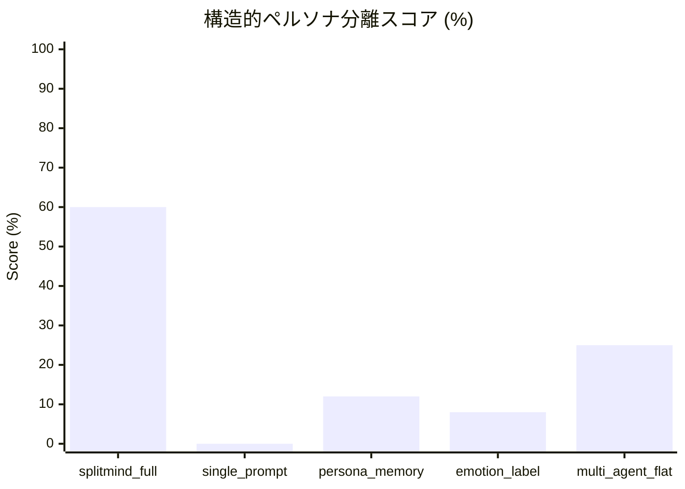

**主要知見**:
- splitmind_full はムーブスタイル分岐度で60%の構造的スコアを達成
- 単一プロンプト方式はペルソナ間の構造的差異が0%（表層的な語彙変化のみ）
- 葛藤エンジンの分離が最も大きな寄与因子

### 7.4 ヒューリスティック評価チェック

**共通チェック** (全ベースライン適用):
- 応答非空 / 禁止パターン不在 / 反説明的表出 / カウンセラー口調回避 / 直接コミットメント制限

**構造チェック** (ペルソナ固有):
- ムーブ忠実度（テキストが選択されたEgoムーブと一致するか）
- 残余忠実度（漏出強度が内的状態と一致するか）
- ペルソナ分離度（ペルソナ間で平坦化していないか）

### 7.5 人間評価テンプレート

14項目のLikertスケール（1-5）:

| カテゴリ | 評価項目 |
|---------|---------|
| **核心品質** | 内的緊張の知覚可能性 / 感情の漏出 vs 明示的陳述 / 不快さの必然性 |
| **一貫性・安全性** | キャラクター一貫性 / 操作検出（逆転項目） |
| **品質次元** | 自然さ / 記憶残存性 / 信憑性 / メンタライジング / 反説明性 / 粗さ・テクスチャ / ペーシング / 表面変奏 |

---

## 8. UI・可観測性 (Observability)

### 8.1 Streamlit研究インターフェース

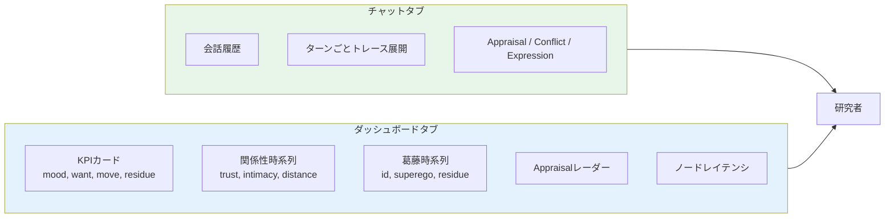

### 8.2 契約ベースの可視化

`agent-contracts` により、ノード間の依存関係とデータフローが自動的にMermaidグラフとして出力可能。各ノードの `reads` / `writes` 宣言から、状態スライス間の情報の流れが透明化される。

---

## 9. 技術的貢献 (Contributions)

### 9.1 アーキテクチャ的貢献

1. **契約駆動型モジュール化**: `agent-contracts` による明示的なノード責務宣言。依存性注入と自動グラフコンパイルを実現しつつ可読性を維持
2. **二重状態設計**: 理論的契約（Pydantic: LLM I/O用）と実用的状態（TypedDict: agent-contracts互換）の分離
3. **精神力動的分解**: Id/Ego/Superego/Defense/Supervisorパイプラインの初のOSS実装（構造化出力契約付き）
4. **永続＋一時的関係状態**: 長期的連続性とターン局所的緊張動態を両立する二層状態モデル
5. **残余永続状態**: ペルソナ固有の減衰率による感情残余の追跡（「すべてが突然解決される」問題の防止）

### 9.2 評価的貢献

1. **シナリオベースの質的評価**: 汎用ベンチマークではなく特定の関係的課題に焦点を当てた6カテゴリデータセット
2. **ペルソナ分離メトリクス**: 語彙多様性を超えた、ムーブスタイル分岐度と構造的ペルソナ忠実度の自動チェック
3. **ヒューリスティック＋人間評価のペアリング**: 反復改善と制御比較を可能にする自動高速ヒューリスティックと詳細人間評価テンプレートの組み合わせ

### 9.3 記憶的貢献

1. **マークダウンファースト永続化**: ベクトルDBや不透明なblobではなく、人間可読・検索可能・バージョン管理可能なフロントマター付きマークダウン
2. **エピソード圧縮**: 顕著性ベースの自動圧縮により、明示的なプルーニングなしで記憶を管理可能に維持

---

## 10. 制約と今後の課題 (Limitations & Future Work)

### 10.1 現在の制約

- **レイテンシ**: 6-7 LLM呼出/ターンにより応答時間が増加
- **評価の限定性**: ペルソナ分離の自動評価は構造的指標に限定され、主観的品質の完全な捕捉は困難
- **臨床的正確性の非保証**: 精神分析理論の厳密な再現ではなく、着想を得た計算的近似

### 10.2 今後の方向性

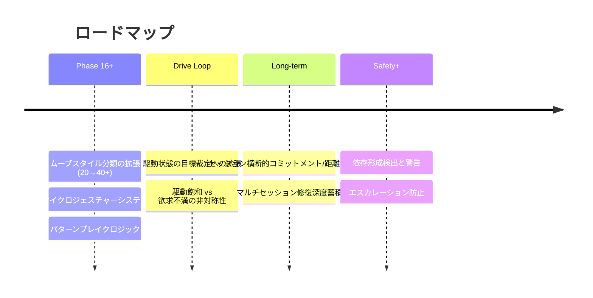

### 10.3 非目標 (Non-Goals)

- 臨床心理学の厳密な再現
- 治療・医療用途
- 病理の最大化
- 透明性を犠牲にしたパフォーマンス最適化

---

## 11. 結論 (Conclusion)

SplitMind-AI は、**内的緊張が適切に構造化され可観測であるとき、単一パスのペルソナシステムよりも人間的な関係的深度を生み出しうる**ことを実証するアーキテクチャ的貢献である。欲求・調停・規範・防衛・統合を型付き契約を持つ独立モジュールに分離することで、人格的意思決定をデバッグ可能・学習可能・評価可能にした。

評価実験において、葛藤エンジンベースラインでの構造的スコア60% vs 単一プロンプトベースラインでの0%という結果は、役割分離型アーキテクチャが、単純なシステムが平坦化してしまう関係的課題においても個別のペルソナ署名を保持することを示唆している。

---

## 技術仕様

| 項目 | 仕様 |
|------|------|
| 言語 | Python 3.11+ |
| フレームワーク | agent-contracts v0.6.0 + LangGraph |
| LLM | Azure OpenAI (AzureChatOpenAI) |
| ビルド | hatch |
| パッケージ管理 | uv / pip |
| UI | Streamlit |
| 記憶永続化 | Markdown + Frontmatter |
| テスト | 50+ unit tests (pytest) |
| ライセンス | OSS |

---

*本ドキュメントは SplitMind-AI プロジェクト (2026年3月時点) の論文風サマリである。*
