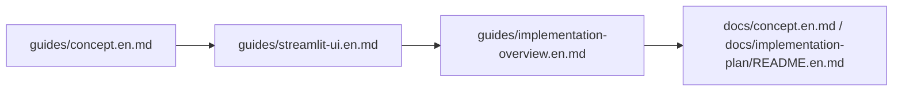

# Guides

`guides/` contains practical documentation for people who want to use, inspect, or extend SplitMind-AI without starting from the full concept spec.

## What This Directory Is For

- learn the core idea quickly before reading the full spec
- understand how to inspect the Streamlit UI
- get an implementation-oriented map of the current codebase
- understand the current conflict-engine runtime and persistent memory flow

## Recommended Reading Order

1. [concept.en.md](./concept.en.md)
2. [streamlit-ui.en.md](./streamlit-ui.en.md)
3. [implementation-overview.en.md](./implementation-overview.en.md)

## Guide Index

- [concept.en.md](./concept.en.md)
  Brief explanation of the problem SplitMind-AI is trying to solve and the core modeling idea.
- [streamlit-ui.en.md](./streamlit-ui.en.md)
  How to launch and inspect the Streamlit research UI, especially the dashboard and persistent memory flow.
- [implementation-overview.en.md](./implementation-overview.en.md)
  How a turn moves through the current runtime, including memory interpretation and markdown persistence.

## Longer References

- [README.md](../README.md)
- [README.ja.md](../README.ja.md)
- [docs/concept.en.md](../docs/concept.en.md)
- [docs/concept.md](../docs/concept.md)
- [docs/implementation-plan/README.en.md](../docs/implementation-plan/README.en.md)
- [docs/implementation-plan/README.md](../docs/implementation-plan/README.md)
- [docs/implementation-plan/15-persona-identity-and-persistent-memory.md](../docs/implementation-plan/15-persona-identity-and-persistent-memory.md)
- [docs/eval/phase9-qualitative-qa.md](../docs/eval/phase9-qualitative-qa.md)
