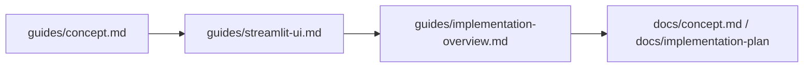

# Guides

`guides/` は、SplitMind-AI を使う人と読む人のための実用ガイド置き場です。
`README` だけでは足りない背景説明と、`docs/` ほど重くない実践的な案内をまとめます。

## このディレクトリの役割

- Streamlit UI の見方を短時間で掴めるようにする
- SplitMind-AI の考え方を要点だけで理解できるようにする
- 現在の実装がどう組み上がっているかを追いやすくする
- Phase 9 以降の `surface / pacing / critic` 追加を、実装と UI の両方から追いやすくする

## 想定読者

- UI を触りながら挙動を観察したい人
- コンセプトを短く把握したい人
- 実装を読む前に全体像を知りたい人

## 推奨読書順

1. [concept.md](./concept.md)
2. [streamlit-ui.md](./streamlit-ui.md)
3. [implementation-overview.md](./implementation-overview.md)

## ガイド一覧

- [concept.md](./concept.md)
  - SplitMind-AI が何を目指しているか、どんな内部概念で会話を組み立てるかを短く説明する
- [streamlit-ui.md](./streamlit-ui.md)
  - Streamlit UI の画面構成と、特に `surface / pacing / critic` を含む Dashboard の読み方を説明する
- [implementation-overview.md](./implementation-overview.md)
  - 現在のコードベースで 1 ターンがどう実行されるかを、Phase 9 の rerank まで含めて説明する

## 詳細資料

- [README.md](../README.md)
- [README.ja.md](../README.ja.md)
- [docs/concept.md](../docs/concept.md)
- [docs/implementation-plan/README.md](../docs/implementation-plan/README.md)
- [docs/eval/phase9-qualitative-qa.md](../docs/eval/phase9-qualitative-qa.md)
