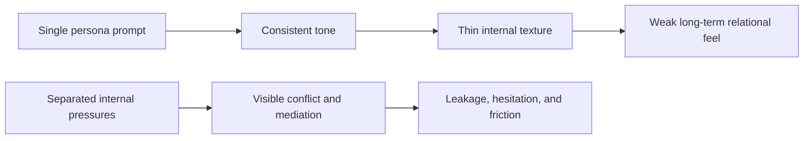

# Concept Guide

This guide is the short English companion to [docs/concept.en.md](../docs/concept.en.md). Its job is to explain the project direction without requiring the full specification.

## The Problem SplitMind-AI Tries To Solve

A single persona prompt can produce a stable tone, but it often produces shallow inner life. The result is usually polished language without visible conflict, hesitation, or relational residue.

Typical failure modes:

- responses are smooth but emotionally thin
- long conversations do not retain the feeling of changing relational pressure
- persona stays at the level of style rather than decision logic
- when a response feels off, it is hard to locate which layer failed

SplitMind-AI approaches this by modeling internal tension explicitly instead of hiding it inside one prompt.

## Core Idea

The system separates response formation into competing functions:

- `Id`: desire, attachment pressure, aversion, immediate impulse
- `Ego`: mediation, sequencing, feasibility, social calibration
- `Superego`: norms, role coherence, shame, ideal self pressure
- `Defense`: transformation pattern when pressure cannot be expressed directly
- `Persona Supervisor`: integrates the active pressures into a response frame

The point is not to simulate Freud literally. The point is to create a structured way to generate:

- hesitation
- contradiction
- guarded warmth
- emotional leakage
- a more inspectable relation between internal state and final wording

## Runtime Shape

The current default runtime uses two model calls per turn.

1. Internal dynamics analysis
2. Persona supervisor generation and selection

Rule-based state updates, safety filters, and memory persistence happen in Python around those calls.

## Why This Matters

This architecture is meant to improve both expression and debuggability.

- You can inspect which pressures were active.
- You can compare baselines against simpler systems.
- You can tune directness, containment, tension, and drive persistence explicitly.
- You can reason about why a reply felt too flat, too harsh, or too revealing.

## What The Project Is Not

SplitMind-AI is not intended to be:

- a clinically valid psychology simulator
- therapy or mental health advice
- a system that optimizes for manipulation or dependency
- a license to increase harmful behavior in the name of realism

## Next Reading

- [streamlit-ui.en.md](./streamlit-ui.en.md)
- [implementation-overview.en.md](./implementation-overview.en.md)
- [docs/concept.en.md](../docs/concept.en.md)
