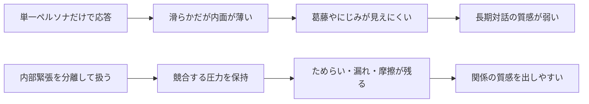
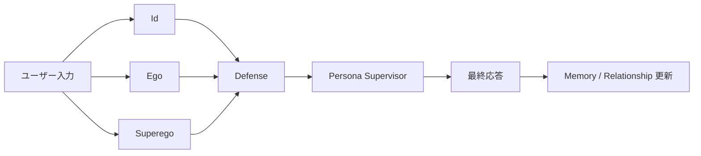
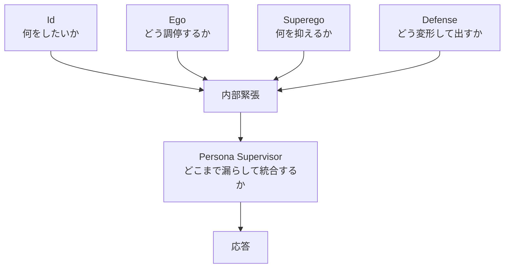
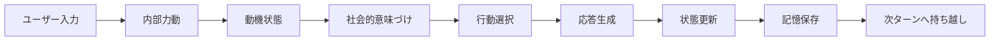

# コンセプトガイド

このガイドは、`docs/concept.md` の案内版です。
仕様書全体を読む前に、SplitMind-AI が何を解こうとしているのかを短く掴むためのものです。

## SplitMind-AI が解こうとしている問題

単一のペルソナプロンプトだけで会話を作ると、口調は整っても内面の厚みが薄くなりがちです。
その結果、次のような問題が起きやすくなります。

- 応答が常に滑らかで、葛藤やためらいが見えない
- 関係の揺れが長期会話に残りにくい
- キャラらしさが表面的な文体にとどまりやすい
- 違和感が出たときに、どの層で崩れたか分析しにくい

SplitMind-AI は、これを「内部緊張を構造として持つ」ことで改善しようとします。

## 中核仮説

SplitMind-AI の中心にある考えは単純です。

- 単一ペルソナから直接応答を出すのではなく
- 複数の内部圧力をいったん分けて扱い
- その緊張関係から最終応答を作る

人間らしさは、単なる正しさや文体だけではなく、
欲しさ、抑制、迷い、距離調整、にじみのような内部のズレから生まれる、という前提です。

## 主要概念

### Id

欲求、衝動、執着、接近したさ、反発したさのような、生のドライブを表す層です。
礼儀や安全性よりも、まず「何をしたいか」を持ち込みます。

### Ego

欲求をそのまま出すのではなく、関係や状況に合わせて調停する層です。
会話を壊さずに進めるにはどう出すかを考えます。

### Superego

規範、理想像、役割整合性の圧力を持つ層です。
その応答が persona や価値観に反していないかを引き締めます。

### Defense

内部圧力をそのまま出せないときに、どう変形して出すかを決める表現戦略です。
抑圧、回避、合理化、皮肉な逸らしのような動きを含みます。

### Persona Supervisor

内部で競合している要素を、最終的に「このキャラクターらしい」方向へ統合する上位層です。
何を出すかだけでなく、どこまで漏らすかも決めます。

### Leakage

抑えたはずの感情や圧力が、完全には消えずに表面へ残ることです。
短さ、冷たさ、微妙な棘、回避、温度差のような形で現れます。

### Appraisal

ユーザー発話を、単なる事実ではなく「自分にとって何を意味するか」に変換する層です。
受容なのか拒絶なのか、競争なのか修復なのか、といった主観的意味づけを作ります。

### Memory

関係状態、気分、感情エピソード、嗜好の断片をセッションをまたいで持ち越す層です。
会話の連続性を作るための土台になります。

### Drive State

現行実装では、イド由来の欲求候補は単発の `dominant_desire` ではなく、持続する `drive_state` と `inhibition_state` に集約されます。
ここには強度だけでなく、target、frustration、carryover、suppression、satiation のような残留量も含まれます。

### Motivational State

`InternalDynamics` が出した仮説と、前ターンから残った residue を統合して、次の一手に効く drive loop を作る層です。
現行 runtime では `MotivationalStateNode` がこの役割を担い、その後の appraisal と action selection に直接つながります。

## 会話がどう進むか

大まかな流れは次の通りです。

1. ユーザー入力
2. 内部力動の生成
3. 動機状態の更新
4. 社会的意味づけ
5. 行動選択
6. 応答生成
7. 状態更新と記憶保存

ひとつの文をその場で直線的に書くのではなく、内部状態を更新しながら turn を組み立てるのが特徴です。

現行コードでは、この「動機状態」が `drive_state` として保持され、Streamlit UI でも `Top Drive` や `Drive Residue` として観測できます。

## このプロジェクトが目指していないもの

- 臨床心理学や精神分析の正確な再現
- セラピーや医療の代替
- 有害性や依存性の最大化

SplitMind-AI は、心理学用語をそのまま診断目的で使うものではなく、
会話エージェントの設計原理として借りているプロジェクトです。

## どこまでが概念で、どこからが実装か

このガイドは概念の入口です。
詳細な仕様や背景は [docs/concept.md](../docs/concept.md) を参照してください。

現在のコードが実際にどう動いているかは、[implementation-overview.md](./implementation-overview.md) にまとめています。
