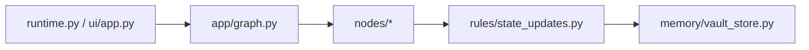

# Implementation Overview Guide

This guide describes how the current codebase executes a turn. It is based on the implementation under `src/`, not only on future plans.

## Entry Points

### CLI

The CLI entry point is `src/splitmind_ai/app/runtime.py`.

- `run_turn`
  Executes one turn and returns the response plus trace data.
- `run_session`
  Runs a terminal chat loop and keeps session state across turns.

### Streamlit UI

The research UI entry point is `src/splitmind_ai/ui/app.py`.

It wraps the same runtime graph, then keeps chat history, traces, and dashboard snapshots inside Streamlit session state.

## High-Level Execution Flow

The graph is built in `src/splitmind_ai/app/graph.py` and coordinates the main nodes:

1. `SessionBootstrapNode`
2. `InternalDynamicsNode`
3. `MotivationalStateNode`
4. `SocialCueNode`
5. `AppraisalNode`
6. `ActionArbitrationNode`
7. `PersonaSupervisorNode`
8. `UtterancePlannerNode`
9. `SurfaceRealizationNode`
10. `MemoryCommitNode`

The exact state handed between nodes is typed through contracts and state slices.

## Where Major Responsibilities Live

### Contracts

`src/splitmind_ai/contracts/` contains Pydantic models for structured outputs and internal data exchange.

### State

`src/splitmind_ai/state/` contains typed state slices such as relationship state, mood, drive state, inhibition state, and trace-friendly snapshots.

### Prompts

`src/splitmind_ai/prompts/` contains prompt builders for the internal dynamics and persona supervisor stages.

### Rules

`src/splitmind_ai/rules/state_updates.py` performs rule-based state transitions after model outputs are interpreted.

`src/splitmind_ai/rules/safety.py` applies explicit safety boundaries.

### Memory

`src/splitmind_ai/memory/vault_store.py` persists state into the Obsidian-style vault structure.

### Evaluation

`src/splitmind_ai/eval/` contains datasets, baselines, reporting, and observability helpers for comparative evaluation.

## What To Read In Code First

If you want to understand behavior quickly, this order works well:

1. `src/splitmind_ai/app/runtime.py`
2. `src/splitmind_ai/app/graph.py`
3. `src/splitmind_ai/nodes/internal_dynamics.py`
4. `src/splitmind_ai/nodes/persona_supervisor.py`
5. `src/splitmind_ai/rules/state_updates.py`
6. `src/splitmind_ai/memory/vault_store.py`

## Related Docs

- [streamlit-ui.en.md](./streamlit-ui.en.md)
- [docs/concept.en.md](../docs/concept.en.md)
- [docs/implementation-plan/README.en.md](../docs/implementation-plan/README.en.md)
