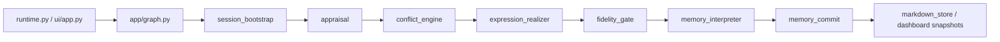

# Implementation Overview Guide

This guide summarizes how one turn executes in the current `src/` implementation.

## Entry Points

### CLI

The CLI entry point is [runtime.py](/Users/iwasakishinya/Documents/hook/SplitMind-AI/src/splitmind_ai/app/runtime.py).

- `run_turn`
  Executes one turn and returns the resulting state.
- `run_session`
  Runs a terminal multi-turn loop.

### Streamlit UI

The research UI entry point is [app.py](/Users/iwasakishinya/Documents/hook/SplitMind-AI/src/splitmind_ai/ui/app.py).

It uses the same graph while keeping:

- chat history
- traces
- turn snapshots
- dashboard view-models

inside Streamlit session state.

## Active Graph

The graph is built in [graph.py](/Users/iwasakishinya/Documents/hook/SplitMind-AI/src/splitmind_ai/app/graph.py).

The default pipeline is:

1. `session_bootstrap`
2. `appraisal`
3. `conflict_engine`
4. `expression_realizer`
5. `fidelity_gate`
6. `memory_commit`
7. `error_handler`

## Node Responsibilities

### `SessionBootstrapNode`

- normalizes request and session data
- loads persona
- restores `relationship_state.durable`, mood, and memory from markdown persistent memory
- initializes `relationship_state.ephemeral` and `working_memory`
- keeps `persona.identity.self_name` in internal session metadata

### `AppraisalNode`

Interprets the latest user message as a relational event and produces:

- `event_type`
- `valence`
- `target_of_tension`
- `stakes`

inside `appraisal`.

### `ConflictEngineNode`

Combines persona priors and `appraisal` into:

- `id_impulse`
- `superego_pressure`
- `ego_move`
- `residue`
- `expression_envelope`

inside `conflict_state`.

### `ExpressionRealizerNode`

- produces exactly one final reply from `conflict_state` and `relationship_state`
- uses structured prompts when an LLM is available
- falls back to deterministic generation otherwise

### `FidelityGateNode`

Checks whether the realized response preserves the selected move and residue.

It records:

- `move_fidelity`
- `residue_fidelity`
- `structural_persona_fidelity`
- `anti_exposition`
- `hard_safety`

in trace output.

### `MemoryInterpreterNode`

Interprets what this turn should leave behind in persistent memory and working memory.

It returns:

- `event_flags`
- `active_themes`
- `current_episode_summary`
- `recent_conflict_summary`

for `memory_commit`.

### `MemoryCommitNode`

- updates `relationship_state` and `mood` with rules
- updates the `relationship-card` and `psychological-card`
- updates memory candidates and working memory
- writes episode digests into markdown persistent memory

### `ErrorNode`

Returns a fallback reply when a node fails or a contract breaks.

## State Slices

The important current slices are:

- `request`
- `response`
- `persona`
- `relationship_state`
- `mood`
- `memory`
- `working_memory`
- `appraisal`
- `conflict_state`
- `trace`
- `_internal`

The key design split is:

1. `persona`
   static personality structure
   including `identity.self_name`
2. `relational_profile`
   static priors for relating to others
3. `relationship_state`
   dynamic state for this specific user

## Prompt Layer

Active prompt builders live in [conflict_pipeline.py](/Users/iwasakishinya/Documents/hook/SplitMind-AI/src/splitmind_ai/prompts/conflict_pipeline.py).

The current rule is:

- do not use persona as direct voice instructions
- use psychodynamics, relational profile, defense, and ego organization as structural priors
- derive expression from `conflict_state + relationship_state`

## What To Read First

If you want to understand behavior quickly, this order works well:

1. [runtime.py](/Users/iwasakishinya/Documents/hook/SplitMind-AI/src/splitmind_ai/app/runtime.py)
2. [graph.py](/Users/iwasakishinya/Documents/hook/SplitMind-AI/src/splitmind_ai/app/graph.py)
3. [appraisal.py](/Users/iwasakishinya/Documents/hook/SplitMind-AI/src/splitmind_ai/nodes/appraisal.py)
4. [conflict_engine.py](/Users/iwasakishinya/Documents/hook/SplitMind-AI/src/splitmind_ai/nodes/conflict_engine.py)
5. [expression_realizer.py](/Users/iwasakishinya/Documents/hook/SplitMind-AI/src/splitmind_ai/nodes/expression_realizer.py)
6. [fidelity_gate.py](/Users/iwasakishinya/Documents/hook/SplitMind-AI/src/splitmind_ai/nodes/fidelity_gate.py)
7. [memory_commit.py](/Users/iwasakishinya/Documents/hook/SplitMind-AI/src/splitmind_ai/nodes/memory_commit.py)
8. [memory_interpreter.py](/Users/iwasakishinya/Documents/hook/SplitMind-AI/src/splitmind_ai/nodes/memory_interpreter.py)
9. [state_updates.py](/Users/iwasakishinya/Documents/hook/SplitMind-AI/src/splitmind_ai/rules/state_updates.py)
10. [markdown_store.py](/Users/iwasakishinya/Documents/hook/SplitMind-AI/src/splitmind_ai/memory/markdown_store.py)

## Related Docs

- [streamlit-ui.en.md](/Users/iwasakishinya/Documents/hook/SplitMind-AI/guides/streamlit-ui.en.md)
- [concept.en.md](/Users/iwasakishinya/Documents/hook/SplitMind-AI/docs/concept.en.md)
- [README.en.md](/Users/iwasakishinya/Documents/hook/SplitMind-AI/docs/implementation-plan/README.en.md)
- [15-persona-identity-and-persistent-memory.md](/Users/iwasakishinya/Documents/hook/SplitMind-AI/docs/implementation-plan/15-persona-identity-and-persistent-memory.md)
