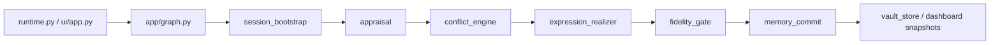

# 実装概要ガイド

このガイドは、現在の `src/` 実装に基づいて、1 ターンがどう実行されるかを短く整理したものです。

## エントリポイント

### CLI

CLI の入口は [runtime.py](/Users/iwasakishinya/Documents/hook/SplitMind-AI/src/splitmind_ai/app/runtime.py) です。

- `run_turn`
  1 ターンだけ実行して結果 state を返します。
- `run_session`
  ターミナルで multi-turn の会話ループを回します。

### Streamlit UI

研究 UI の入口は [app.py](/Users/iwasakishinya/Documents/hook/SplitMind-AI/src/splitmind_ai/ui/app.py) です。

同じ graph を使いながら、

- chat history
- traces
- turn snapshots
- dashboard view-model

を Streamlit session state に保持します。

## 現行 graph

graph は [graph.py](/Users/iwasakishinya/Documents/hook/SplitMind-AI/src/splitmind_ai/app/graph.py) で組み立てています。

現在の既定 pipeline は次の 7 ノードです。

1. `session_bootstrap`
2. `appraisal`
3. `conflict_engine`
4. `expression_realizer`
5. `fidelity_gate`
6. `memory_commit`
7. `error_handler`

## 各ノードの役割

### `SessionBootstrapNode`

- request / session 情報を正規化
- persona を読み込む
- vault から `relationship_state.durable`、mood、memory を復元
- `relationship_state.ephemeral` と `working_memory` を初期化

### `AppraisalNode`

- 最新 user message を relational event として解釈
- `event_type`
- `valence`
- `target_of_tension`
- `stakes`

を持つ `appraisal` を作ります。

### `ConflictEngineNode`

- persona の理論寄り priors と `appraisal` を受ける
- `id_impulse`
- `superego_pressure`
- `ego_move`
- `residue`
- `expression_envelope`

をまとめた `conflict_state` を作ります。

### `ExpressionRealizerNode`

- `conflict_state` と `relationship_state` をもとに最終応答を 1 本だけ作ります
- LLM があるときは構造化 prompt を使います
- ないときは deterministic fallback で返します

### `FidelityGateNode`

- 最終応答が selected move と residue を壊していないか検査します
- `move_fidelity`
- `residue_fidelity`
- `structural_persona_fidelity`
- `anti_exposition`
- `hard_safety`

を trace に残します。

### `MemoryCommitNode`

- rule-based に `relationship_state` と `mood` を更新
- `relationship_state.durable` だけを永続化
- memory candidates と working memory を更新

### `ErrorNode`

- node failure や contract 破綻時に fallback 応答を返します

## state slices

現在の root state で重要なのは次です。

- `request`
- `response`
- `persona`
- `relationship_state`
- `mood`
- `memory`
- `working_memory`
- `appraisal`
- `conflict_state`
- `trace`
- `_internal`

特に設計上重要なのはこの 3 層です。

1. `persona`
   静的な人格構造
2. `relational_profile`
   他者一般への静的 prior
3. `relationship_state`
   このユーザーとの動的な関係状態

## prompt の位置づけ

active prompt builders は [conflict_pipeline.py](/Users/iwasakishinya/Documents/hook/SplitMind-AI/src/splitmind_ai/prompts/conflict_pipeline.py) に集約しています。

方針は次です。

- persona を話し方の直接指定として使わない
- psychodynamics / relational_profile / defense / ego organization を構造 priors として使う
- 応答は `conflict_state + relationship_state` から導く

## まず読むべきコード

挙動を早く掴むなら次の順が効率的です。

1. [runtime.py](/Users/iwasakishinya/Documents/hook/SplitMind-AI/src/splitmind_ai/app/runtime.py)
2. [graph.py](/Users/iwasakishinya/Documents/hook/SplitMind-AI/src/splitmind_ai/app/graph.py)
3. [appraisal.py](/Users/iwasakishinya/Documents/hook/SplitMind-AI/src/splitmind_ai/nodes/appraisal.py)
4. [conflict_engine.py](/Users/iwasakishinya/Documents/hook/SplitMind-AI/src/splitmind_ai/nodes/conflict_engine.py)
5. [expression_realizer.py](/Users/iwasakishinya/Documents/hook/SplitMind-AI/src/splitmind_ai/nodes/expression_realizer.py)
6. [fidelity_gate.py](/Users/iwasakishinya/Documents/hook/SplitMind-AI/src/splitmind_ai/nodes/fidelity_gate.py)
7. [memory_commit.py](/Users/iwasakishinya/Documents/hook/SplitMind-AI/src/splitmind_ai/nodes/memory_commit.py)
8. [state_updates.py](/Users/iwasakishinya/Documents/hook/SplitMind-AI/src/splitmind_ai/rules/state_updates.py)
9. [vault_store.py](/Users/iwasakishinya/Documents/hook/SplitMind-AI/src/splitmind_ai/memory/vault_store.py)

## 関連ドキュメント

- [streamlit-ui.md](/Users/iwasakishinya/Documents/hook/SplitMind-AI/guides/streamlit-ui.md)
- [concept.md](/Users/iwasakishinya/Documents/hook/SplitMind-AI/docs/concept.md)
- [README.md](/Users/iwasakishinya/Documents/hook/SplitMind-AI/docs/implementation-plan/README.md)
