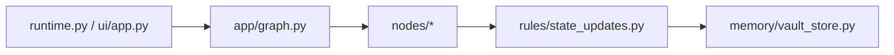
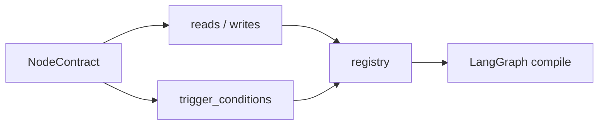
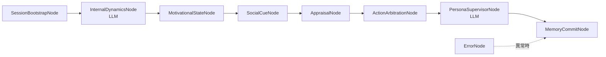
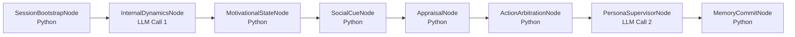
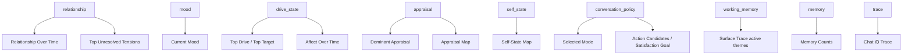
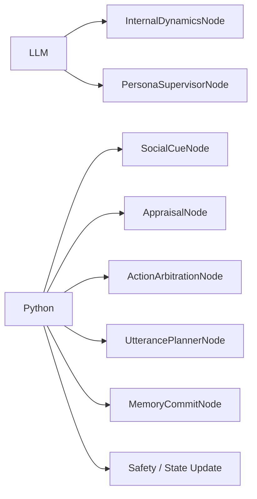
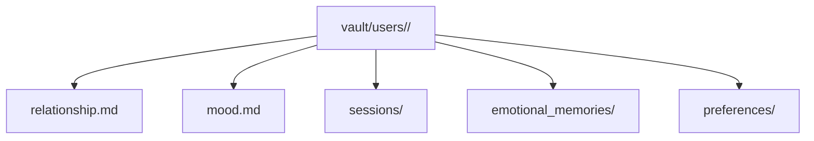

# 実装概要ガイド

このガイドは、現在のコードベースで SplitMind-AI がどう動いているかを説明するものです。
将来計画ではなく、`src/` にある現実装を基準にまとめています。



## エントリポイント

### CLI

CLI 実行の入口は `src/splitmind_ai/app/runtime.py` です。

- `run_turn`
  - 単発の 1 ターン実行
- `run_session`
  - ターミナルでの対話セッション

### UI

Streamlit UI の入口は `src/splitmind_ai/ui/app.py` です。
chat 表示、trace 表示、dashboard 表示、session state 管理をここでまとめています。

## グラフ構築

グラフの組み立ては `src/splitmind_ai/app/graph.py` で行います。

流れは次の通りです。

1. registry を初期化する
2. custom slice を登録する
3. 各 node を registry に登録する
4. `agent-contracts` から graph を組み立てる
5. entry point を `main_supervisor` に設定して compile する

ノード間の接続は手書きの if 文でつないでいるのではなく、各 node が宣言する `reads / writes / trigger_conditions` に基づいて決まります。



## 現在のターン処理フロー

現在の 1 ターンは、既定ではおおむね次の順で進みます。

1. `SessionBootstrapNode`
2. `InternalDynamicsNode`
3. `MotivationalStateNode`
4. `SocialCueNode`
5. `AppraisalNode`
6. `ActionArbitrationNode`
7. `PersonaSupervisorNode`
8. `MemoryCommitNode`
9. `ErrorNode` は異常時の fallback



この図で `LLM` と付いている node が、外部モデルを呼ぶ箇所です。
既定設定では、LLM を使うのは次の 2 箇所です。

- `InternalDynamicsNode`
- `PersonaSupervisorNode`

## どこで LLM を使うか

既定では「内部を考える」「persona frame と最終文面をまとめて決める」の 2 段階で LLM を使います。
それ以外の node は、現在の実装では Python のロジックだけで処理します。



### LLM 利用箇所の早見表

| node | 何のために使うか | 主な入力 | 主な出力 |
|---|---|---|---|
| `InternalDynamicsNode` | ユーザー入力から内部力動と drive hypothesis を構造化する | `request`, `conversation`, `persona`, `relationship`, `mood`, `memory` | `dynamics`, `_internal.event_flags`, `trace.internal_dynamics` |
| `PersonaSupervisorNode` | persona と現在状態を統合し、既定では frame と最終文面をまとめて作る | `request`, `persona`, `relationship`, `mood`, `dynamics`, `drive_state`, `appraisal`, `conversation_policy`, `memory`, `_internal` | `utterance_plan`, `response`, `trace.supervisor`, `trace.surface_realization` |

### 現行 2-pass の流れ

#### 1. `InternalDynamicsNode`

最初の LLM 呼び出しです。
ここでは、ユーザー発話を受けて内部で何が起きたかを structured output で作ります。

- 欲求は何か
- 防衛は何か
- 感情圧はどの程度か
- event flag を何として扱うか

つまり、応答を書く前の「内面の下書き」をここで作っています。

#### 2. `PersonaSupervisorNode`

2 回目の LLM 呼び出しです。
既定設定では、内部力動だけではなく persona、relationship、appraisal、selected mode を合わせて、
今回の turn をどんな表情で出すかを決め、そのまま候補生成と最終応答選択までまとめて行います。

- 表向き意図
- 隠れた圧力
- mask goal
- leakage level
- 表現設定
- 候補文
- 最終応答

つまり現在の既定 runtime では、「どういう調子で言うか」の設計と「何を返すか」の確定を同じ call で行います。

各 node の役割は次の通りです。

### `SessionBootstrapNode`

- session 情報を正規化する
- persona を読み込む
- vault から relationship / mood / memory を復元する
- `drive_state` / `inhibition_state` / `working_memory` と `_internal` を初期化する

### `InternalDynamicsNode`

- ユーザー入力から内部力動を構造化する
- `dynamics` と `event_flags` の元データを作る
- `drive_axes` を含む hypothesis を返す
- LLM を使う

### `MotivationalStateNode`

- `InternalDynamicsNode` の hypothesis と前ターンの residue を統合する
- `drive_state` と `inhibition_state` を作る
- `carryover / frustration / satiation / suppression` を次段へ渡す

### `SocialCueNode`

- ユーザー発話と event flags から、対人的な cue 候補を作る

### `AppraisalNode`

- social cue を「自分にとって何を意味するか」へ変換する
- `appraisal`、`social_model`、`self_state` を作る

### `ActionArbitrationNode`

- appraisal と self-state と drive competition をもとに、turn の対人方針を選ぶ
- `selected_mode`、候補群、`blocked_by_inhibition`、`satisfaction_goal` を `conversation_policy` に入れる

### `PersonaSupervisorNode`

- persona と現在状態を統合し、既定では発話フレームと最終応答をまとめて作る
- 表向き意図、隠れた圧力、漏出量、表現設定を `utterance_plan` に入れる
- `response.final_response_text` もここで確定する
- LLM を使う

### `UtterancePlannerNode`

- blueprint 候補の生成責務を切り出した補助 node

### `SurfaceRealizationNode`

- blueprint 候補から最終文面を選ぶ責務を切り出した補助 node
- 現行の標準 runtime では通らない

### `MemoryCommitNode`

- ルールベースで relationship / mood / memory を更新する
- vault に commit する
- 次 turn のための `working_memory` を更新する

### `ErrorNode`

- node failure や contract 破綻時に安全な fallback 応答を返す

## 状態スライス

現在の root state は次の slice で構成されています。

- `request`
- `response`
- `conversation`
- `persona`
- `relationship`
- `mood`
- `memory`
- `appraisal`
- `social_model`
- `self_state`
- `conversation_policy`
- `utterance_plan`
- `working_memory`
- `drive_state`
- `inhibition_state`
- `dynamics`
- `trace`
- `_internal`

UI と対応が強い slice は次の通りです。

- `relationship`
  - Dashboard の `Relationship Over Time` と `Top Unresolved Tensions`
- `mood`
  - `Current Mood`
- `drive_state`
  - `Top Drive`、`Top Target`、drive residue 系グラフ
- `inhibition_state`
  - `blocked_by_inhibition` の補助根拠
- `appraisal`
  - `Appraisal Map`
- `self_state`
  - `Self-State Map`
- `conversation_policy`
  - `Selected Mode`、`Action Candidates`、`Satisfaction goal`
- `working_memory`
  - `Surface Trace` 内の active themes
- `memory`
  - `Memory Counts`
- `trace`
  - Chat タブの `Trace` と timing、`latent_drive_signature`



## ルールベース部分と LLM 部分の分担

概念資料では 2-call の説明が中心で、現行 runtime もその構成です。
補助 node はコードベースに残っていますが、標準経路では `SurfaceRealizationNode` を呼びません。

- 現行 runtime の LLM
  - `InternalDynamicsNode`
  - `PersonaSupervisorNode`
- Python
  - `SocialCueNode`
  - `AppraisalNode`
  - `ActionArbitrationNode`
  - `UtterancePlannerNode`
  - `MemoryCommitNode`
  - safety と state update まわり

つまり現在は、LLM は「考える」と「演出方針と応答をまとめて決める」の 2 役を担います。



## 永続化

永続化は `src/splitmind_ai/memory/vault_store.py` が担当します。
保存先は `vault/` 以下で、`user_id` ごとに namespace が分かれます。

基本レイアウトは次の通りです。

```text
vault/
  users/
    <user_id>/
      relationship.md
      mood.md
      sessions/
      emotional_memories/
      preferences/
```

このうち日常的によく見るのは次です。

- `relationship.md`
  - relationship snapshot
- `mood.md`
  - mood snapshot
- `emotional_memories/`
  - 感情エピソードの蓄積
- `preferences/`
  - セマンティックな嗜好

必要に応じて `sessions/` に session summary も保存されます。



## 実装を読むときのおすすめ順

最初から全 node を深追いするより、この順で読むと追いやすいです。

1. `src/splitmind_ai/ui/app.py`
2. `src/splitmind_ai/app/graph.py`
3. `src/splitmind_ai/nodes/`
4. `src/splitmind_ai/rules/state_updates.py`
5. `src/splitmind_ai/memory/vault_store.py`

まず UI や runtime から入口を見て、その後に graph と node contract を追うと、state の流れが見えやすくなります。
