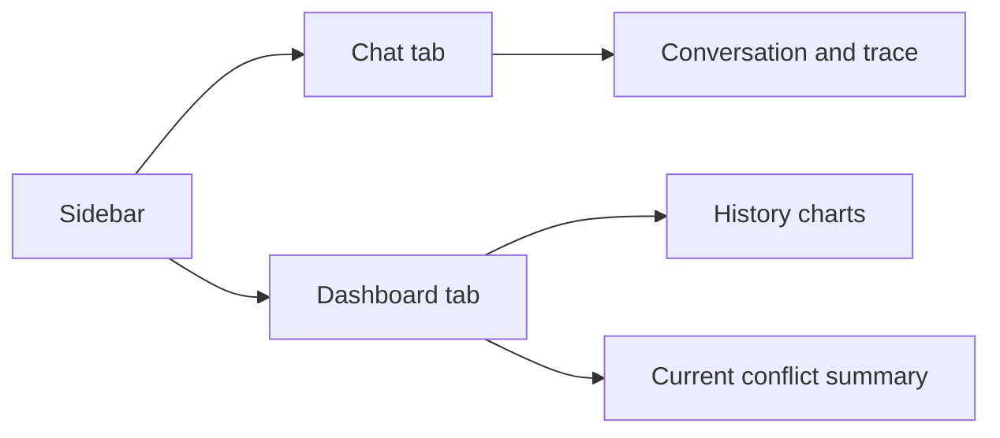
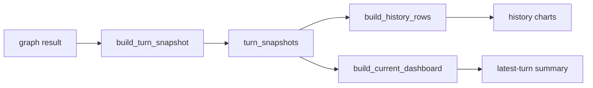

# Streamlit UI Guide

This guide explains how to read the Streamlit UI launched from [app.py](/Users/iwasakishinya/Documents/hook/SplitMind-AI/src/splitmind_ai/ui/app.py).



## Launch

```bash
uv run streamlit run src/splitmind_ai/ui/app.py
```

To use a specific memory namespace:

```bash
uv run streamlit run src/splitmind_ai/ui/app.py -- --user-id alice
```

## Sidebar

The sidebar exposes:

- persona selector
- trace toggle
- persistent memory toggle
- response language
- reset session
- user id / session id / turn count

### `Current Summary`

The sidebar summary shows:

- `Top tension`
  - the first item in `relationship_state.durable.unresolved_tension_summary`
- `Dominant want`
  - `conflict_state.id_impulse.dominant_want`
- `Ego move`
  - `conflict_state.ego_move.social_move`
- `Event`
  - `appraisal.event_type`
- `Trust / Tension`
  - durable trust and ephemeral tension

## Chat Tab

The chat tab shows user and assistant messages in chronological order.

### Per-turn `Trace`

When `Show trace` is enabled, each assistant message includes `Trace (turn n)`.

The active trace structure is organized around:

- `appraisal`
- `conflict_engine`
- `expression_realizer`
- `fidelity_gate`
- `memory_commit`

### What To Inspect In Trace

#### `Conflict Trace`

- event type
- valence
- target of tension
- dominant want
- ego move
- residue

This is where the human-like conflict for the turn is visible.

#### `Expression Trace`

- expression length
- temperature
- directness
- fidelity passed
- move fidelity
- warnings

This is where you check how the conflict was surfaced.

#### `Timing`

The UI lists each `*_ms` value recorded in trace:

- `appraisal`
- `conflict_engine`
- `expression_realizer`
- `fidelity_gate`
- `memory_commit`

## Dashboard Tab

The dashboard renders from `turn_snapshots`.



## Main Panels

### KPI cards

- `Current Mood`
- `Dominant Want`
- `Top Target`
- `Ego Move`
- `Residue`
- `Turns`

### `Relationship Over Time`

Turn-indexed relationship movement:

- `trust`
- `intimacy`
- `distance`
- `tension`
- `attachment_pull`

### `Conflict Over Time`

Turn-indexed conflict metrics:

- `id_intensity`
- `superego_pressure`
- `residue_intensity`
- `directness`
- `closure`

### `Appraisal Map`

Latest-turn appraisal axes:

- confidence
- stakes
- closeness axis
- pride axis
- jealousy axis
- ambiguity axis

### `Conflict Summary`

Latest-turn `conflict_state` summary:

- dominant want
- social move
- residue

### `Expression Envelope`

Latest-turn expression constraints:

- length
- temperature
- directness

### `Fidelity Verdict`

Latest-turn gate result:

- passed
- move fidelity
- warnings

### `Current Trace`

Latest-turn combined summary of:

- event type
- target tension
- ego move
- residue
- relationship stage
- expression temperature
- forbidden moves
- fidelity pass / warning

## Practical Reading Tips

- If replies feel flat, inspect `dominant want` and `residue`.
- If replies feel too soft, inspect `ego move` and `fidelity warnings`.
- If pacing feels off, inspect `relationship stage` and `escalation_allowed`.
- If you want the semantic meaning of the turn, start with `appraisal.event_type`.
- If you want to inspect cross-session continuity, compare the `memory_commit` output with what `session_bootstrap` restores on the next session.

## Related Docs

- [implementation-overview.en.md](/Users/iwasakishinya/Documents/hook/SplitMind-AI/guides/implementation-overview.en.md)
- [concept.en.md](/Users/iwasakishinya/Documents/hook/SplitMind-AI/docs/concept.en.md)
- [15-persona-identity-and-persistent-memory.md](/Users/iwasakishinya/Documents/hook/SplitMind-AI/docs/implementation-plan/15-persona-identity-and-persistent-memory.md)
