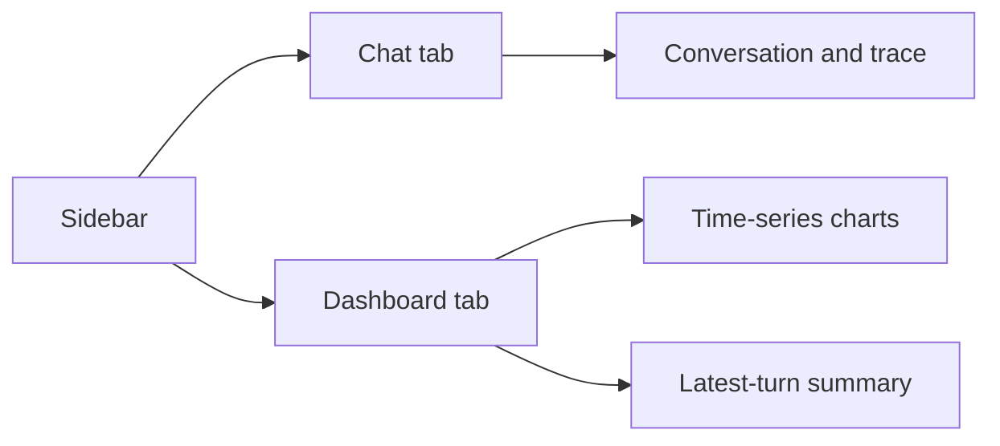

# Streamlit UI Guide

This guide explains how to read the Streamlit UI launched from `src/splitmind_ai/ui/app.py`. The `Dashboard` tab is especially useful for inspecting internal state over time.



## Launch

```bash
uv run streamlit run src/splitmind_ai/ui/app.py
```

To use a specific vault namespace:

```bash
uv run streamlit run src/splitmind_ai/ui/app.py -- --user-id alice
```

That `user_id` selects the storage path under `vault/users/<user_id>/`.

## Layout

The UI has three main areas:

- sidebar
  Run settings and session metadata
- `Chat` tab
  User and assistant messages, plus per-turn trace output
- `Dashboard` tab
  Aggregated snapshots, charts, and latest-state summaries

## Sidebar

### Persona Selector

Loads persona configs from `configs/personas/`.

### Show Trace

When enabled, each assistant response shows an expandable trace summary. Use this when you want to inspect internal reasoning outputs without reading raw code or logs.

### Memory Toggle

When enabled, the app reads and writes vault memory. When disabled, the session only uses in-memory Streamlit state.

### Reset Session

Clears the current Streamlit session state and creates a new `session_id`. This also resets `messages`, `traces`, `turn_snapshots`, and `latest_state`.

### Session Summary

The sidebar also surfaces compact status information such as:

- current `user_id`
- current UI session identifier
- completed turn count
- unresolved tension summary
- top drive name, intensity, and target

This is meant to make residual pressure visible at a glance.

## Chat Tab

### Message History

Shows the user and assistant messages in chronological order.

### Per-Turn Trace

When `Show trace` is enabled, each assistant message includes a trace block for that turn. The trace summarizes what happened inside the graph, not just the final text shown in chat.

## Dashboard Tab

The dashboard treats `drive_state` as the main long-term pressure source and shows related snapshots turn by turn.

Useful things to watch:

- top drives over time
- inhibition blocks and containment behavior
- latent drive signature changes
- relationship and mood movement
- residue that remains after a turn is completed

## How To Use The Dashboard

- If the assistant feels too flat, compare the visible response to drive and inhibition movement.
- If it feels too repetitive, inspect whether the same drives or unresolved tensions persist without decay.
- If safety feels too aggressive or too weak, inspect the trace around appraisal, arbitration, and final realization.

## Related Docs

- [implementation-overview.en.md](./implementation-overview.en.md)
- [docs/concept.en.md](../docs/concept.en.md)
