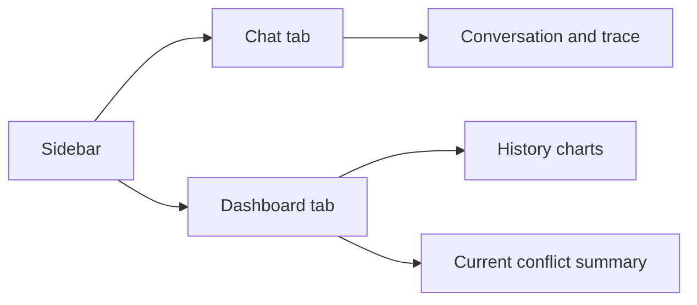
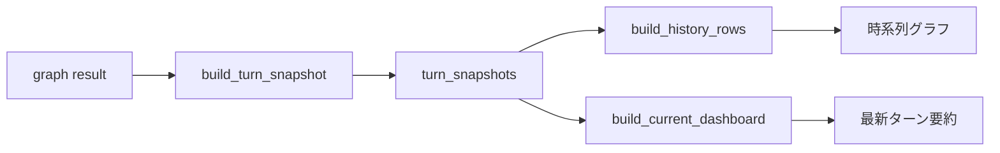

# Streamlit UI ガイド

このガイドは [app.py](/Users/iwasakishinya/Documents/hook/SplitMind-AI/src/splitmind_ai/ui/app.py) で起動する Streamlit UI の読み方を説明します。



## 起動

```bash
uv run streamlit run src/splitmind_ai/ui/app.py
```

特定の memory namespace を使う場合:

```bash
uv run streamlit run src/splitmind_ai/ui/app.py -- --user-id alice
```

## Sidebar

Sidebar では次を操作・確認します。

- persona selector
- trace toggle
- persistent memory toggle
- response language
- reset session
- user id / session id / turn count

### `Current Summary`

Sidebar の要約は次を簡易表示します。

- `Top tension`
  - `relationship_state.durable.unresolved_tension_summary` の先頭
- `Dominant want`
  - `conflict_state.id_impulse.dominant_want`
- `Ego move`
  - `conflict_state.ego_move.social_move`
- `Event`
  - `appraisal.event_type`
- `Trust / Tension`
  - durable trust と ephemeral tension

## Chat タブ

通常の chat UI と同じく user / assistant の発話が時系列で並びます。

### assistant ごとの `Trace`

`Show trace` がオンのとき、assistant 応答ごとに `Trace (turn n)` が付きます。

現在の trace は次の単位で整理されています。

- `appraisal`
- `conflict_engine`
- `expression_realizer`
- `fidelity_gate`
- `memory_commit`

### Trace で見るもの

#### `Conflict Trace`

- event type
- valence
- target of tension
- dominant want
- ego move
- residue

ここで「このターンの人間っぽさを生んだ衝突」が読めます。

#### `Expression Trace`

- expression length
- temperature
- directness
- fidelity passed
- move fidelity
- warnings

ここで「その衝突がどう表面に落ちたか」を見ます。

#### `Timing`

trace に書かれた `*_ms` を一覧表示します。

- `appraisal`
- `conflict_engine`
- `expression_realizer`
- `fidelity_gate`
- `memory_commit`

## Dashboard タブ

Dashboard は `turn_snapshots` をもとに描画されます。



## 主要パネル

### KPI cards

- `Current Mood`
- `Dominant Want`
- `Top Target`
- `Ego Move`
- `Residue`
- `Turns`

### `Relationship Over Time`

turn ごとの関係推移を見ます。

- `trust`
- `intimacy`
- `distance`
- `tension`
- `attachment_pull`

### `Conflict Over Time`

turn ごとの衝突系指標を見ます。

- `id_intensity`
- `superego_pressure`
- `residue_intensity`
- `directness`
- `closure`

### `Appraisal Map`

最新ターンの appraisal をレーダー風に見ます。

- confidence
- stakes
- closeness axis
- pride axis
- jealousy axis
- ambiguity axis

### `Conflict Summary`

最新ターンの `conflict_state` を要約します。

- dominant want
- social move
- residue

### `Expression Envelope`

最新ターンの表出側制約を見ます。

- length
- temperature
- directness

### `Fidelity Verdict`

最新ターンの fidelity gate 結果を見ます。

- passed
- move fidelity
- warnings

### `Current Trace`

最新ターンの

- event type
- target tension
- ego move
- residue
- relationship stage
- expression temperature
- forbidden moves
- fidelity pass / warning

をまとめて見ます。

## 読み方のコツ

- 応答が平板なら `dominant want` と `residue` が弱すぎないか見る
- 応答が甘すぎるなら `ego move` と `fidelity warnings` を見る
- 会話が不自然に進むなら `relationship stage` と `escalation_allowed` を見る
- そのターンの意味を知りたいなら、まず `appraisal.event_type` を見る
- セッションを跨いだ継続性を見たいなら、`memory_commit` 後の persistent memory 更新と `session_bootstrap` 復元結果を見る

## 関連ドキュメント

- [implementation-overview.md](/Users/iwasakishinya/Documents/hook/SplitMind-AI/guides/implementation-overview.md)
- [concept.md](/Users/iwasakishinya/Documents/hook/SplitMind-AI/docs/concept.md)
- [15-persona-identity-and-persistent-memory.md](/Users/iwasakishinya/Documents/hook/SplitMind-AI/docs/implementation-plan/15-persona-identity-and-persistent-memory.md)
