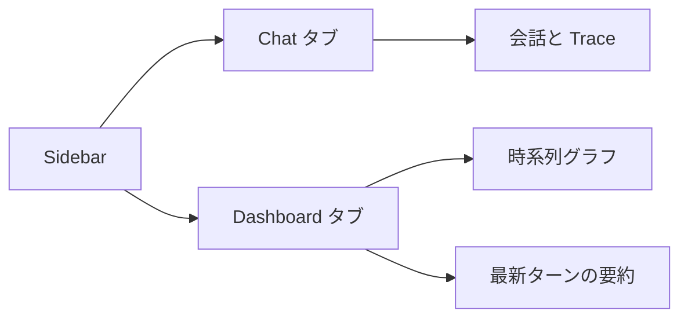
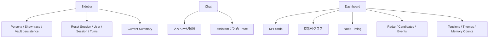
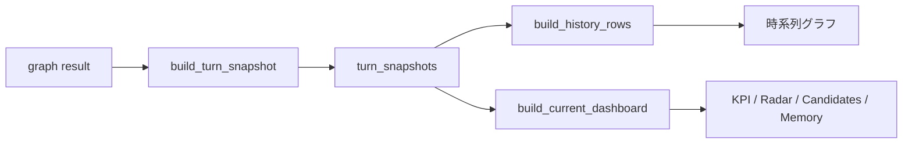
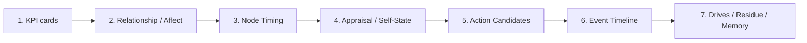
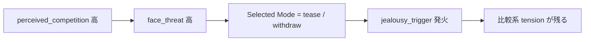
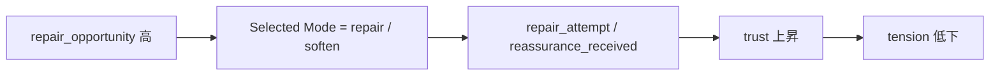

# Streamlit UI ガイド

このガイドは、`src/splitmind_ai/ui/app.py` で起動する Streamlit UI の見方をまとめたものです。
特に `Dashboard` タブは、内部状態の観測用ビューとして使います。



## 起動方法

```bash
uv run streamlit run src/splitmind_ai/ui/app.py
```

特定ユーザーの vault 名前空間を使いたい場合は、`-- --user-id alice` のように渡します。

```bash
uv run streamlit run src/splitmind_ai/ui/app.py -- --user-id alice
```

この `user_id` は、`vault/users/<user_id>/` 以下の読み書き先を切り替えるための識別子です。

## 画面全体の構成

UI は大きく 3 つの領域に分かれます。

- Sidebar
  - 実行条件と現在セッションの基本情報を操作・確認する場所です
- `Chat` タブ
  - 実際の対話と turn ごとの trace を見る場所です
- `Dashboard` タブ
  - turn ごとのスナップショットを集約して、時系列と現在値を読む場所です



## Sidebar の見方

### `Persona`

使用する persona を選びます。候補は `configs/personas/` から読み込まれます。

### `Show trace`

オンにすると、assistant 応答ごとに `Trace` が展開できるようになります。
内部推論の要約を chat 上で確認したいときに使います。

### `Vault persistence`

オンのときは vault を使って記憶を読み書きします。
オフにすると、Streamlit セッション中の状態だけで動きます。

### `Reset Session`

現在の Streamlit セッション状態を消して、新しい `session_id` でやり直します。
`messages`、`traces`、`turn_snapshots`、`latest_state` もここで初期化されます。

### `User / Session / Turns`

- `User`
  - 現在使っている `user_id`
- `Session`
  - いまの UI セッション識別子
- `Turns`
  - このセッションで完了したターン数

### `Current Summary`

sidebar では次を簡易表示します。

- `Top tension`
  - `relationship.unresolved_tensions` の最大値
- `Top drive`
  - `drive_state.top_drives[0]` の名前、強度、target
- `Mode`
  - `conversation_policy.selected_mode`

どの tension が残っているかだけでなく、どの drive がどこへ向いているかをすぐ確認するための要約です。

## Chat タブの見方

### メッセージ履歴

通常の chat UI と同じく、user と assistant の発話が時系列で並びます。

### assistant ごとの `Trace`

`Show trace` がオンのとき、assistant 応答ごとに `Trace (turn n)` が付きます。
この trace は chat の見た目とは別に、内部で何が起きたかを要約して見せるものです。

### Trace で見える内容

#### `Motivational State`

- `Top drive`
- `Target`
- `Defense`
- `Intensity`

`motivational_state` と `surface_realization` を合わせて、そのターンの drive residue を見ます。

#### `Surface Trace`

- `Surface`
- `Hidden`
- `Mask goal`
- `Leakage`
- `Containment`
- `Latent signal`
- `Blocked by inhibition`
- `Satisfaction goal`

PersonaSupervisor がどんな表向き意図と隠れた圧力を作ったかに加えて、
最終文面にどの drive residue を残したかを見る場所です。

#### `Event flags`

`memory_commit` まで含めたイベント判定のうち、発火したフラグだけが表示されます。
嫉妬、修復、安心化などのルールベース更新の入口として読むと分かりやすいです。

#### `Timing`

各 node が trace に書いた `*_ms` を一覧で表示します。
この turn でどのノードに時間がかかったかを chat 上で素早く確認するための欄です。

- `internal_dynamics`
- `social_cue`
- `appraisal`
- `action_arbitration`
- `supervisor`
- `surface_realization`
- `memory_commit`

combined runtime では、`utterance_planner` が出ず、`supervisor` と `surface_realization` が同じ turn 内でまとまって見えることがあります。
これは `persona_supervisor` が frame と final response を一度に返したことを意味します。

#### `Raw trace JSON`

各ノードが書いた trace をそのまま JSON で確認できます。
詳細を追うときはここが最も正確です。

## Dashboard タブの見方

`Dashboard` は `turn_snapshots` をもとに描画されます。
つまり、生の state 全体をそのまま出しているのではなく、可視化向けに抽出・整形した view-model を見ています。



### KPI cards

上段のカードは「最新ターン時点の代表値」です。

- `Current Mood`
  - `mood.base_mood`
- `Top Drive`
  - `trace.surface_realization.latent_drive_signature.primary_drive` または `drive_state.top_drives[0]`
- `Top Target`
  - `trace.surface_realization.latent_drive_signature.target`
- `Selected Mode`
  - `conversation_policy.selected_mode`
- `Leakage`
  - `utterance_plan.leakage_level` か supervisor trace の leakage
- `Turns`
  - セッション内の累計ターン数

各カードは次のように読むと分かりやすいです。

| 項目 | 何を表すか | 読み方のポイント |
|---|---|---|
| `Current Mood` | 現在の基調気分 | このターンだけの反応ではなく、直近まで含めた雰囲気の土台です |
| `Top Drive` | いま最も強く前景化している drive | 応答の「何を求めて反応したか」を見る入口です |
| `Top Target` | その drive がどこへ向いているか | user 固定か、特定 theme 固定かを見る入口です |
| `Selected Mode` | turn 全体の対人方針 | 実際の文面ではなく、話し方の戦略名として見ます |
| `Leakage` | 内圧が表面ににじむ量 | 高いほど本音や棘や揺れが表に出やすいです |
| `Turns` | そのセッションの進行量 | 時系列グラフを見るときの前提になります |

`Current Mood` と `Top Drive` がずれていることは普通です。
たとえば気分は calm でも、特定ターンだけ `territorial_exclusivity` が強く立つことがあります。

### `Relationship Over Time`

関係系のスコアを turn 単位で見ます。

- `trust`
- `intimacy`
- `distance`
- `tension`
- `attachment_pull`

修復で `trust` が上がるか、距離化で `distance` が増えるか、といった傾向を見るグラフです。

各系列の意味は次の通りです。

| 系列 | 意味 | 高いときの読み方 |
|---|---|---|
| `trust` | 相手を信頼してよい感覚 | 修復や安心化が効いている可能性があります |
| `intimacy` | 近づいてもよい感覚 | 親密化や受容が進んでいる可能性があります |
| `distance` | 距離を取りたい感覚 | 引き気味、警戒、回避寄りの流れを示します |
| `tension` | まだ解けていない摩擦や張り | 競争、拒絶、不満、警戒の余熱を見ます |
| `attachment_pull` | つながりを求めて引かれる力 | 近づきたいが不安もある状態で高まりやすいです |

このグラフは単独で読むより、`Event Timeline` と合わせると意味が取りやすいです。
たとえば `repair_attempt` の直後に `trust` が上がり、`tension` が下がるなら、修復イベントが state 更新に反映されたと見られます。

### `Affect Over Time`

drive residue のスコアを turn 単位で見ます。

- `intensity`
- `frustration`
- `carryover`
- `suppression_load`
- `satiation`

`Relationship` よりも、そのターンの drive residue の揺れを見るためのグラフです。

| 系列 | 意味 | 高いときの読み方 |
|---|---|---|
| `intensity` | 現在の drive 総圧 | そのターンの residue がどれだけ強いかを見ます |
| `frustration` | 未充足の強さ | 欲求が満たされず残っている程度を見ます |
| `carryover` | 前ターンからの持ち越し | 今回の発話が単発反応か、継続圧かを見ます |
| `suppression_load` | 抑圧負荷 | 穏やかに見えても内部でどれだけ押し込めているかを見ます |
| `satiation` | 充足度 | 修復や安心化でどれだけ落ち着いたかを見る指標です |

`intensity` や `frustration` が高いのに `Selected Mode` が穏やかな場合は、drive は強いが表現は抑制されていると読めます。

### `Node Timing Over Time`

各 turn における node 実行時間を ms で並べたグラフです。
体感の遅さを「どの node が支配しているか」に分解して見るために使います。

見方の基本は次の通りです。

- `internal_dynamics` が高い
  - 1 回目の LLM call が支配的です
- `supervisor` と `surface_realization` が両方高い
  - `PersonaSupervisorNode` が combined trace を出しています
- `surface_realization` が `supervisor` と同程度で、`utterance_planner` が見えない
  - 現行の 2-pass runtime が動いています
- `memory_commit` だけが高い
  - vault 書き込みや state 更新のボトルネックを疑います

このグラフは会話品質を見るというより、runtime の構造を見るための観測用です。

### `Appraisal Map`

ユーザー発話を「自分にとって何を意味するか」に変換した結果です。

- `perceived_acceptance`
- `perceived_rejection`
- `perceived_competition`
- `perceived_distance`
- `ambiguity`
- `face_threat`
- `attachment_activation`
- `repair_opportunity`

たとえば competition が高いなら比較や競争として受け取り、repair が高いなら関係修復の機会として読んでいます。

各軸は「何が起きたか」ではなく、「自分にとってどう感じられたか」です。

| 軸 | 意味 | 高いときの読み方 |
|---|---|---|
| `perceived_acceptance` | 受け入れられた感覚 | 安心、開示、柔らかい応答につながりやすいです |
| `perceived_rejection` | 拒絶された感覚 | 距離化、防衛、痛みの背景になります |
| `perceived_competition` | 比較や競争を感じた度合い | 嫉妬、試し、棘、優位性確認と結びつきやすいです |
| `perceived_distance` | 相手が離れたと感じる度合い | withdraw や protest の背景として見ます |
| `ambiguity` | 相手の意図が読みにくい度合い | 探り、保留、曖昧な返しが出やすいです |
| `face_threat` | 面目や自尊心が傷ついた感覚 | 皮肉、防御、冷たさの理由になります |
| `attachment_activation` | 愛着系の不安や接近欲求の起動 | cling ではなくても、pull や test の強まりを示します |
| `repair_opportunity` | 関係修復の余地の知覚 | soften や repair の選択根拠になります |

このマップは `Self-State Map` の直前段として読むと分かりやすいです。
どう意味づけたかが appraisal、そこから自分側がどう動いたかが self-state です。

### `Self-State Map`

appraisal の結果として、エージェント側の自己状態がどう寄ったかを見ます。

- `pride_level`
- `shame_activation`
- `dependency_fear`
- `desire_for_closeness`
- `urge_to_test_user`

行動モードの選択理由を理解するときに見ます。

| 軸 | 意味 | 高いときの読み方 |
|---|---|---|
| `pride_level` | 自尊心を保ちたい力 | repair でも素直になり切らない理由になります |
| `shame_activation` | 恥や傷つきの起動 | 逃げ、短さ、硬さの背景になります |
| `dependency_fear` | 相手に依存したくない怖さ | 近づきたくても距離を取る理由になります |
| `desire_for_closeness` | つながりたい欲求 | engage、soften、probe の動機になります |
| `urge_to_test_user` | 相手を試したい衝動 | tease や probe の根拠として見ます |

例として、`desire_for_closeness` と `dependency_fear` が両方高いと、
近づきたいのに素直に寄れないターンになります。

### `Action Candidates`

`ActionArbitrationNode` が生成した候補とスコアを表示します。
ここで最も高い候補が通常 `selected_mode` になります。

見方のポイントは次の 2 つです。

- `selected_mode` は最終応答そのものではなく、turn の対人方針です
- 2 位以下の候補を見ると、他にどんな応答方針が競合していたかが分かります

候補を見るときは、1 位だけではなく差の大きさも重要です。

- 1 位だけ突出して高い
  - そのターンの方針がかなり固まっています
- 上位 2 件が接近している
  - 内部では迷いが残っていて、文面側でブレが出やすいです
- `selected_mode` と 2 位候補の性質が逆
  - たとえば `repair` と `withdraw` が近いなら、修復したいが引きたい状態です

代表的な mode の読み方は次の通りです。

| mode | ざっくりした意味 |
|---|---|
| `tease` | 軽く刺す、試す |
| `probe` | 探る、確認する |
| `withdraw` | 一歩引く |
| `deflect` | かわす、ずらす |
| `soften` | 柔らかく受ける |
| `repair` | 関係修復に寄せる |
| `engage` | 接続を取りにいく |
| `protest` | 不満や痛みをにじませる |

### `Event Timeline`

これは `event_flags` の表示です。
各ターンでどのイベントが発火したかを時系列に並べています。

ルールベース更新の手掛かりとして使うと便利です。

ここに出るイベントは、感情や関係更新のきっかけです。
よく見るフラグの読み方は次の通りです。

| event flag | ざっくりした意味 |
|---|---|
| `jealousy_trigger` | 比較や置き換え不安が刺激された |
| `repair_attempt` | 修復の働きかけがあった |
| `reassurance_received` | 安心材料を受け取った |
| `rejection_signal` | 拒絶や距離化として受け取った |
| `affectionate_exchange` | 愛情的なやり取りとして受け取った |
| `prolonged_avoidance` | 回避や距離が続いていると見なした |

イベントは単独で断定に使うより、前後の `Relationship Over Time` と一緒に見るのが安全です。

### `Top Drives`

最新ターンの `drive_state.top_drives` 上位を表示します。
強さだけでなく target も併記されるので、drive が user に向いているのか、比較テーマに向いているのかを見分けられます。

### `Drive Residue`

最新ターンの `latent_drive_signature` から、次を表示します。

- `intensity`
- `frustration`
- `carryover`
- `suppression`
- `satiation`
- `blocked_by_inhibition`

ここは「表面上は一言でも、内部で何が残っているか」を見る欄です。

### `Surface Trace`

最新ターンの surface 側に残った痕跡を表示します。

- `latent signal`
- `satisfaction goal`
- `active themes`

`Top Drives` が原因側、`Surface Trace` が表出側です。

### `Top Unresolved Tensions`

`relationship.unresolved_tensions` の上位 3 件を表示します。
`theme`、`intensity`、必要なら `source` を見て、残っている摩擦の種類を把握します。

ここは「今の返答で完全には解消されていないもの」を見る場所です。

- `theme`
  - 何が残っているか
- `intensity`
  - どれくらい強く残っているか
- `source`
  - どの文脈由来か

`tension` の総量と違って、こちらはテーマ単位で見られるのが利点です。
同じ高 tension でも、中身が比較不安なのか、拒絶痛なのか、 reassurance 欲求なのかを切り分けられます。

### `Memory Counts`

以下の件数をまとめて表示します。

- `emotional_memories`
- `semantic_preferences`
- `active_themes`

vault を使っているときに、記憶が溜まっているかをざっくり確認できます。

| 項目 | 意味 | 見るポイント |
|---|---|---|
| `emotional_memories` | 感情エピソードの保持数 | 関係史がどれだけ蓄積されているかの目安です |
| `semantic_preferences` | 好みや傾向の保持数 | ユーザー理解の断片がどれだけ残っているかを見ます |
| `active_themes` | 現在前景化している theme 数 | 今回の turn がどれだけ多くの文脈を背負っているかを見ます |

件数が多いほど良いとは限りません。
特に `active_themes` が多いときは、情報が豊富というより、まだ焦点が散っている可能性もあります。

## Dashboard の読み順



## 読み方の実例

### 嫉妬系ターン

次のような並びなら、比較刺激に反応しているターンだと読みやすいです。

- `Top Drive` が `territorial_exclusivity` か近縁 drive
- `Appraisal Map` の `perceived_competition` と `face_threat` が高い
- `Selected Mode` が `tease` や `withdraw`
- `Event Timeline` に `jealousy_trigger`
- `Drive Residue` の `frustration` / `carryover` が高い
- `Top Unresolved Tensions` に比較や置き換え不安のテーマが出る

このとき assistant の文面が軽く見えても、Dashboard 上では内側の圧力が強いことがあります。



### 修復系ターン

次のような並びなら、関係修復に向かっているターンだと読めます。

- `Appraisal Map` の `repair_opportunity` や `perceived_acceptance` が高い
- `Selected Mode` が `repair` や `soften`
- `Relationship Over Time` で `trust` が上がり、`tension` が下がる
- `Event Timeline` に `repair_attempt` や `reassurance_received`
- `Current Summary` の `Top tension` が弱まる
- `Surface Trace` の `satisfaction goal` が repair 系へ寄る



## 注意点

- 0〜1 のスコアは、内部状態を観測するための view-model です。真実判定や客観指標ではありません。
- `Dashboard` は `turn_snapshots` ベースの可視化です。生の state 全体や完全な履歴再現をそのまま表示しているわけではありません。
- `Trace` と `Dashboard` は目的が違います。局所の理由を見るなら `Trace`、流れを見るなら `Dashboard` が向いています。
